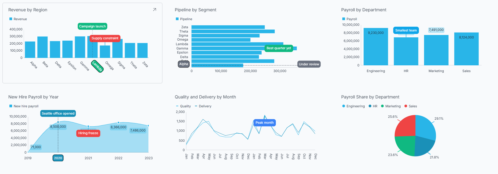
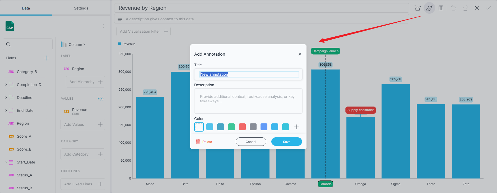
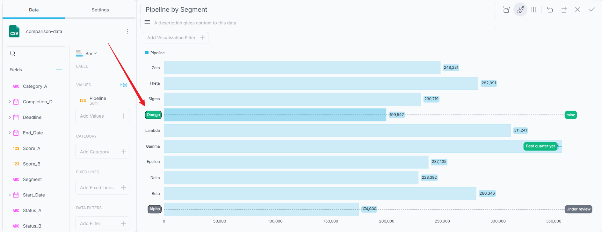
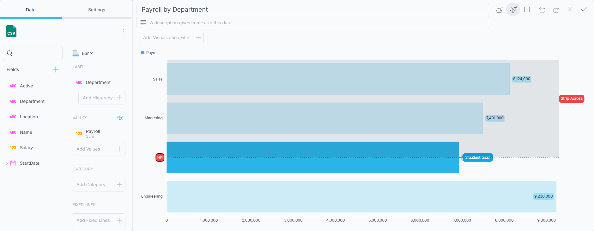

# Chart Annotations

Numbers rarely explain themselves. A spike in a line chart could be a record-breaking campaign or a data-entry mistake, and only the person who investigated it knows which. *Chart annotations* let you write that explanation directly onto the chart, so the context travels with the dashboard instead of living in a separate email or meeting note.

An annotation is a short note - a title and an optional description - anchored to a specific place on your chart. Once saved, it is stored with the dashboard and everyone who opens it sees the same note in the same place.

## Which Charts Support Annotations?

Annotations are available on the category chart family:

* Area
* Bar
* Column
* Line
* Spline
* Spline Area
* Step Area
* Step Line
* Time Series

Stacked chart variants - such as Stacked Column or Stacked Bar - do not support annotations. In a stacked chart, each segment is drawn at an accumulated position rather than at its own value, so an annotation cannot be reliably anchored to the value you clicked.

If your visualization is not one of the supported types, the *Annotate* button in the Visualization Editor is disabled.

## Adding an Annotation

1. Open the visualization you want to annotate in the [Visualization Editor](visualization-editor.md).

2. Click/tap the **Annotate** button in the editor's top toolbar. On narrower layouts, you will find *Annotate* in the overflow menu instead. The button stays highlighted while annotation mode is on.

   

3. With annotation mode on, place the annotation using one of the three gestures described in [Types of Annotations](#types-of-annotations) below.

4. The **Add Annotation** dialog opens. Enter a **Title**, and optionally a **Description** and a **color**.

5. Click/tap **Save**.

Annotation mode stays on after you save, so you can keep placing annotations one after another. Click/tap **Annotate** again to turn the mode off when you are done.

:::note
The **Title** is required - the *Save* button stays disabled until you enter one. Closing the dialog any other way - *Cancel*, the *X* button, or the *Escape* key - discards the annotation you were placing.
:::

## Types of Annotations

Reveal decides what kind of annotation you are creating from the gesture you make. All three are placed while annotation mode is on.

### Point

**Click/tap a data point** on the chart.

A *Point* annotation attaches to one data point on one series - a single month's value for a single measure, for example. It is the right choice when the story is about one specific number.

If several series overlap where you clicked - which happens easily with area and spline area charts - Reveal anchors the annotation to the series whose data point sits closest to where you clicked, not simply to the shape drawn on top.

### Slice

**Click/tap a label on the category axis.**

A *Slice* annotation marks one whole category - a single month, region, or product - across every series in the chart. Use it when the note is about the category itself rather than about one measure within it.

### Strip

**Drag across a range** in the plot area.

A *Strip* annotation marks a span of categories, such as a quarter, a promotional period, or an outage window. Like a *Slice*, it spans every series in the chart.

:::note
*Slice* and *Strip* annotations can only be anchored to the **category axis**. Clicking a label on the value axis does not create an annotation - a marker pinned to a number rather than to a category would drift as your data changes.
:::

## Reading Annotations

Annotated charts show a label at each annotation's anchor. Hover over - or tap - an annotation to expand its card, which shows the annotation's title and description.

Annotations are part of the visualization, so they are visible to anyone viewing the dashboard, not only to the person who wrote them.

## Editing and Deleting Annotations

Editing and deleting are available only while **Annotate** mode is on. With the mode on, hover over - or tap - an annotation to expand its card and reveal the **edit** and **delete** buttons in its action pill. In normal dashboard or view mode the card still shows the title and description, but without those buttons.

* **Edit** reopens the annotation dialog with the saved title, description, and color. Change what you need and click/tap **Save**.

* **Delete** removes the annotation. There is no undo, and the two delete paths differ: from the card, Reveal asks you to confirm first; from the **Edit Annotation** dialog, it deletes immediately.

## Choosing an Annotation Color

The annotation dialog offers a row of color swatches drawn from your dashboard's current theme. The color you pick becomes the annotation's **background**, filling its label and card - it is not a separate marker at the anchor point.

Picking a color is optional. Without one, an annotation is transparent when collapsed and falls back to the theme background when hovered or expanded. Choose a color when you want it to stand out at a glance.

Your color survives a theme change. Everything else - text color, borders, spacing - is derived from the active theme, so annotations follow along when you restyle the dashboard.

## Saving and Sharing

Annotations are saved as part of the visualization's settings, which means they travel with the dashboard. When you save the dashboard, export it, or share the `.rdash` file, the annotations go with it and appear for the next person who opens it.

:::note
Chart annotations are authored through the Visualization Editor. There is no Reveal SDK API for creating or modifying them programmatically.
:::

## Related Topics

* [Visualization Editor](visualization-editor.md)
* [Category Charts](chart-types/category-charts.md)
* [Time Series Charts](chart-types/time-series-charts.md)
