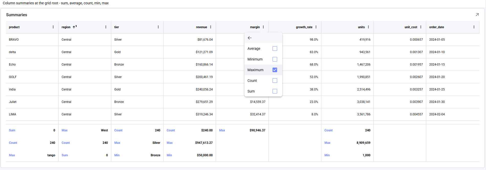
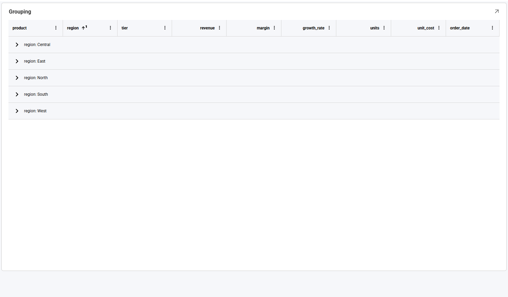
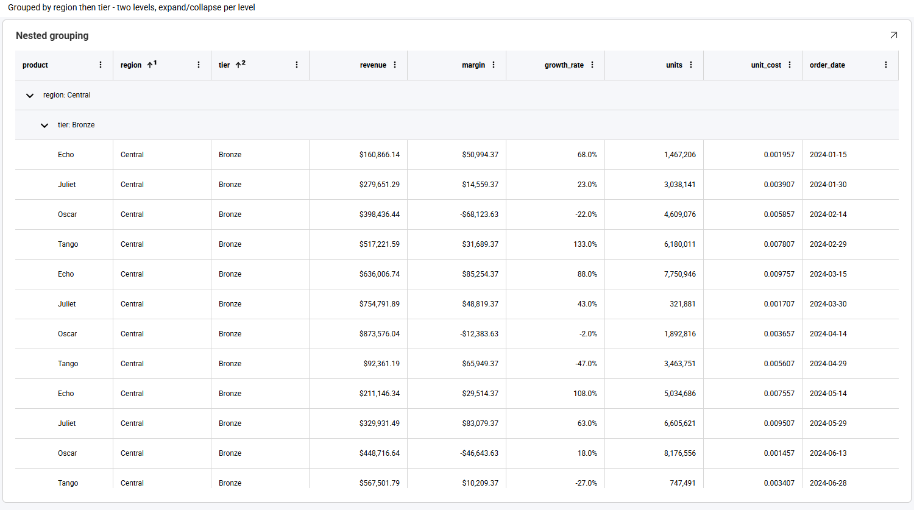
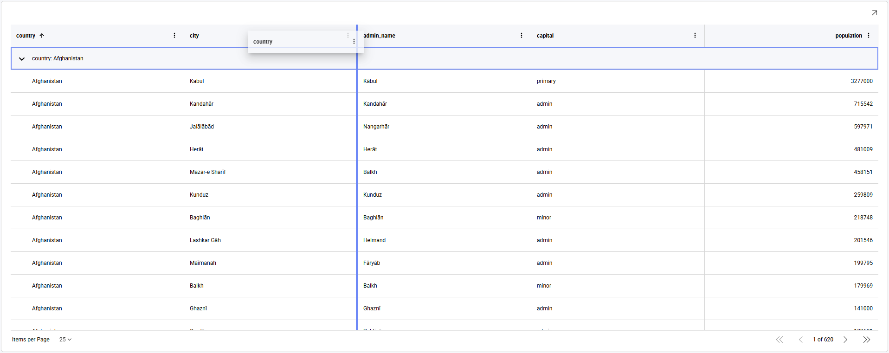

# Grid Chart

The grid chart displays your data in a matrix of rows and columns. Beyond simply presenting the data, it lets you work with it directly from the visualization: every column can be sorted, filtered, summarized, grouped, pinned, resized, reordered or hidden, without going back to the editor.

This topic covers what you can do with a grid in *Dashboard View mode* first, then the settings available when authoring one in the **Visualization Editor**.

## The Column Options Menu

Every column header carries a **⋮** button. It opens the column options menu, which gathers everything you can do to that column in one place.


The row of icons across the top acts on the column itself:

| Icon | What it does |
|---|---|
| **Move left / Move right** | Shifts the column one position in either direction. |
| **Pin left / Pin right** | Freezes the column against the left or right edge, so it stays visible while the rest of the grid scrolls sideways. |
| **Hide column** | Removes the column from view. |
| **Show columns** | Opens the list of columns, so you can bring hidden ones back. |

Below the icons are **Sort Ascending** and **Sort Descending**, the **Summaries** submenu, **Clear Filter**, and the searchable list of values used for filtering.

:::tip
Clicking the **header text** sorts the column. The menu opens only from the **⋮** button.
:::

## Sorting Columns in Dashboard View Mode

The grid allows you to change the sorting of your columns (ascending or descending) in *Dashboard View mode*. Click the column header, or choose **Sort Ascending** or **Sort Descending** from its **⋮** menu.

You can apply more than one sorting criteria. Sorting a second column **adds** to the sort rather than replacing it, and each sorted header shows a small raised number giving its position in the sort order.


Here `product` sorts first and `region` second. Sorting is case-insensitive, so `Alpha`, `alpha` and `ALPHA` are ordered together rather than being separated into upper- and lower-case blocks.

Clicking a header cycles through three states — ascending, then descending, then unsorted — so a third click removes the sort. You can also open the column's **⋮** menu and clear the selected sort option.

## Filtering a Column

Each column can be filtered from its own options menu. The value list is built from that column's distinct values, and is searchable — useful when a column has many values.


Use **(Select All)** to toggle everything at once, clear the values you want to exclude, then choose **Apply**. Here the `region` column has been filtered to **Central** and **East**:


**Clear Filter** removes the filter from that column only. Filters on different columns combine, so filtering `region` and then `tier` narrows the rows to those matching both. Column filters apply on top of any dashboard filters already in place.

:::info
Values appear in the list **formatted**, exactly as they appear in the cells — a currency column lists `$50,000.00` rather than `50000`.
:::

## Column Summaries

Numeric columns can display an aggregate in a summary row. Open the column's **⋮** menu and choose **Summaries**:



Five aggregates are available — **Average**, **Minimum**, **Maximum**, **Count** and **Sum**. They are checkboxes rather than a single choice, so one column can show more than one aggregate at a time.

:::caution
Summaries are unavailable on a paged grid — see [Paging](#paging).
:::

## Grouping

Rows can be grouped by a column — either from that column's options menu, or by authoring **Grouped Columns** on the visualization in the editor (see [Working With the Grid Chart in the Visualization Editor](#working-with-the-grid-chart-in-the-visualization-editor)).



Grouping can go more than one level deep, and each level expands and collapses independently:



:::note
Groups render collapsed by default, so you can see the full set of values before expanding the ones you want.
:::

## Paging

:::note
There is no practical limit on how many rows and columns work well, with or without paging. Because you can filter, group and summarize the data directly from the grid, larger result sets remain readable.
:::

When paging is enabled on a grid, the rows are split across pages and a pager appears along the bottom of the visualization. Use **Items per Page** to choose how many rows each page holds, and the arrows to move between pages — the innermost arrows step one page at a time, the outermost jump to the first or last page.

Paging works alongside grouping. Here a grid is grouped by `country` and paged at 25 rows per page:


On a paged grid, groups render **expanded** rather than collapsed, so the rows on the current page are visible straight away.

:::caution
**Summaries are unavailable while paging is on**, and the **Summaries** entry no longer appears in the column options menu. A paged grid holds one page of rows at a time, so a total calculated from it would describe only the current page rather than the whole result set. To show totals alongside a paged grid, add them as a separate visualization.

Sorting, filtering and grouping are unaffected by paging.
:::

## Resizing and Reordering Columns

By default, columns share the available width proportionally. Columns given an explicit width in the visualization editor keep that width instead, so a grid with authored widths does not stretch to fill the visualization and may scroll horizontally.

Both gestures live on the column header:

| Gesture | Result |
|---|---|
| Drag a header's **right edge** | Resizes that column. Neighbouring columns keep their widths, and any overflow becomes a horizontal scroll region. |
| Drag a header's **middle** | Moves the column to a new position — see [Moving a Column](#moving-a-column). |

### Moving a Column

To move a column, press and hold anywhere on its header, then drag sideways. While you drag, a floating copy of the header follows the pointer and a vertical line shows where the column will land:



Here the `country` header is being dragged to the right, and the indicator sits between `city` and `admin_name` — releasing the pointer there drops the column into that position. The remaining columns shift across to make room.

The order you set this way applies to your current view of the dashboard and is not saved back to it.

:::tip
Dragging is not the only way. The **Move left** and **Move right** icons in the column options menu shift a column one position at a time, which is easier to control when you only need a small adjustment, or when the grid scrolls horizontally.
:::

Column **visibility** and **pinning** are handled from the column options menu instead — see [The Column Options Menu](#the-column-options-menu).

## Selecting and Copying Cells

Clicking a cell selects it. Dragging across cells selects a rectangular range, which is highlighted with the starting cell outlined:


Press **Ctrl+C** (**⌘+C** on macOS) to copy the selection. A single cell copies as one value; a range copies as comma-separated rows, one line per row:

```
alpha,North,"$50,000.00",-50.0%,2024-01-01
ALPHA,South,"$57,919.01",-13.0%,2024-01-02
Alpha,East,"$65,838.02",24.0%,2024-01-03
```

Values are copied **formatted**, exactly as they appear on screen — a currency cell copies as `$50,000.00` rather than `50000`.

Values are quoted following the usual CSV convention, so the separator is never ambiguous. A value is wrapped in double quotes when it contains a comma, a double quote, or a line break, and any double quotes inside it are doubled — a cell reading `6" pipe` copies as `"6"" pipe"`.

:::note
Only one range can be selected at a time — selecting another replaces it.

The copied text is comma-separated rather than tab-separated. Spreadsheet applications differ in how they handle this: some place it straight into cells, while others route it through a text-import step.
:::

## Row Shading

Rows sit on a single flat background and are separated by horizontal rules, rather than being shaded in alternating bands.

:::caution
Alternate row shading is **not currently available**, and there is no setting to enable it.

It was **intentionally disabled**, because the feature conflicts with capabilities such as grouping, cell merging and conditional formatting, resulting in inconsistent visual behavior. It remains off pending a design that works consistently across all grid features.
:::

## Working With the Grid Chart in the Visualization Editor

To build a grid, add the fields you want as **Columns**. Each row of your data becomes a row in the grid.


You can adjust the size of your font by going to the **Settings**
section and choosing a different size. The default one is *Small*. The
*Medium* size will increase the size by 2px, whereas *Large* will
increase it by 4px.


You can also set the first column to be in a fixed position by checking
the *Fix First Column* option under **Settings**. This is particularly
useful when working with many columns.

Grouping can be authored here too, by adding fields as **Grouped Columns** rather than leaving it to the end-user to group from the column menu.

### Column Formatting

Hyperlink columns, renamed field captions and cell formatting — currency, percentages, decimal precision and dates — are all configured on the visualization in the editor and rendered by the grid. Numeric columns are right-aligned, so magnitudes line up and are easy to compare. Hyperlink columns are covered in [Grid Hyperlink Columns](../../web/hyperlink-columns.md).

When several conditional formatting rules match the same cell, they are applied in list order, with later rules winning for any properties they share.

## Configuring the Grid From Code

This section is for developers embedding the Reveal SDK. If you are working with dashboards in the UI, everything you need is covered above.

### Do I Need to Enable These Features Individually?

**No.** There is no per-feature switch, on the client or the server, and nothing to add to a `.rdash` file. The grid's features come as a set, configured by the SDK itself.

That means there is currently **no supported way to turn an individual feature off** — you cannot, for example, keep the column options menu but remove the filter section, or disable copying.

:::info
**Client-side only.** This grid is the default and needs nothing enabled. Which grid renders is decided in the browser while the visualization is built, so the server SDK plays no part in it and needs no configuration. A single server can back applications using either grid. If you need the legacy grid while migrating, see [Using the Legacy Grid](../../web/beta-features.md#using-the-legacy-grid).
:::

### What You Can Customize

| Area | How |
|---|---|
| **Theme** | `RevealSdkSettings.theme` — header and cell backgrounds, text and separator colors, scrollbars, the selected-cell highlight, the summary row and the column options menu all follow the active theme. See [Theming Dashboards](../../web/theming-dashboards.md) |
| **Responding to a clicked cell** | `onVisualizationDataPointClicked`, which carries the cell's `columnName`, `columnLabel`, `value` and `formattedValue`, plus every cell in that row. See [Responding to Click Events](../../web/click-events.md) |
| **The visualization's overflow menu** | `onMenuOpening` — see [Custom Menu Items](../../web/custom-menu-items.md) |
| **Tooltips** | See [Tooltips](../../web/tooltips.md) |
| **Field formatting, captions, hyperlinks and grouping** | Authored on the dashboard in the visualization editor |

:::info
Set the theme **before** creating the `RevealView`. The grid resolves theme colors as it renders, so assigning a theme afterwards does not repaint a grid that is already on screen.
:::

### Current Limitations

The following are not available through the SDK today. Note the distinction the table draws: **"not configurable" is not the same as "does not happen"** — cell selection and clipboard copy work for the end-user, they simply cannot be controlled from code.

| Feature | Status |
|---|---|
| **Alternate row shading** | **Intentionally disabled**, and there is no property to enable it — it conflicts with grouping, cell merging and conditional formatting. Pending a design that works across all grid features. See [Row Shading](#row-shading) |
| **Configuring selection** | Selection and copying **work for the end-user** ([Selecting and Copying Cells](#selecting-and-copying-cells)), but there is no API to choose a selection mode, disable copying, or set and read the selection from code. Use `onVisualizationDataPointClicked` to respond to a clicked cell |
| **Copying raw values** | Copied values are always formatted as displayed; there is no option to copy the underlying values |
| **Multiple selected ranges** | Only one cell range can be selected at a time; selecting another replaces it |
| **Turning individual features off** | The grid's features are configured by the SDK and cannot be enabled or disabled one by one |
| **Grid toolbar** | There is no toolbar above the grid. Column pinning and column visibility are available from the column options menu instead |
| **Cell, header and pager templating** | No API for supplying custom cell, header or pager templates. Cell appearance is controlled through field formatting and the theme |

:::info
This list is expected to change between releases. Check the [Release Notes](../../web/release-notes.md) and [Beta Features](../../web/beta-features.md) for the current state.
:::
