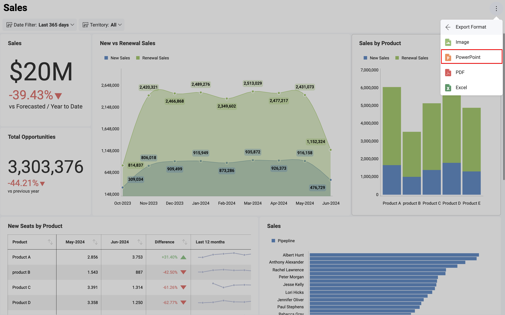
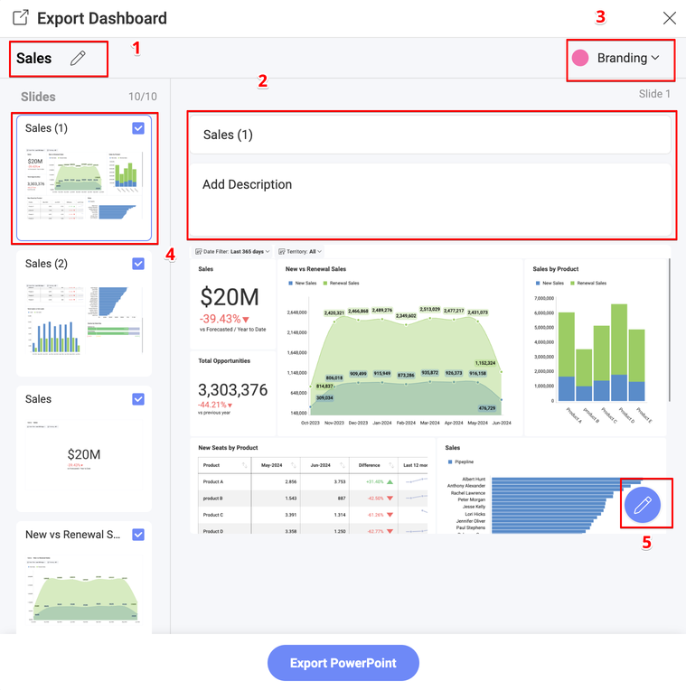

# Exporting Dashboards as PowerPoint Presentations

Analytics allows you to export your dashboard as a PowerPoint presentation.
Every visualization that is part of this dashboard will be displayed on
a separate slide of the presentation.

All the elements of the presentation are editable so that you can tailor
it to your needs.

To export a dashboard as a PowerPoint presentation, you need to:

1. Go to the dashboard *View mode* and click/tap on the overflow menu. 

2. Choose **Export** and then click/tap on **PowerPoint**. 

 

3. The *Export Dashboard* dialog will open, allowing you to set up your
presentation and annotate specific slides.

## Export Settings

In the *Export Dashboard* dialog you can manage the following settings:

1.  Change the **main title** of your PowerPoint presentation. The
    default title is your dashboard's title.

2.  Change the **slide's title**. You can also add a description in the **Add Description** box (the second box). The default slide's title is the title of
    the visualization displayed on the slide.

3.  Manage **Branding** settings options allows you to choose:

    1.  *Author*'s and their *Company*'s name - displayed in the header
        panel of the slide;

    2.  Company's *logo* displayed in the footer and *color* (the main
        color of the PowerPoint presentation) - here you can choose one
        of the following options:

          - **Analytics**

          - **User's organization/workspace** - your organization and all of
            your workspaces having their branding (logo and color) set up are
            displayed as options.

          - **Custom** - select a color and upload a *logo* image of
            your choice.

:::note
**Requirements for logo images**. The image you upload for a logo must be no bigger than **5MB** and one of the following formats: JPG, JPEG, PNG, GIF.
:::
4.  You can **manage your PowerPoint slides** by selecting a slide from
    the list to modify its title, annotate or delete it (by removing the
    tick icon in the upper right corner).

5.  **Annotate** the selected slide by clicking/tapping the *pencil*
    icon. For more information about **annotation settings**, please
    refer to [Annotating images](dashboard-export-image.md#annotating) in the *Exporting Dashboards as Images* topic.
