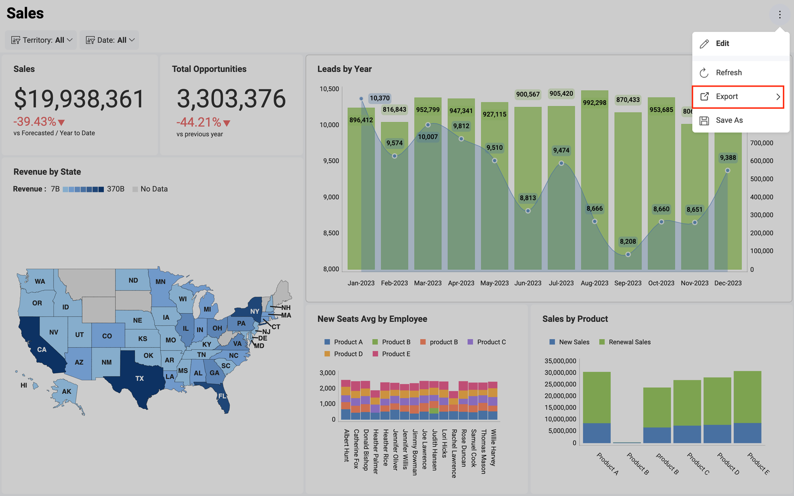
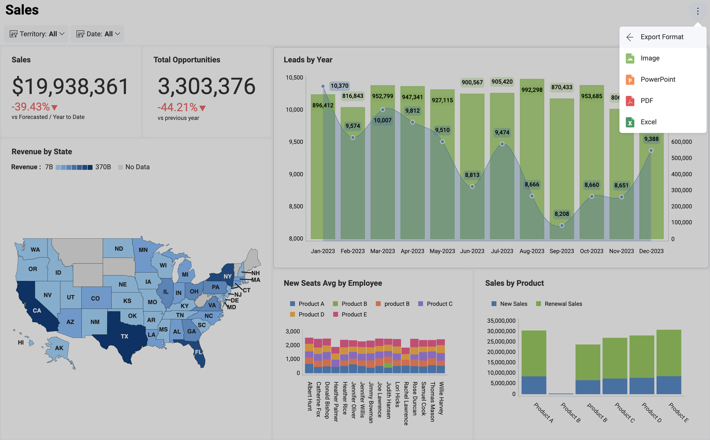

# Export Dashboards

The information displayed in dashboards will change over time as the
data changes in the data source, but there will be scenarios where you
can benefit from sharing a snapshot of the data at that specific moment
in time. For instance, to highlight an unexpected value that may provide
some business insight and requires attention right away.

In order to **access the export feature**, select the overflow button in
the top right-hand corner and click/tap *Export*.

## Export Format

You can easily export dashboards by using the available Export options.

  - [**Export Image**](dashboard-export-image.md) - export a screen capture of the entire
    dashboard or individual visualizations.

  - [**Export PowerPoint**](dashboard-export-powerpoint.md) - export your
    dashboard as a PowerPoint presentation.

  - [**Export PDF**](dashboard-export-pdf.md) - export your dashboard as a PDF
    document.

  - [**Export Excel**](dashboard-export-excel.md) - you can export the data used for your dashboards to the **Excel format** and choose if you want to also export the visualization to your spreadsheet.
