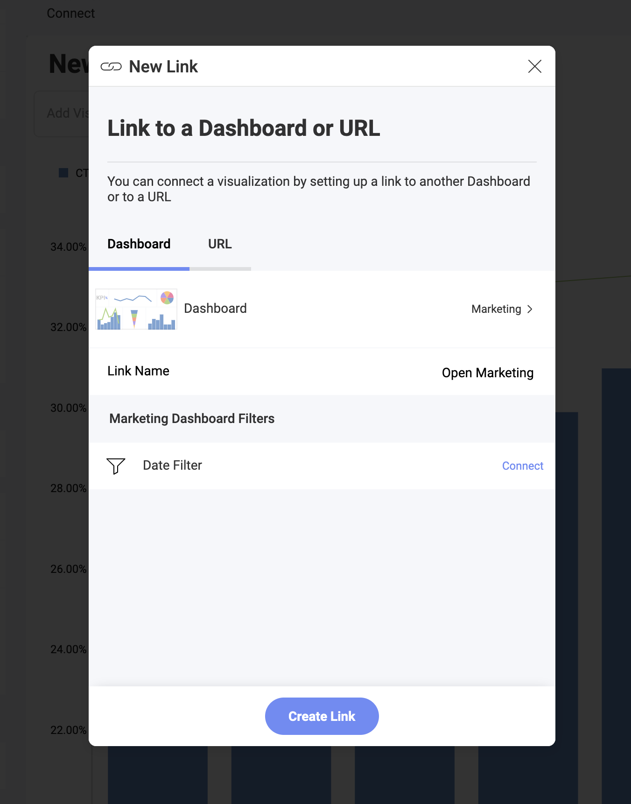
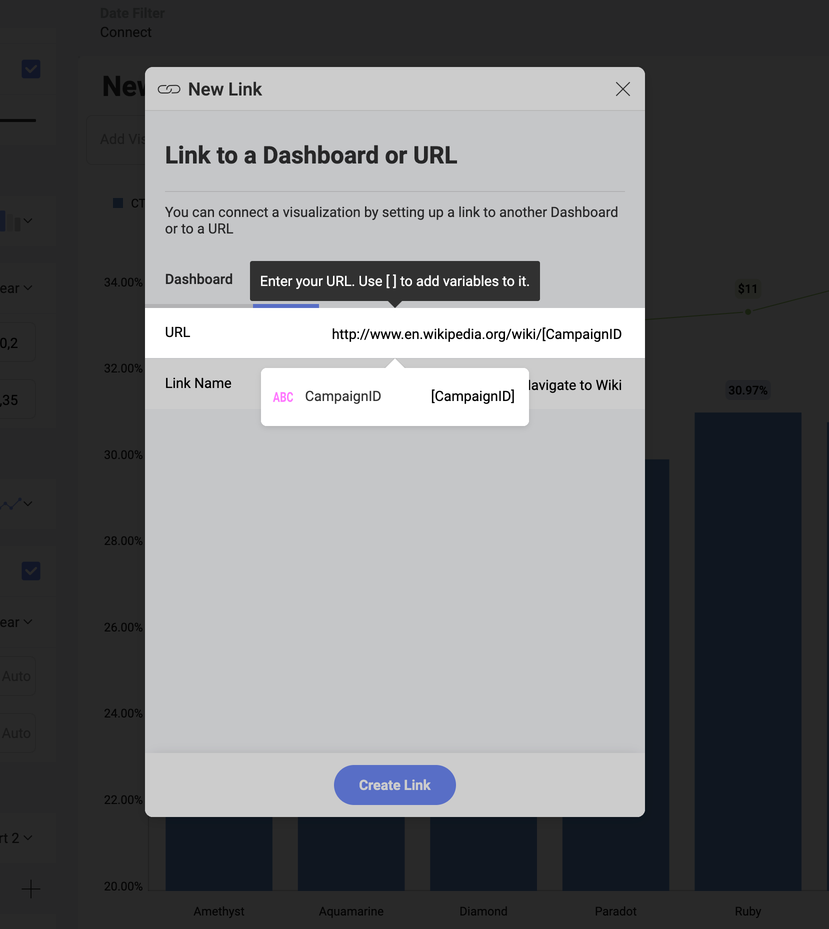
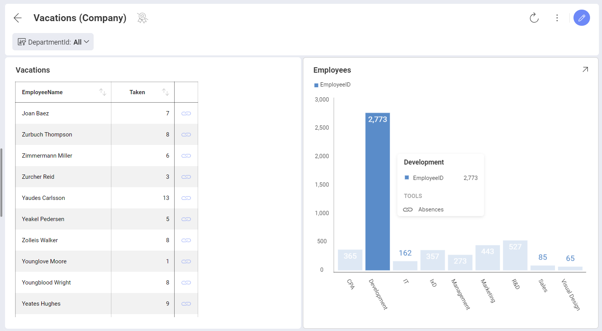

# Linking Dashboards

Reveal supports dashboard linking which allows you to connect the visualizations in a dashboard with other dashboards or URLs. Imagine you want to provide more details on the information displayed in a visualization - you can use a whole new dashboard to do so. This can be very useful in Company dashboards, for example, where you will be able to establish top-down analysis paths, where you go from a high level overview of the reality of a business to more detailed views with the specifics. 

Let's take a Company dashboard (see below) which provides key performance indicators for each area of interest in the company. Once you've opened the dashboard, you will notice the **link symbol** on one or more visualizations. 

By clicking/tapping the link symbol, you can open: 

* **Another dashboard** (shown in the screenshot below), which gives more specific information related to the visualization or a value in it.
* **A URL**, which will enable extensibility scenarios such as interacting with third-party web applications as part of the dashboard navigation. 

## Adding a Link 

To configure a link, go to the **Settings** section of the *Visualizations Editor* and click/tap the *+* in **Links**. Alternatively, you can choose **Connect this visualization to another dashboard or a URL**.

The added link will appear as a symbol on the visualization it is configured for when the dashboard is in *View Mode*.  

### Linking to Another Dashboard

Linking to another dashboard gives you the ability to jump from a specific point in one dashboard to another dashboard. This point can be a visualization or a specific value in a visualization, depending on the link trigger you chose (see more [below](#choosing-a-trigger)).

To link your dashboard to another dashboard you need to perform the steps below.  

1. **Prepare** the dashboard you are linking to. Carefully consider the relation between the two dashboards. 

  **Adding filters** in advance to the dashboard you are linking to as well as the main dashboard will allow you to connect the two dashboards by a common field. This field will play a role as a filter in the second dashboard and a measured category in the first dashboard. 

2. After preparing the dashboard you are linking to, open the main dashboard where you want to add the link. Select the visualization on which you want the link symbol to appear and open it in the *Visualization Editor*. 

3. Go to **Settings** and select the **+** in *Links* to open the **New Link** dialog: 

  

  Here you will need to configure two parameters:

  * The **Dashboard** that will be opened when the link symbol is clicked.

  * The **Link Name** which is the title the users will see if they select the grid row or chart element.

  If you have added **dashboard filters** to the target dashboard, then you will also need to connect the dashboard filters to their corresponding fields in the dataset of the visualization you are adding a link to (see below). Click **Done** and go back. 

  

4. Select the **Create Link** blue button. 

The link to the dashboard will appear under *Links* in the *Visualization Editor*. You will notice that the *Trigger* setting has also appeared. See below for more information on [choosing your trigger](#choosing-a-trigger).  

### Adding a URL 

Adding a URL is another option in the *New Link* dialog. It enables you to open the configured URL in your device’s browser. 

There are two parameters that you need to define:

  - The **URL** the visualization will point to. You will be redirected to it once the link symbol is selected.
  
  - The **Link Name**, which is the title the users will see if they select the grid row or chart element.

For URLs, you can also include **Variables** which will dynamically
construct the URL the user will be linked to based on the values in your
visualization fields. For example, let’s take a look at the following
visualization link:

The URL has been set to `http://www.en.wikipedia.org/wiki`, and in this case we selected the *variable* **CampaignID**. Therefore, users who select
the **Navigate to Wiki** link in the visualization will be redirected to:

`http://www.en.wikipedia.org/wiki/[CampaignID].htm`

Where `[CampaignID]` will vary depending on the values.

:::info **Testing the Example.**
To test how adding variables work, use the **Marketing Dashboard**. Choose a *Conversions by Campaign* visualization in it which contains the *CampaignID* data field and add the URL as shown in the screenshot. Save the visualization and in *Dashboard Edit* mode click on different parts of the funnel visualization to see how the URL you are redirected to changes. 
:::

## Choosing a Trigger

After adding your first link to the visualization, the *Trigger* appears under *Links* in *Settings*. Here you can choose between *Value is Selected* and *Visualization is Maximized* as trigger options. 
You can add as many links to a visualization as you want, but they will all have the same trigger enabled. 

### Value is Selected Trigger

If you choose this option a tooltip with the link symbol appears whenever a data item of a chart, such as columns, bar, pie slices, etc. is clicked/tapped. In the grid chart the link symbol appears in the last column on the right (see below).

If you have added a dashboard filter with the *EmployeeName* to the target dashboard, then clicking the link symbol in the grid, as shown in the screenshot above, will open another dashboard filtered by the *EmployeeName* field with the *Joan Baez* value pre-selected. This way, in the target dashboard, you will see only the analysis for the value you selected.

If a URL is linked to the selected value, then clicking/tapping the link symbol will open the URL you have added. To take the best advantage of this feature, you can also add the field to the URL as a [variable](#adding-a-url). 

### Visualization is Maximized Trigger 

If you choose this option a link symbol will appear in the upper right corner of the visualization in *Dashboard View* mode. So instead of maximizing the visualization, selecting the link symbol in the upper right corner will open another dashboard or the URL you have linked to.

