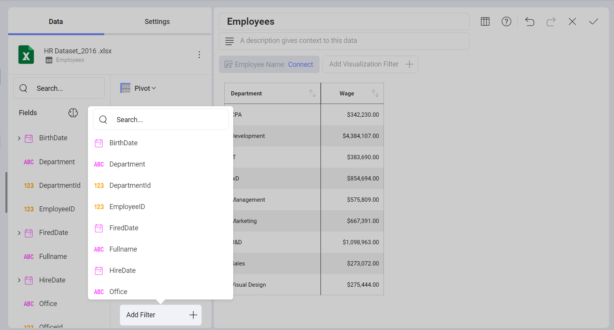
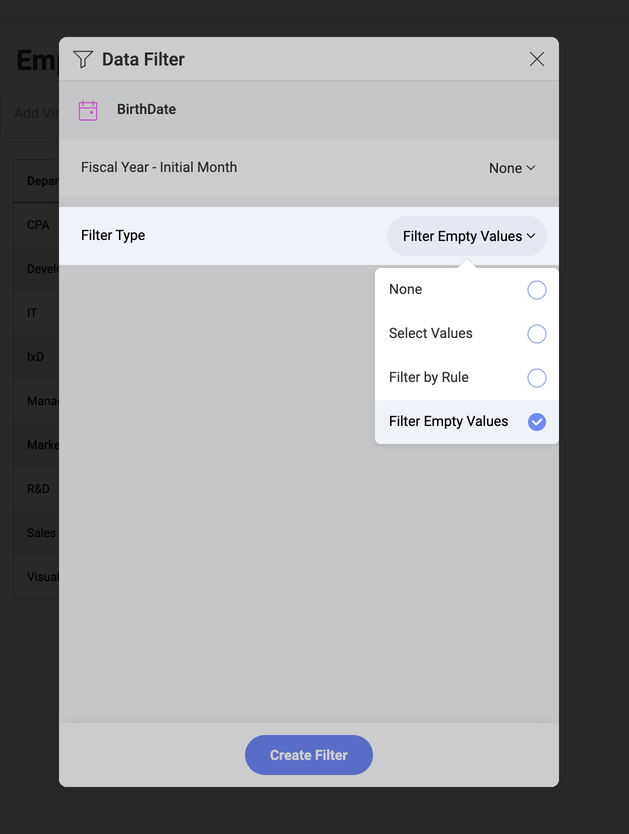
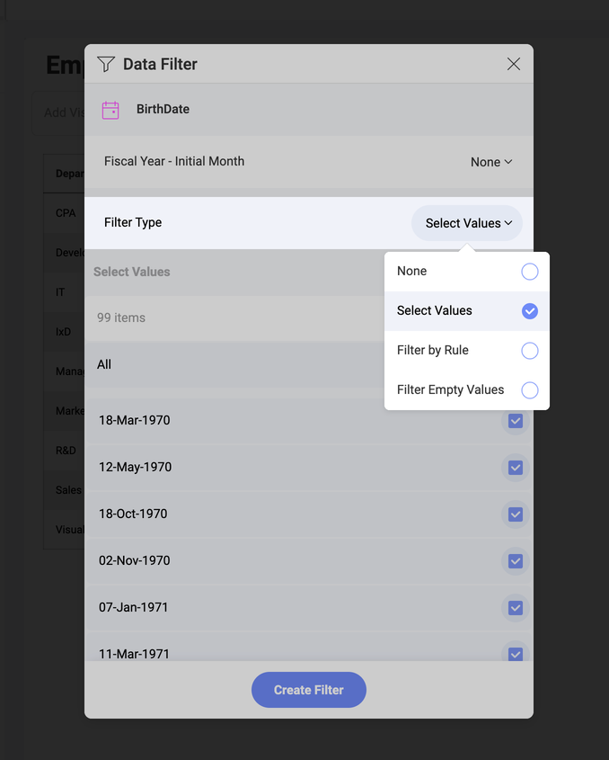
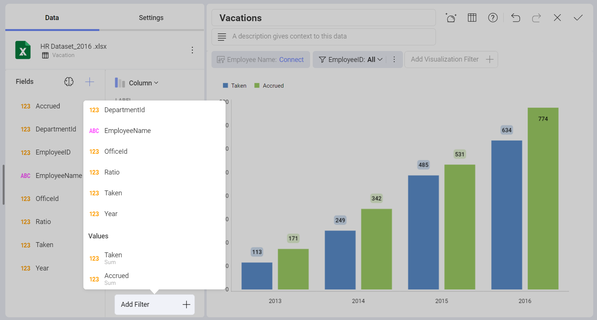

# Field Filters and Rules

You can also apply filters or rules to the fields in your dataset. In
order to do so, you will need to add a field to the **Data Filters**
placeholder in the lower section of the data editor. Then, select a field
from the dropdown menu to access the *Data Filter* window.

## Filter Empty Values

Analytics provides the ability to filter rows in the dataset that have null
or empty values on a specific column by enabling the filter empty values
configuration setting on a specific column.

## Select Values

This type of filter supports the definition of the set of values to
display for a specific field. To enable it, drag and drop a field to the
**Data Filters** placeholder.

In the *Field Settings* dialog, you will see the option to **Select
Values**. This displays the list of possible values for a column, and
allows you to select only the items you want to remain in the dataset.
Rows with values excluded by the filter aren't displayed in the
visualization.

## Filter by Rule

The **Filter by Rule** option enables the definition of more complex
rules. The available rule options change depending on the field type.

### Rules for Date Fields

Date fields include rules designed to support time-based scenarios,
changing the data range and filtering the information displayed in the
visualization.

  - Custom Date Range

  - Last Week, Month, or Year

  - Month to Date

  - Next Month, Quarter, or Year

  - Previous Month, Quarter, or Year

  - Quarter to Date

  - This Month, Quarter, or Year

  - Today

  - Year to Date

  - Yesterday

By default, when Filter by Rule is enabled on a numeric field, it is set
to "None".

### Rules for Numeric Fields

Numeric fields (such as integers, decimals, and currencies) support the
following rules:

  - Above Average

  - Above Equals Value

  - Above Value

  - Below Average

  - Below Equals Value

  - Below Value

  - Bottom Items

  - Bottom Percent

  - Top Items

  - Top Percent

By default, when Filter by Rule is enabled on a numeric field, it is set
to "None".

### Rules for String Fields

Text columns support the following type of rules:

  - Contains

  - Ends With

  - Is Equal

  - Not Contains

  - Not Equals

  - Starts With

Similarly, these rules also take one parameter: the value of the 'starts
with', or 'equals' that the rule is going to use to evaluate, and is
entered in a text box in the same position.

## Filtering Fields in Values

You can filter your *Values* by [aggreggation](https://www.slingshotapp.io/en/help/docs/analytics/data-visualizations/fields/calculated-fields/aggregation). Then this value will appear with the same aggregation in the list of fields in the **Data Filters** placeholder.

