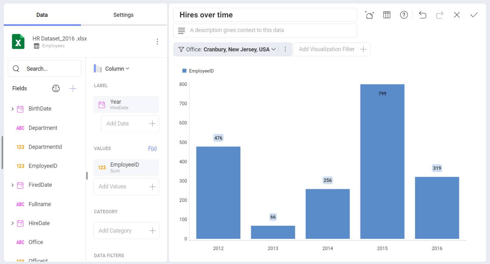

# Fields

This section describes the different options for applying transformations to the fields in your dataset. By applying filters, you can optimize the information in your fields for your business analysis. Remove any unnecessary noise, highlight the most valuable aspects and summarize information in many useful ways.

## Topics Overview

There are several field settings and filtering options:

  - Settings for [date](field-settings.md#date-fields),
    [numeric](field-settings.md#numeric-fields), and
    [string](field-settings.md#string-fields) fields, including label
    renaming, aggregation, sorting, formatting, and [conditional formatting](conditional-formatting).

  - Filters for [empty values](field-filters-rules.md#filter-empty-values).

  - Filters to [select specific values](field-filters-rules.md#select-values).

  - Filters by [Rule](field-filters-rules.md#filter-by-rule).

Field settings and rules are accessible through the [visualizations editor](/docs/user/visualization-editor.md), which is displayed automatically when a
dataset is added to the dashboard canvas.
