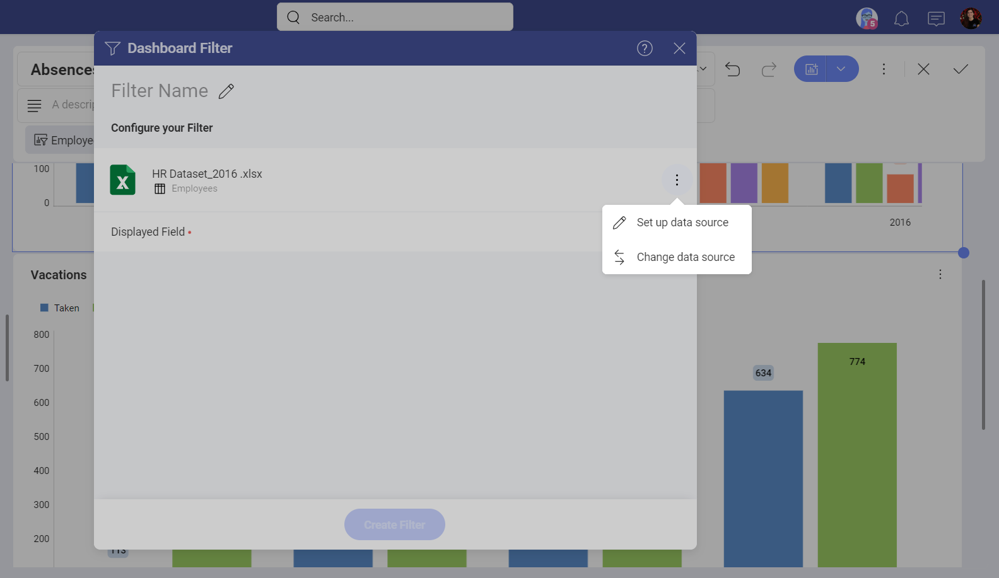
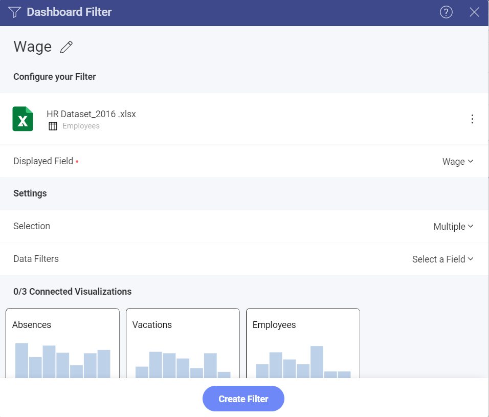
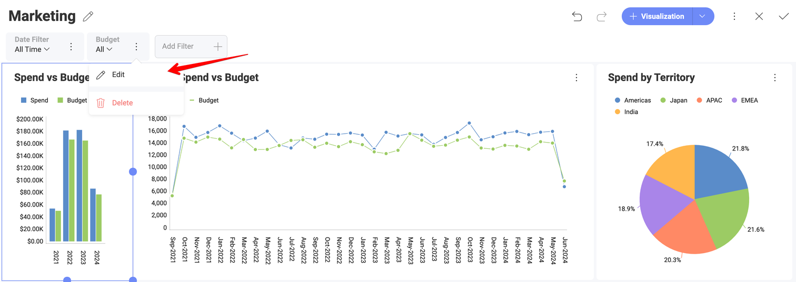
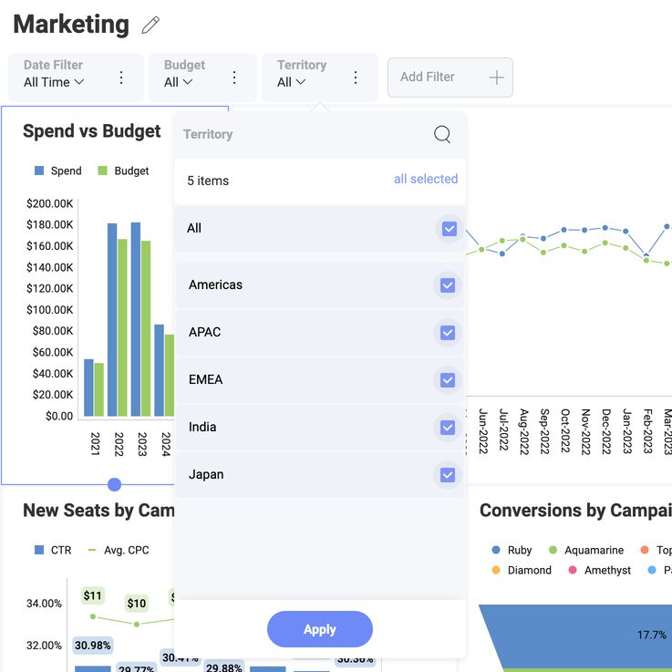
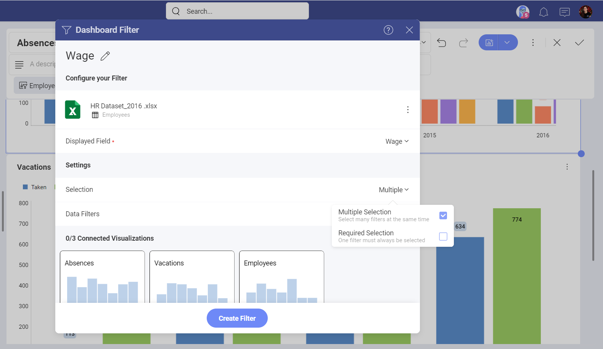
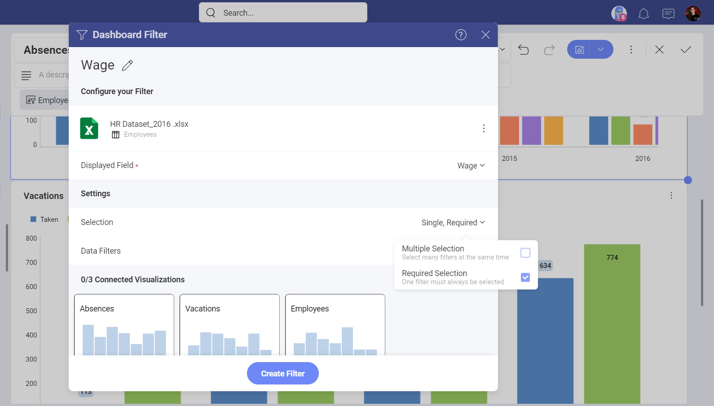
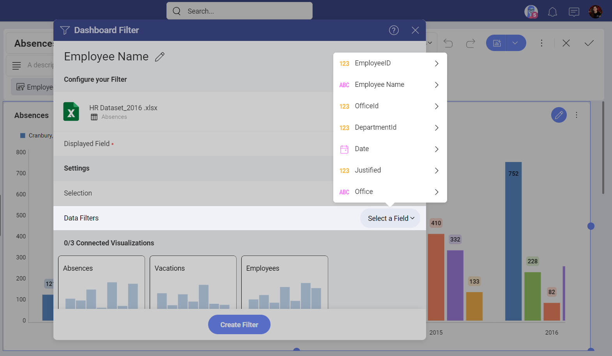
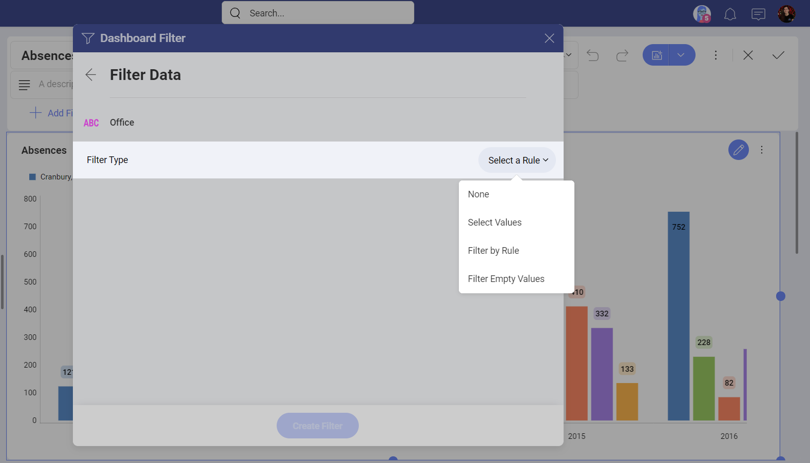
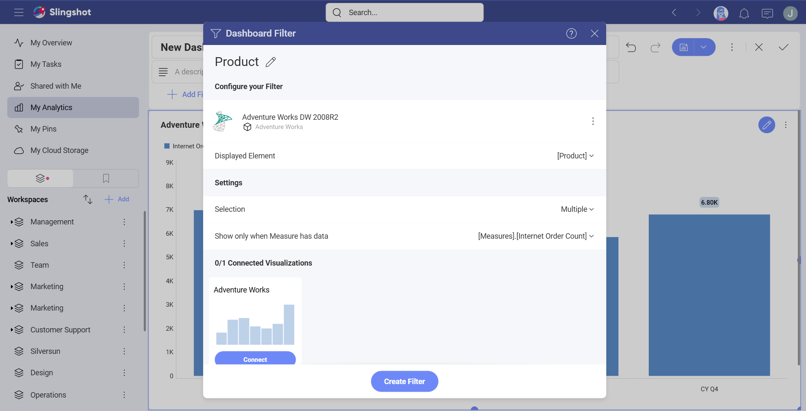

# Dashboard Filters and Their Properties

## Accessing Dashboard Filter Properties

In order to add a new dashboard filter:

1.  Go to the *Dashboard editor* and select *Add Filter* ⇒ *Add
    Dashboard Filter*.

2.  The *Dashboard Filter* menu will open. By default, the selected data
    source will be the data source used in your first visualization. You
    can configure or change it using the overflow menu next to the data
    source's name.

  

3.  Choose which dataset to use as a dashboard filter and click/tap on
    *Select Data*.

## Filter Settings Overview

You will be able to change the following settings for the filter:

- Title. The title for the dashboard filter, which will be displayed right under the dashboard title. By default, this is the name of the field that will be used as a filter.

- <a href="#displayed-field">Displayed Field/Element</a>. The field in your dataset, which will be used as a dashboard filter.

- Selection. This setting allows you to configure: <a href="#multiple-selection">Multiple Selection</a> (more than one value can be selected at a time) and/or <a href="#required-selection">Required Selection</a> (at least one value must always be selected).

- <a href="#data-filters">Data Filters</a>. This setting allows you to apply any <a href="#">field filters and rules</a> to the data source used for the dashboard filter.

- <a href="filters-connecting.md">Connected Visualizations</a>. Whether your dashboard will be connected to any visualization or not.

## Displayed Field

>[!NOTE] For dashboard filters using data from *Microsoft Analysis Services* and *Google Analytics*, this setting is named **Displayed Element**.

The *Displayed Field/Element* setting specifies the dataset field that will be used to display
the values in the *Dashboard Filters*. Listed values will not be repeated
even if they appear multiple times in the original dataset.

You can change the displayed column in *Edit mode* by selecting the *Edit* button in the overflow menu next to the dashboard filter name.

## Multiple Selection

Analytics supports the selection of multiple dashboard filter values
simultaneously. This is meant to enable side by side comparison between different elements in a collection. For instance, in the *HR Dashboard* dashboard you can compare the hires and absences over time of different
offices by enabling multiple selection.

In order to **enable "Multiple Selection"**, you must switch the
dashboard to *Edit* mode ⇒ choose *Edit* from the overflow menu of a
dashboard filter ⇒ *Selection* ⇒ tick *Multiple Selection* checkbox.

## Required Selection

Dashboard filters can be configured to require a selected option or not.
By default, selections are not required. Making selections optional
allows the user to uncheck all dashboard filter values, which removes
the filter from the performed query. The query retrieves all data from
the data source, and *No Selection* is displayed in the dashboard
filters row.

In order to **enable "Required Selection"**, you must switch the
dashboard to *Edit* mode ⇒ choose *Edit* from the overflow menu of a
dashboard filter ⇒ *Selection* ⇒ tick *Required Selection* checkbox.

## Data Filters

You can also apply filters to the fields in the dataset displayed in the
Dashboard Filter. This allows you to filter out null or empty values on
a specific field (empty values filter). You can also select specific values, or add
rules to your field in order to change the
options depending on the field type. For more information, visit the
**field filters and rules** section.

For example, if you use the *Fullname* field to filter the data in
your *HR Dashboard*, the *Dashboard filter* will show a list of all
employees in all offices of the company:

If you want your filter list to contain only employees working in a particular office, e.g.
*London, UK*, apply a data filter as shown below.

### Applying a data filter to your dashboard filter

To apply field filters and rules to the data source used as a dashboard
filter and have the dashboard filter show only the employees in the
*London, UK* office (as in the example above), follow these steps:

1.  Go to *Data Filters* in Dashboard Filter settings.

2.  Select *Employee name* for the *Displayed Field* property.

3.  Click/tap on *Select a Field* and choose *Office* from the list.

  

4.  In the following dialog, select the filter type you want to apply
    (choose *Select Values* for the purposes of this example):

  

5.  Choose *London, UK* from the list and click/tap on the *Create Filter*
    button.

## Dashboard Filters Using Microsoft Analysis Data

There are some specifics when configuring an MS Analysis dashboard filter.

 1. **Displayed Element** - you can select a *Dimension*, *Hierarchy* or *Level* data field to display dashboard filter values, but not a *Measure* data field. 

 2. (*Optional*) **Show only when Measure has data** - select a *Measure* to limit the dashboard filter list to values that contain data for a certain Measure.

Look at the screenshot above. In this example, the *Product* Dimension is selected as a *Displayed element*, so the dashboard filter will show a list of products (e.g. bikes, clothes, etc.). 
By additionally selecting the *Internet orders* Measure for *Show only when Measure has data* field, you will exclude dashboard filter values, which do not contain information about the *Internet orders* Measure. So, if there are no internet orders of the product bike, *bike* will not show up as a possible selection in the *Dashboard Filters* list.

## Next Steps 

Now that you have already created your dashboard filter, you will need
to **connect it to the visualizations** you want to apply filtering to.
To learn more about this, please read [Connecting Dashboard Filters to a Visualization](filters-connecting.md).

