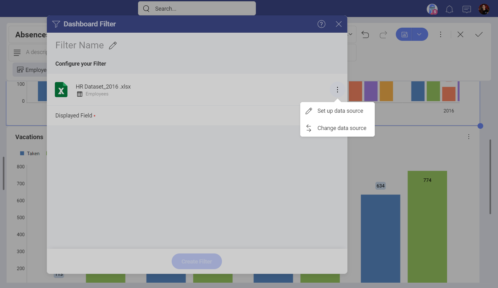
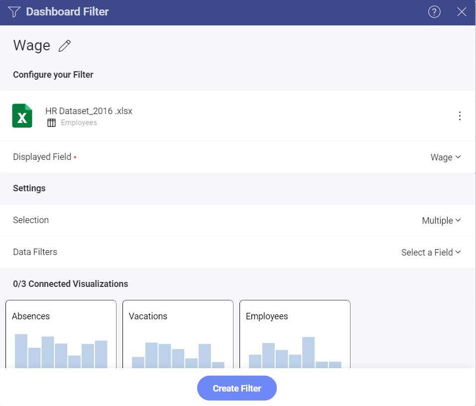
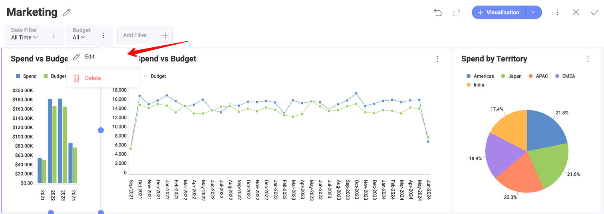
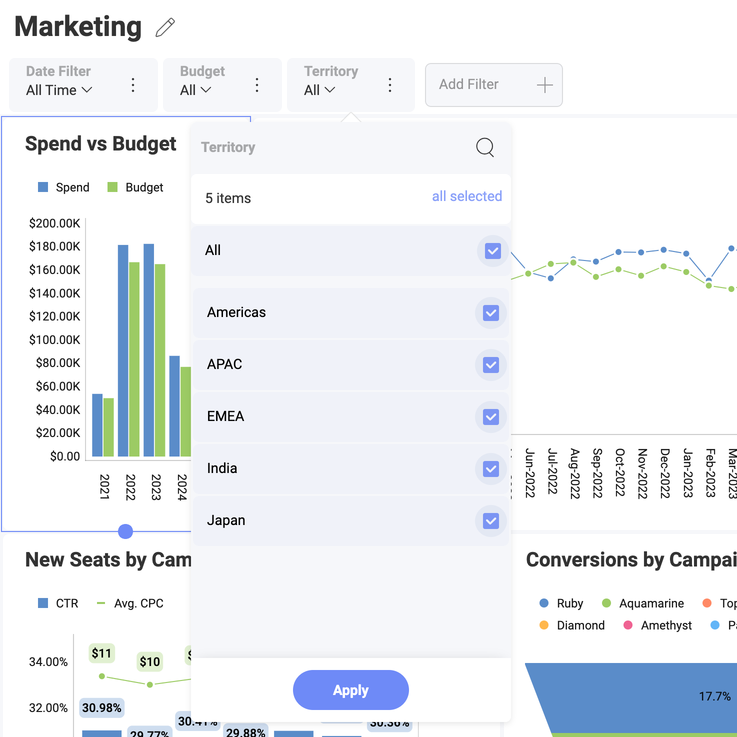
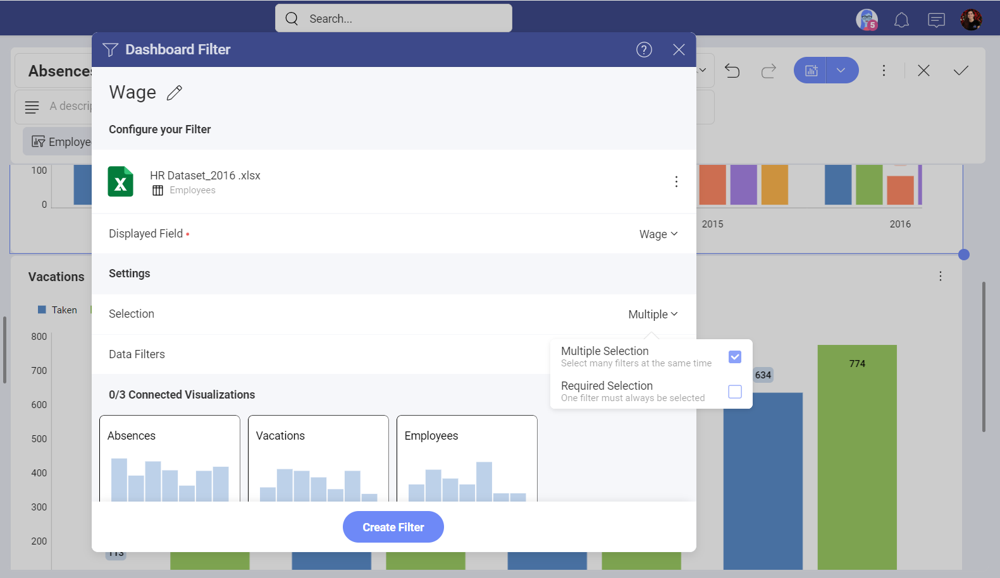
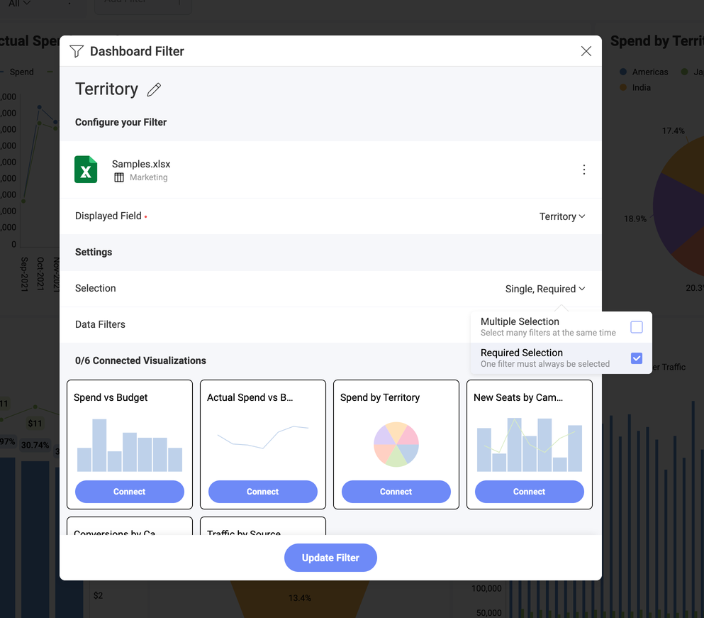
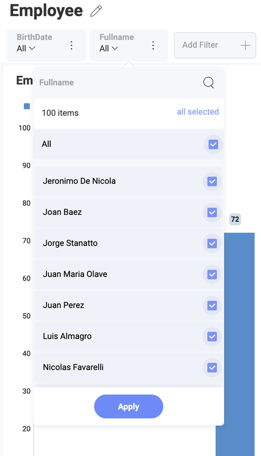
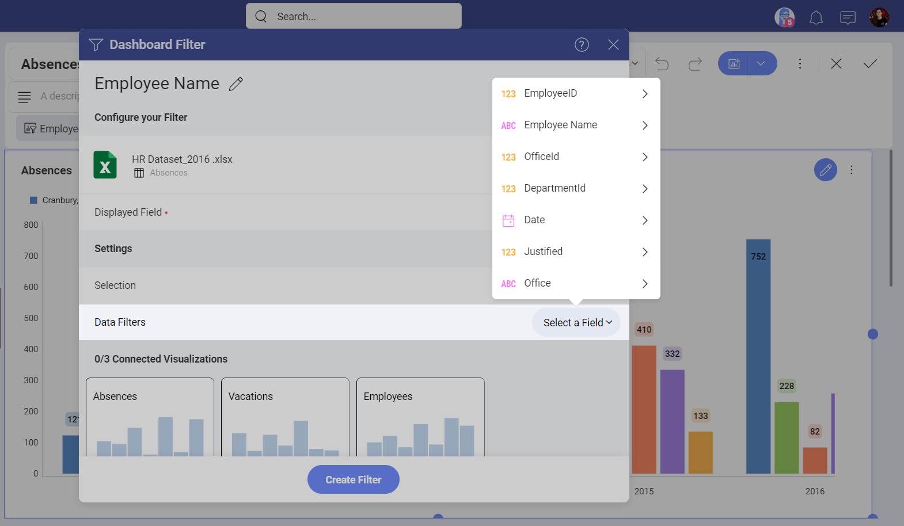
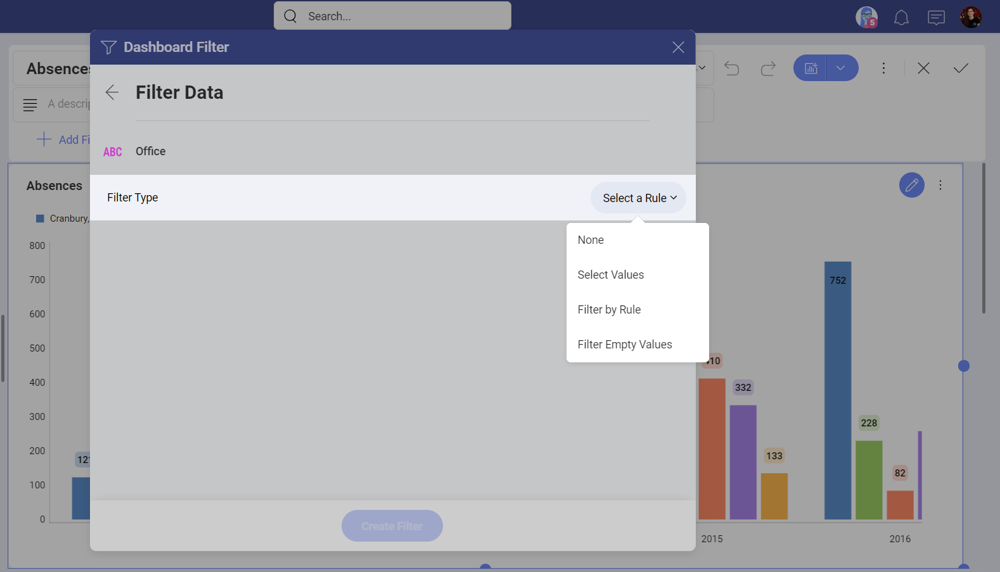

# Dashboard Filters and Their Properties

## Accessing Dashboard Filter Properties

In order to add a new dashboard filter:

1.  Go to the *Dashboard editor* and select *Add Filter* ⇒ *Add
    Dashboard Filter*.

2.  The *Dashboard Filter* menu will open. By default, the selected data
    source will be the data source used in your first visualization. You
    can configure or change it using the overflow menu next to the data
    source's name.

  

3.  Choose which dataset to use as a dashboard filter and click/tap on
    *Select Data*.

## Filter Settings Overview

You will be able to change the following settings for the filter:

- **Title:** The title for the dashboard filter, which will be displayed right under the dashboard title. By default, this is the name of the field that will be used as a filter.

- [**Displayed Field/Element:**](#displayed-field) The field in your dataset, which will be used as a dashboard filter.

- **Selection:** This setting allows you to configure: [Multiple Selection](#multiple-selection) (more than one value can be selected at a time) and/or [Required Selection](#required-selection) (at least one value must always be selected).

- [**Data Filters:**](#data-filters) This setting allows you to apply any field filters and rules to the data source used for the dashboard filter.

- [**Hierarchy:**](#hierarchy) This setting lets you turn the filter into an expandable, drill-down tree, when the underlying data source supports it.

- [**Connected Visualizations:**](filters-connecting.md) Whether your dashboard will be connected to any visualization or not.

## Displayed Field

:::note
For dashboard filters using data from *Microsoft Analysis Services* and *Google Analytics*, this setting is named **Displayed Element**.
:::

The *Displayed Field/Element* setting specifies the dataset field that will be used to display
the values in the *Dashboard Filters*. Listed values will not be repeated
even if they appear multiple times in the original dataset.

You can change the displayed column in *Edit mode* by selecting the *Edit* button in the overflow menu next to the dashboard filter name.

## Multiple Selection

Reveal supports the selection of multiple dashboard filter values
simultaneously. This is meant to enable side by side comparison between different elements in a collection. For instance, in the *HR Dashboard* dashboard you can compare the hires and absences over time of different
offices by enabling multiple selection.

In order to **enable "Multiple Selection"**, you must switch the
dashboard to *Edit* mode ⇒ choose *Edit* from the overflow menu of a
dashboard filter ⇒ *Selection* ⇒ tick *Multiple Selection* checkbox.

## Required Selection

Dashboard filters can be configured to require a selected option or not.
By default, selections are not required. Making selections optional
allows the user to uncheck all dashboard filter values, which removes
the filter from the performed query. The query retrieves all data from
the data source, and *No Selection* is displayed in the dashboard
filters row.

In order to **enable "Required Selection"**, you must switch the
dashboard to *Edit* mode ⇒ choose *Edit* from the overflow menu of a
dashboard filter ⇒ *Selection* ⇒ tick *Required Selection* checkbox.

## Data Filters

You can also apply filters to the fields in the dataset displayed in the
Dashboard Filter. This allows you to filter out null or empty values on
a specific field (empty values filter). You can also select specific values, or add
rules to your field in order to change the
options depending on the field type. For more information, visit the
**field filters and rules** section.

For example, if you use the *Fullname* field to filter the data in
your *HR Dashboard*, the *Dashboard filter* will show a list of all
employees in all offices of the company:

If you want your filter list to contain only employees working in a particular office, e.g.
*London, UK*, apply a data filter as shown below.

### Applying a data filter to your dashboard filter

To apply field filters and rules to the data source used as a dashboard
filter and have the dashboard filter show only the employees in the
*London, UK* office (as in the example above), follow these steps:

1.  Go to *Data Filters* in Dashboard Filter settings.

2.  Select *Employee name* for the *Displayed Field* property.

3.  Click/tap on *Select a Field* and choose *Office* from the list.

  

4.  In the following dialog, select the filter type you want to apply
    (choose *Select Values* for the purposes of this example):

  

5.  Choose *London, UK* from the list and click/tap on the *Create Filter*
    button.

## Hierarchy

Some dashboard filters can be turned into hierarchical filters, which display their values as an expandable tree instead of a flat list, letting you drill down level by level (for example *Category* ⇒ *Subcategory* ⇒ *Product*) instead of picking from one long list.

There are two ways a dashboard filter can become hierarchical, depending on its data source:

  - **OLAP data sources** (such as Microsoft Analysis Services): this happens automatically. When you select the field for the filter, choosing a whole dimension in the schema browser instead of one specific level makes Reveal build the filter as a hierarchy, using that dimension's own levels. There is no separate setting to turn on.

  - **Data sources with parameters** (stored procedures in SQL-based connectors, REST services, and OData functions or actions): when your dashboard filter is built from one of these, its settings panel will show a *Hierarchy* section. Turn on the **Enable Hierarchy** toggle, then map one of the data source's parameters to a field in your dataset. This tells Reveal which field's value to send to the data source whenever you expand a node, so it can fetch that node's children.

Only a data source that itself takes input parameters can offer the *Hierarchy* option. In practice, this means:

  - On SQL-based connectors (such as MS SQL Server, PostgreSQL, MySQL, Oracle, and others), only a stored procedure that takes input parameters qualifies. Regular tables or views will never show the *Hierarchy* option, even from the same connection.

  - For a REST service, it depends on whether the endpoint's URL contains placeholder segments, such as `.../orders/{customerId}`. A URL without placeholders has nothing to map.

  - For OData, only a function or action that declares parameters qualifies, not a plain entity set.

:::note
- Not every parameter needs to be mapped to a field. A parameter can also be given a fixed value instead. You only need to map the parameter(s) needed to identify the node whose children you want to fetch.

- Hierarchical filters can cascade with other filters using the same rule as regular dashboard filters (see [Cascading Filters](filters-dashboard.md#cascading-filters)), meaning they need to point to the same underlying data item. Because levels load on demand though, a cascading update can only affect the levels that are already expanded. Collapsed branches pick up the change the next time they are expanded.

- Searching in a hierarchical filter only looks within the level that is currently visible, not the whole hierarchy, since deeper levels may not be loaded yet.
:::

## Next Steps 

Now that you have already created your dashboard filter, you will need
to **connect it to the visualizations** you want to apply filtering to.
To learn more about this, please read [Connecting Dashboard Filters to a Visualization](filters-connecting.md).

