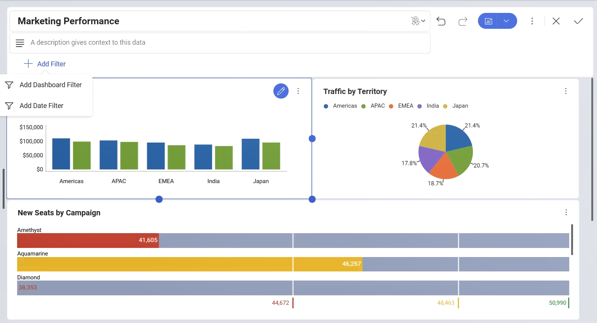
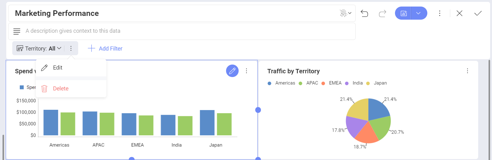
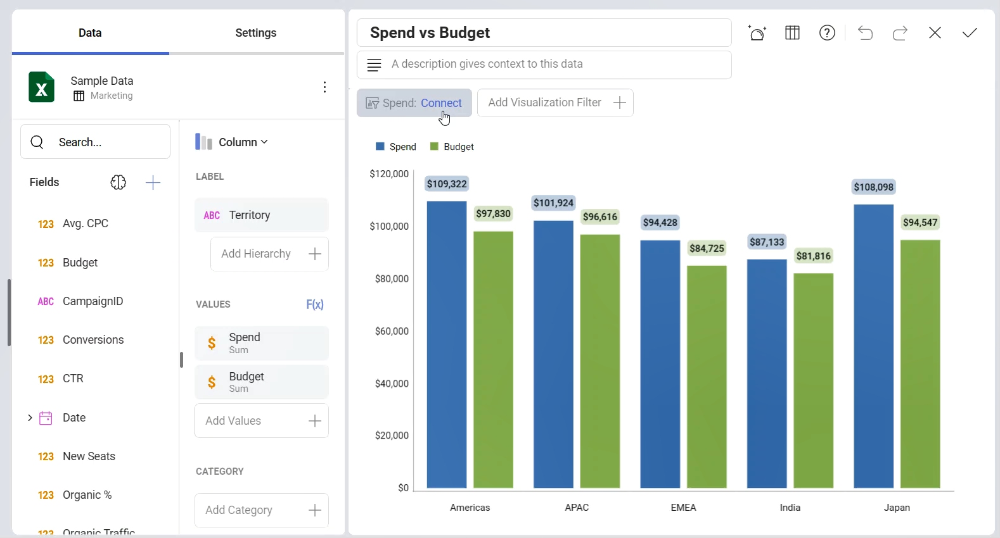
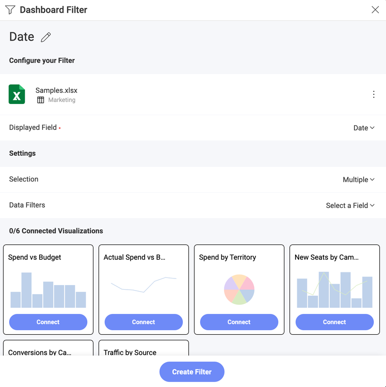

# Dashboard Filters

The dashboard filters dataset is defined by entering *Dashboard edit*
mode. To add a new dataset, just select the *Add Filter* button.

This will result in the display of a list with the possible dashboard
filters to be applied. You can choose between:

  - **Adding a Dashboard Filter**. This option will allow you to choose
    information from a data source, after which you can bind your filter
    to each of the visualizations in the dashboard.

  - **Adding a Date Filter**. This option will allow you to choose a
    fixed range or customize it to show only a specific date range.

To remove a dataset from the dashboard filters list, just select the
overflow button next to the dashboard filter and select **Delete**.

## Dashboard Filters and the Visualization Editor

Once there is at least one Dashboard Filter or Date filter defined in the Dashboard
Editor, you will be able to bind the data in that Dashboard Filter or the Date filter to a
visualization by selecting **Connect** under the filter's name. 

Alternatively, you can connect the data in the *Date filter* dialog or in the *Dashboard filter* dialog.

For more information on the binding functionality, please refer to
[Connecting Dashboard Filters to a Visualization](filters-connecting.md).
