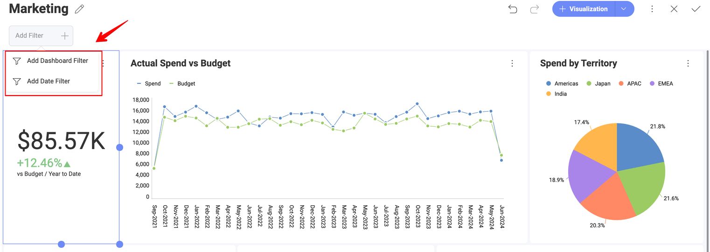
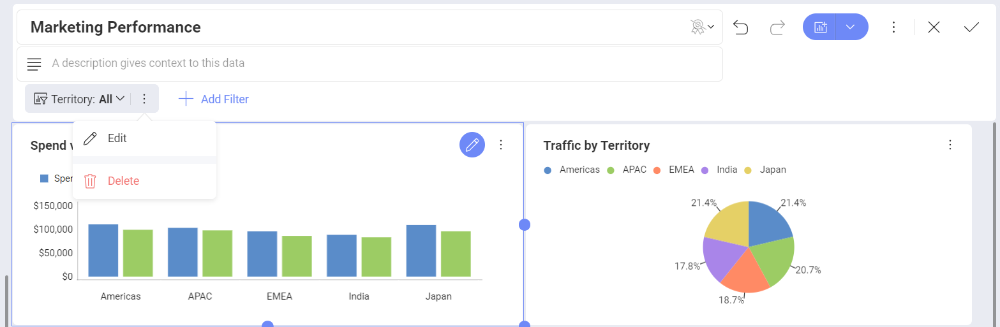
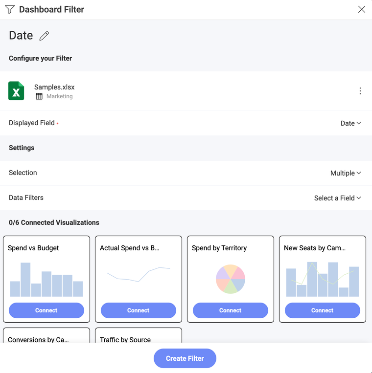

# Dashboard Filters

The dashboard filters dataset is defined by entering *Dashboard edit*
mode. To add a new dataset, just select the *Add Filter* button.

This will result in the display of a list with the possible dashboard
filters to be applied. You can choose between:

  - **Adding a Dashboard Filter**. This option will allow you to choose
    information from a data source, after which you can bind your filter
    to each of the visualizations in the dashboard.

  - **Adding a Date Filter**. This option will allow you to choose a
    fixed range or customize it to show only a specific date range.

To remove a dataset from the dashboard filters list, just select the
overflow button next to the dashboard filter and select **Delete**.

## Dashboard Filters and the Visualization Editor

Once there is at least one Dashboard Filter or Date filter defined in the Dashboard
Editor, you will be able to bind the data in that Dashboard Filter or the Date filter to a
visualization by selecting **Connect** under the filter's name. 

Alternatively, you can connect the data in the *Date filter* dialog or in the *Dashboard filter* dialog.

For more information on the binding functionality, please refer to
[Connecting Dashboard Filters to a Visualization](filters-connecting.md).

## Cascading Filters

Dashboard filters can *cascade*: selecting a value in one filter can automatically narrow down the list of values offered by another filter that comes after it in the dashboard filters list.

For instance, if your dashboard has a *Country* filter followed by a *City* filter, selecting *Germany* in *Country* will make the *City* filter only offer German cities instead of every city in the dataset.

Cascading is automatic. There is no setting to turn it on or to link two filters together, but it only happens when both of the following are true:

  - The filter being narrowed down (*City* in the example above) comes **after** the filter that was changed, in the dashboard filters list. Order matters, and it only applies in that direction: a filter never cascades into one that comes before it.

  - Both filters are built directly from the exact same data item. If *Country* is built from a *Countries* table and *City* is built from a different *Orders* table, the two filters will not cascade, even if *Orders* has a country column that could logically link the two, and even if a visualization on the dashboard blends both tables together. Blending tables for a visualization's data does not extend to the dashboard filters. Filter cascading only looks at whether both filters point to the same underlying data item, not at how any visualization combines its data.

If nothing is selected in the filter that changed, the dependent filter simply goes back to showing its full, unfiltered list of values.

:::note
This is a different feature from cascading between *Visualization Quick Filters*, which is simpler since those filters always share the same visualization dataset. See [Cascading Filters](filters-visualization.md#cascading-filters) in Visualization Quick Filters.
:::
