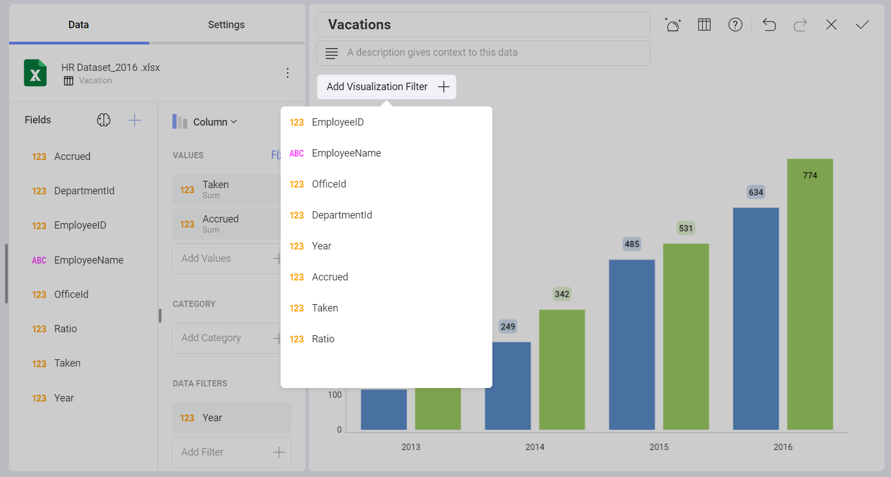
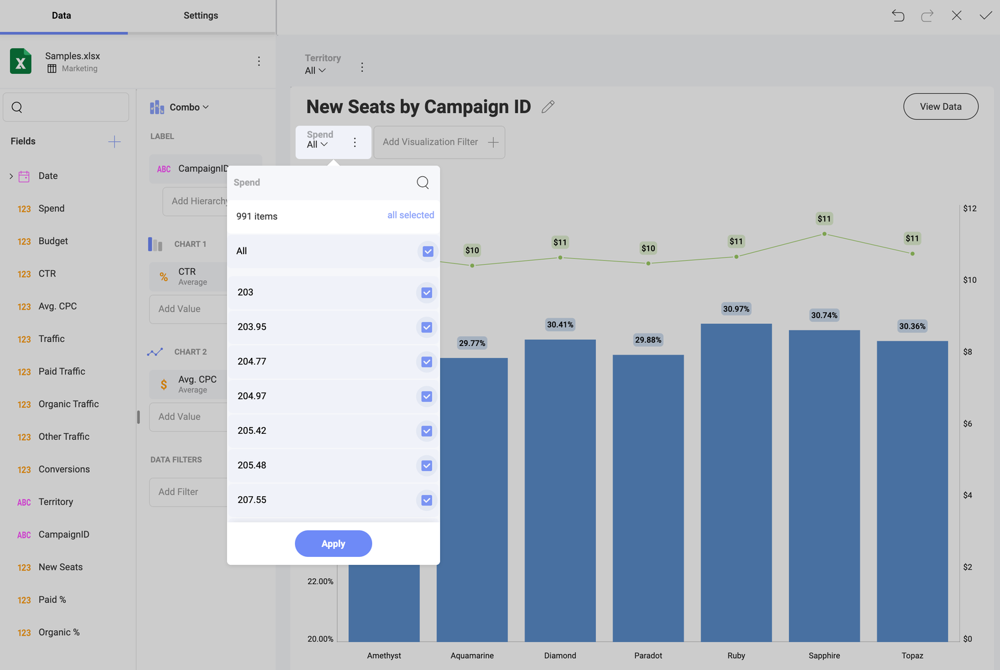
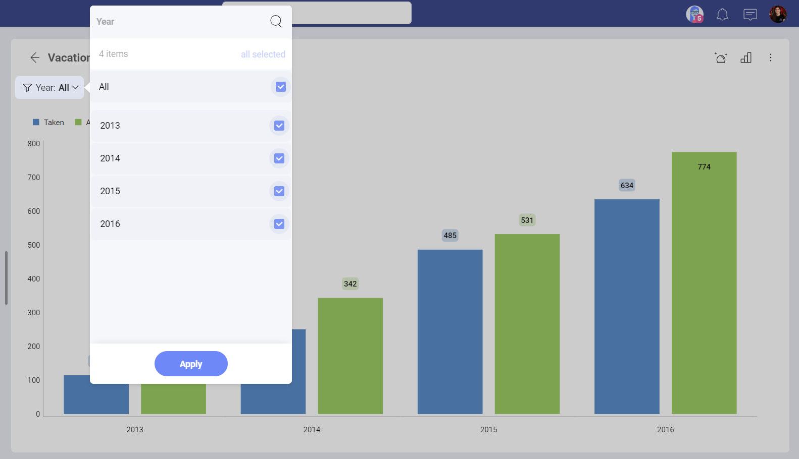
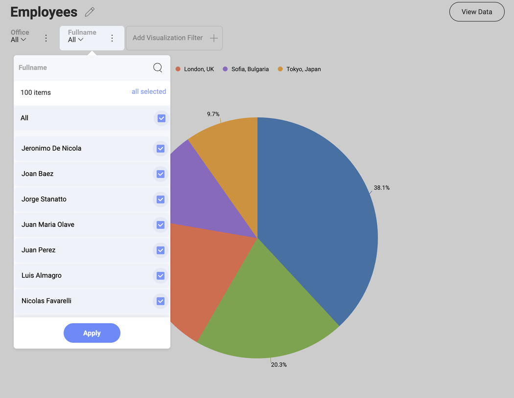
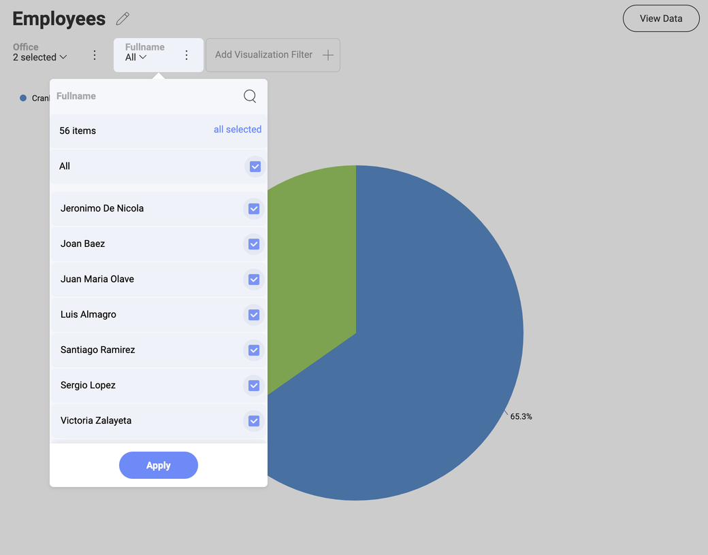

# Visualization Quick Filters

At a visualization level, you can also apply "quick" filters, which
allow you to dynamically filter the visualization contents as the quick
filter selection changes. These become part of the dashboard definition
and can't be modified by consumers of the dashboard.

In order to define a quick filter, select the **Add a Visualization Filter** button on top of your visualization in the Visualization
Editor:

The filter options displayed in the Visualization Filters area depend on
the data type of the field. There are three different filter dialogs:
text, numeric and date fields. Once created, the quick filter will be
displayed on top of your visualization in the Visualization Editor.

When the visualization is maximized in Dashboard View mode, you will see
it under the visualization's title.

As with [Dashboard Filters](filters-dashboard.md), this enables a dynamic
filtering of the visualization contents as the quick filter selection
changes.

## Cascading Filters

The list of possible values displayed to select from in Quick Filters
will be filtered based on previous Quick Filter selections. Fields on
the left take precedence and determine the list of possible values on
filters to the right.

For instance, in the example below, the *State* filter was created
first, and the *County* filter was created after that one. After
selecting **Colorado** as a *State*, the *County*
list was the following:

However, if you select **Arkansas** instead, the list of
*County* will be a different one.

