# Creating Gauge Visualizations

In this tutorial, you will learn how to create *Gauge* visualizations
using a sample spreadsheet.

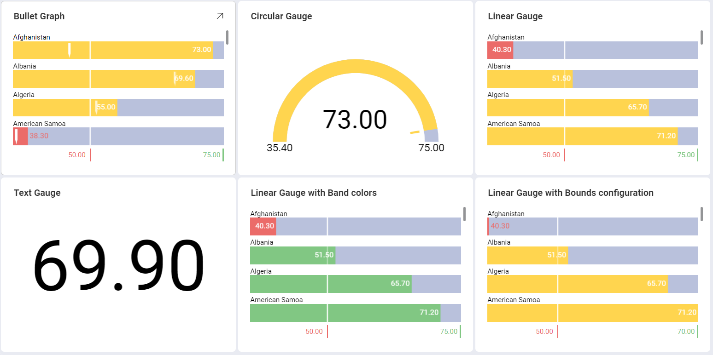

## Key Concepts

There are two different layouts to choose from when using gauge charts:

  - **Bounds Configuration**. The bounds configuration for gauges covers
    the lowest and highest possible values in your gauges. It is usually
    set to the lowest value in your data source by default, but you can
    change it to exclude specific data.

  - **Bands Configuration**. The bands configuration allows you to
    establish three different ranges for your information (Higher than,
    between, and Less than). You can override the default values with
    ranges tailored to your data source.

## Sample Data Source

For this tutorial, you will use the *Gauge Views* sheet in the <a href="/data/Reveal_Visualization_Tutorials.xlsx" download>Reveal Visualization Tutorials</a>.

## Creating a Linear Gauge

1. Choose **Edit** in overflow menu.
   
   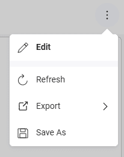

2. Select the **+ Visualization** button in the top right-hand corner.

   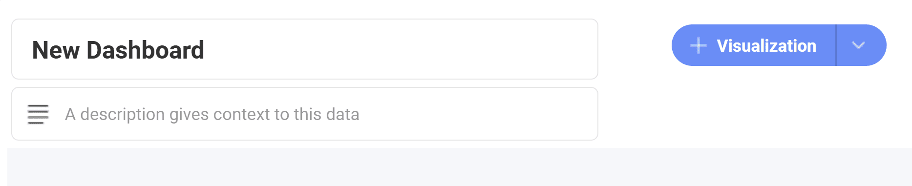                                      

3. Select your data source from the list of data sources.

   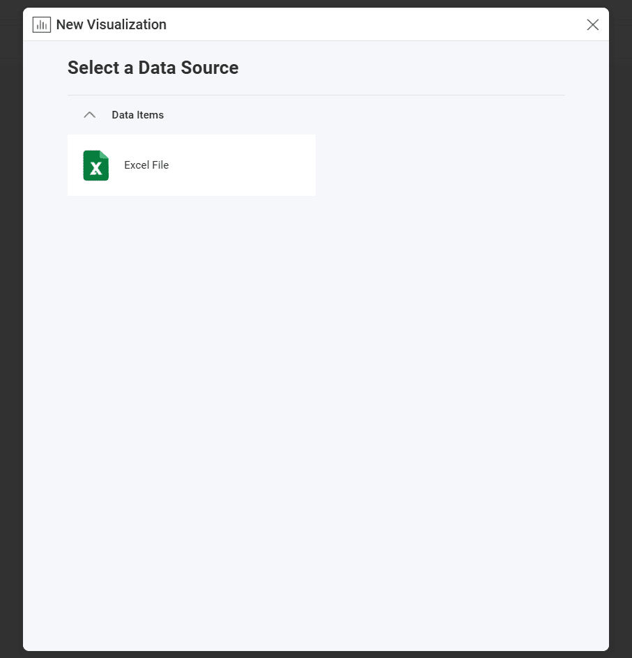
         
4. Choose the **Gauge Views** sheet.
  
   
         
5. Open the *Visualization Picker* and select the **Linear** visualization. By default, the visualization type will be set to *Column*. 

   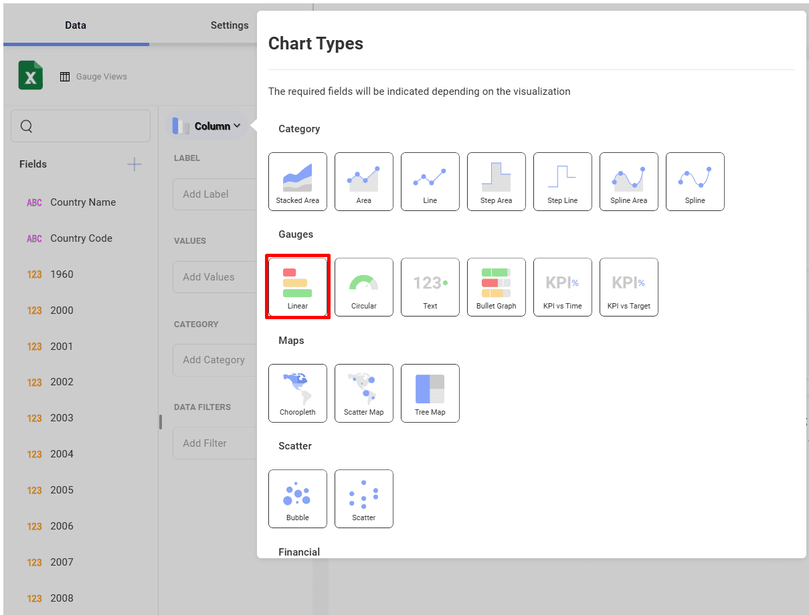

6. This linear gauge, for example, will display *Life expectancy* per *Country*. Drag and drop the *Country Name* field to **Label** and one of the *Year* fields into **Value**.
  
   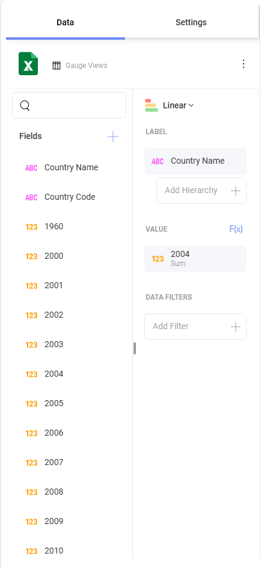                         

## Creating a Circular Gauge

1. Choose **Edit** in overflow menu.
   
   

2. Select the **+ Visualization** button in the top right-hand corner.

                                         

3. Select your data source from the list of data sources.

                                          

4. Choose the **Gauge Views** sheet.
  
   
         
5. Open the *Visualization Picker* and select the **Circular** visualization. By default, the visualization type will be set to *Column*. 

   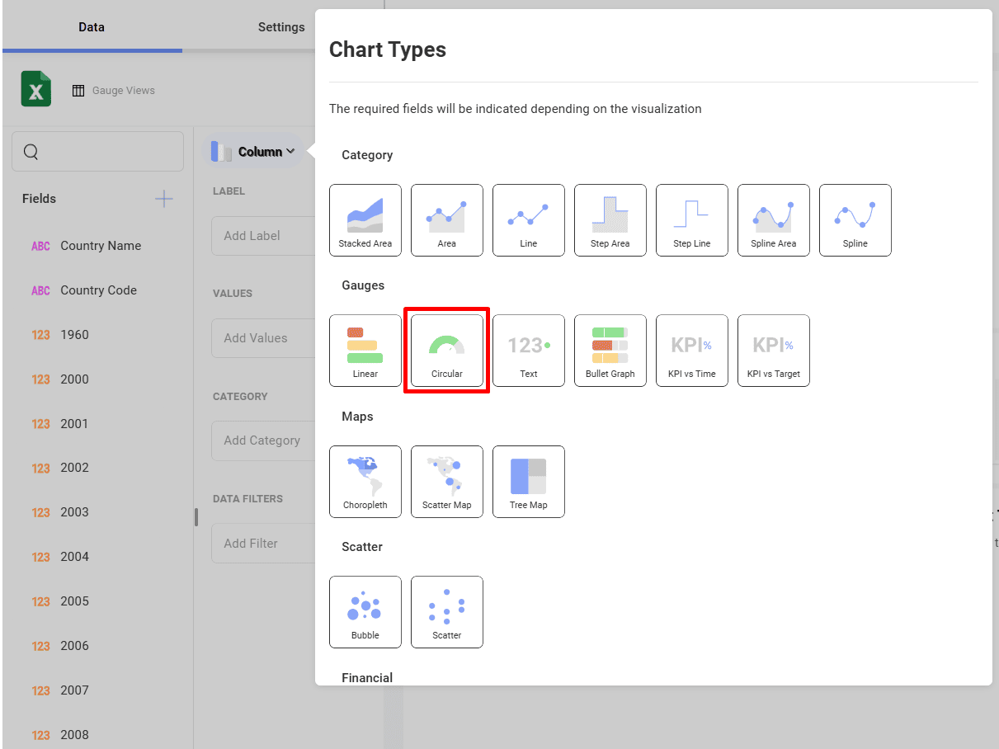

6. This linear gauge, for example, will display *Life expectancy* per *Country*. Drag and drop the *Country Name* field to **Label** and one of the *Year* fields into **Value**.
  
    

Circular Gauges are particularly useful to show average values as well
as sum of values. In order to change the aggregation for the field
displayed in Values:

|                                              |                                                                            |                                                                                           |
| -------------------------------------------- | -------------------------------------------------------------------------- | ----------------------------------------------------------------------------------------- |
| 1\. **Access Field Settings for your Value** | 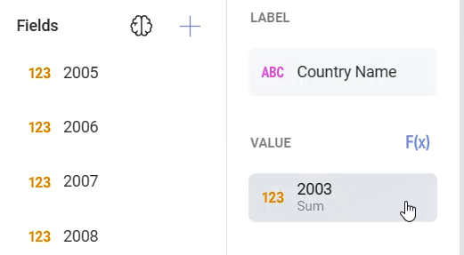 | Select the field in **Value** to access                                                  |
| 2\. **Choose a different Aggregation**       | 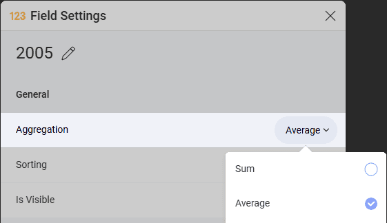         | Expand the **Aggregation** dropdown and select a different option (for example, Average). |

## Creating a Text Gauge

1. Choose **Edit** in overflow menu.
   
   

2. Select the **+ Visualization** button in the top right-hand corner.

                                         

3. Select your data source from the list of data sources.

                                          

4. Choose the **Gauge Views** sheet.
  
   
         
5. Open the *Visualization Picker* and select the **Text** visualization. By default, the visualization type will be set to *Column*. 

   

6. This text gauge, for example, will display life expectancy per Country. Drag and drop one of the year fields into **Values**, and then the *Country Name* field into **Data Filters**. Then, select the specific country you want by selecting the field. 

   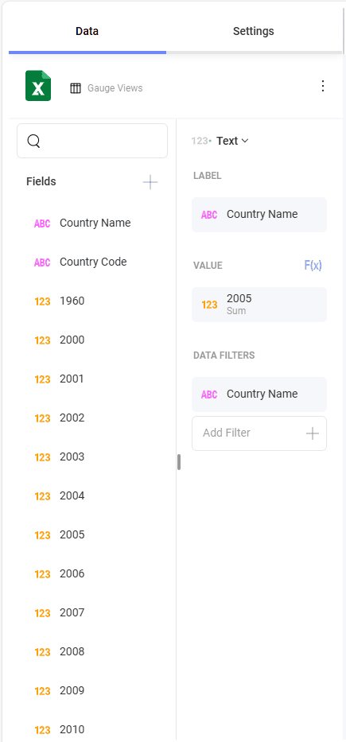

The text gauge sample above utilizes the average aggregation.

## Creating a Bullet Graph

1. Choose **Edit** in overflow menu.
   
   

2. Select the **+ Visualization** button in the top right-hand corner.

                                         

3. Select your data source from the list of data sources.

                                          

4. Choose the **Gauge Views** sheet.
  
   
         
5. Open the *Visualization Picker* and select the **Bullet Graph** visualization. By default, the visualization type will be set to *Column*. 

   

6. This bullet graph, for example, will display life expectancy per Country. Drag and drop the *Country Name* field to **Label**, one of the years into **Values** and another *Year* into **Target**.

   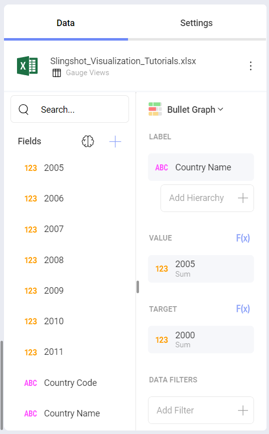

## Adding Bounds to your Gauge

Bounds allow you to set the lowest and highest values in your gauges. As
mentioned in [Key Concepts](#key-concepts), you can change it to exclude
specific data. In order to do this:

|                                                |                                                                        |                                                                                                                                       |
| ---------------------------------------------- | ---------------------------------------------------------------------- | ------------------------------------------------------------------------------------------------------------------------------------- |
| 1\. **Change Settings**                        | 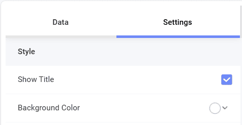 | Go to the **Settings** section of the Visualization Editor.                                                                           |
| 2\. **Change the Default selection in Limits** | 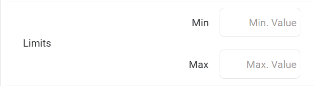         | Depending on whether you want to set the minimum or maximum value (or both), enter the value you want the chart to start or end with. |

## Changing Band Colors

The colors for the three different ranges (Higher than, Lower than and
Between) can be changed between the predefined colors. In order to do
so:

|                                    |                                                                        |                                                                          |
| ---------------------------------- | ---------------------------------------------------------------------- | ------------------------------------------------------------------------ |
| 1\. **Change Settings**            |  | Go to the **Settings** section of the Visualization Editor.              |
| 2\. **Access the Colors dropdown** |      | Expand the dropdown of the range for which you want to change the color. Select one of Reveal's three predefined colors for your band color.|

