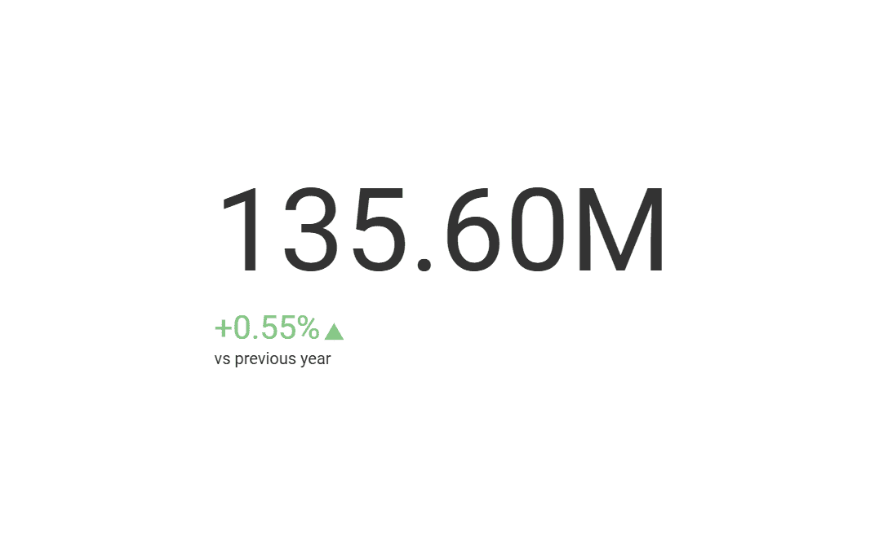
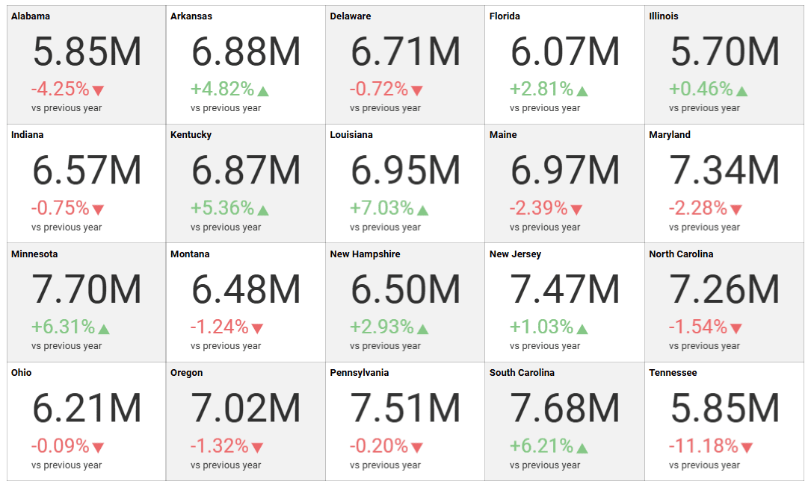
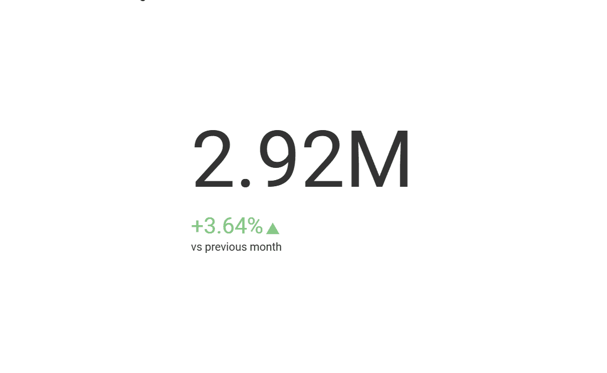
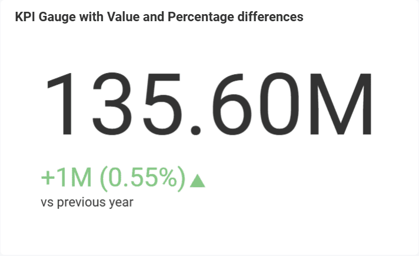
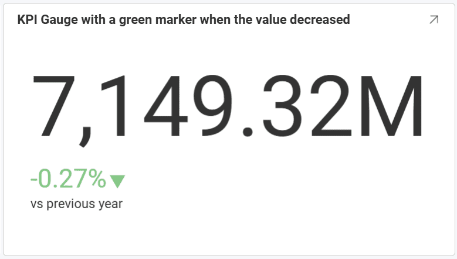
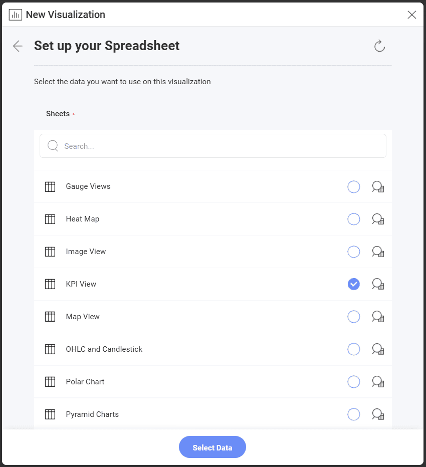
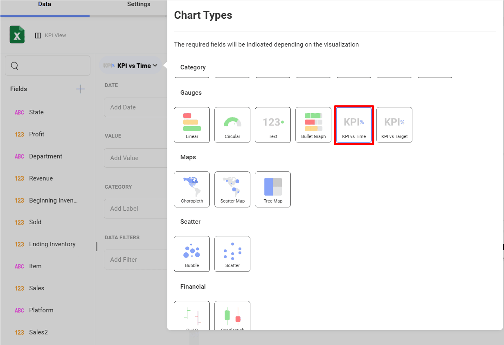
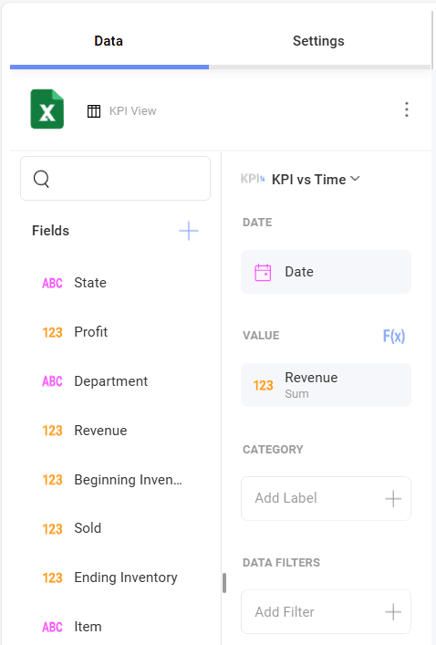
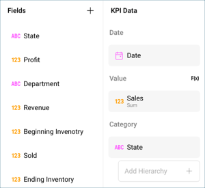
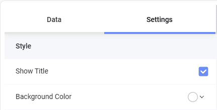

# Creating KPI Gauges

In this tutorial, you will learn how to a KPI gauge visualization using
a sample spreadsheet.

|   |   |
|:-:|:-:|
|     [KPI Gauge](#creating-a-kpi-gauge) |     [Multiple KPI Gauges](#creating-multiple-kpi-gauges-in-one-visualization) |
|     [Month-over-Month KPI Gauge](#changing-the-date-comparison-type) |     [KPI Gauge with Value and Percentage differences](#changing-the-difference-labels-for-the-kpi-gauge) |
|     [KPI Gauge with a green marker when the value decreased](#changing-the-color-of-the-difference-marker) | |

## Key Concepts

KPI gauges are meant to display performances and their variation within
a given time period. To create them, you will need:

  - **One field** to be dropped into the **Date** placeholder of the
    data editor.

  - **One field** to be dropped into **Value**.

## Sample Data Source

For this tutorial, you will use the "KPI View" sheet in the <a href="/data/Reveal_Visualization_Tutorials.xlsx" download>Reveal Visualization Tutorials</a>.

## Creating a KPI Gauge

|                                          |                                                                                              |                                                                                                                                                      |
| ---------------------------------------- | -------------------------------------------------------------------------------------------- | ---------------------------------------------------------------------------------------------------------------------------------------------------- |
| 1\. **Enter Edit Mode**               |  | Choose **Edit** in overflow menu. |
| 2\. **Create new Visualization**      |  | Select the **+ Visualization** button in the top right-hand corner. |
| 3\. **Configure your Data Source**       |  | Select your data source from the list of data sources.                                       |
| 4\. **Select the Tutorials Spreadsheet** | | Once the data source is configured, then, choose the "KPI View" sheet.                                 |
| 5\. **Select KPI Gauge chart type**      |  | By default, the visualization type will be set to Column. Select the **KPI vs Time** option.                                                                                |
| 6\. **Organize your Data**               |  | Drag and drop the "Date" field into "Date" and the "Revenue" field into "Value".                                                                       |

## Creating Multiple KPI Gauges in one Visualization

In order to create more than one KPI in one visualization, you will need
to add a field to the **category** placeholder of the data editor.

|                                          |                                                                                                      |                                                                                                                                                      |
| ---------------------------------------- | ---------------------------------------------------------------------------------------------------- | ---------------------------------------------------------------------------------------------------------------------------------------------------- |
| 1\. **Enter Edit Mode**               |  | Choose **Edit** in overflow menu. |
| 2\. **Create new Visualization**      |  | Select the **+ Visualization** button in the top right-hand corner. |
| 3\. **Configure your Data Source**       |  | Select your data source from the list of data sources.                                       |
| 4\. **Select the Tutorials Spreadsheet** | | Once the data source is configured, then, choose the "KPI View" sheet.                                 |
| 5\. **Select KPI Gauge chart type**      |  | By default, the visualization type will be set to Column. Select the **KPI vs Time** option.                                                                                |
| 6\. **Organize your Data**               |  | Drag and drop the "Date" field into "Date", the "Sales" field into "Value" and the "State" field into "Category".                                    |

## Changing the Date Comparison Type

By default, the date type for your KPI Gauge will be Year-over-Year. You
can change this by modifying the "Type" field. In order to do so:

|                                  |                                                                        |                                                                                                                                                |
| -------------------------------- | ---------------------------------------------------------------------- | ---------------------------------------------------------------------------------------------------------------------------------------------- |
| 1\. **Access the Settings Menu** |  | Go to the **Settings** section of the Visualization Editor.                                                                                    |
| 2\. **Change the Type**          |      | By default, the date type will be set to **Year vs previous Year**. Select the dropdown next to **Type**, and change the selection to **Month vs previous Month**. |

## Changing the Difference Labels for the KPI Gauge

|                                  |                                                                                            |                                                                                                                                                                         |
| -------------------------------- | ------------------------------------------------------------------------------------------ | ----------------------------------------------------------------------------------------------------------------------------------------------------------------------- |
| 1\. **Access the Settings Menu** |                      | Go to the **Settings** section of the Visualization Editor.                                                                                                             |
| 2\. **Change the Type**          |  | By default, the difference label will be set to **Percentage**. Select the dropdown next to **Show difference as**, and change the selection to **Value and Percentage**. |

## Changing the Color of the Difference Marker

The color for the marker in the KPI gauge will be set to green for
positive values and red for negative values by default. There might be
some cases, however, when you want to represent a decrease as a positive
occurrence. In order to change this:

|                                  |                                                                                                          |                                                                                                                                                             |
| -------------------------------- | -------------------------------------------------------------------------------------------------------- | ----------------------------------------------------------------------------------------------------------------------------------------------------------- |
| 1\. **Access the Settings Menu** |                                    | Go to the **Settings** section of the Visualization Editor.                                                                                                 |
| 2\. **Change the Type**          |  | By default, the color of the marker will be set to **green**. Select the dropdown next to **When difference is positive**, and change the selection to **red**. |
