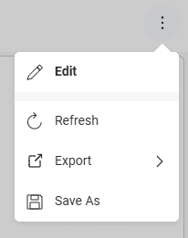
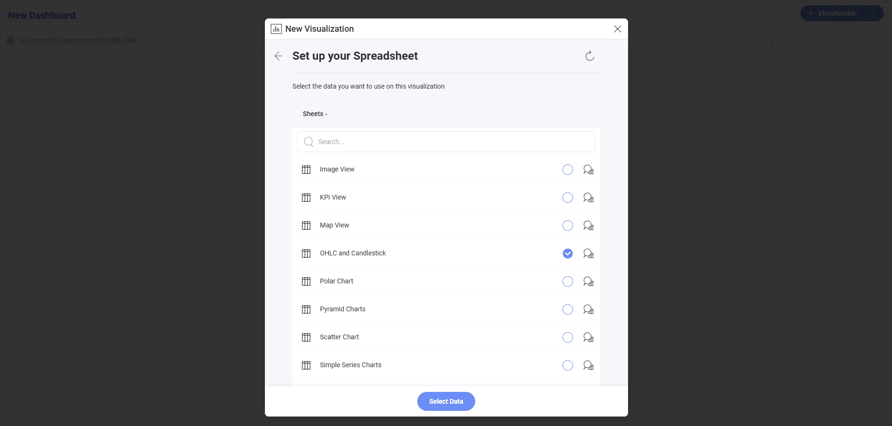
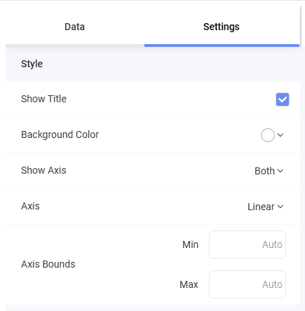

# Creating OHLC Visualizations

In this tutorial, you will learn how to create a OHLC chart visualization using
a sample spreadsheet.

## Key Concepts

Like Candlestick Charts, OHLC charts are meant to show the opening,
high, low and closing prices for any financial data. They are
particularly useful for financial scenarios and stock movement analysis.
This chart displays numerical values in vertical axes with the two
horizontal lines in each vertical axis representing the *Open* and
*Close* values.

OHLC charts, therefore, require:

  - One field to be dropped into the **Label** placeholder of the data
    editor, generally related to dates.

  - Four different fields in the *Open*, *High*, *Low* and *Close*
    categories of the data editor.

There are also different options to add further information to your
chart:

  - **Axis Configuration**: the axis configuration lets you configure
    the minimum and maximum values for your charts. The minimum value is
    set to 0 by default and the maximum calculated automatically
    depending on your values.

  - **Logarithmic Axis Configuration**: if you check the *Logarithmic*
    checkbox, the scale for your values will be calculated with a
    non-linear scale which takes magnitude into account instead of the
    usual linear scale.

## Sample Data Source

For this tutorial, you will use the *OHLC and Candlestick* sheet in the <a href="/data/Reveal_Visualization_Tutorials.xlsx" download>Reveal Visualization Tutorials</a>.

## Creating a OHLC Chart

1. Choose **Edit** in overflow menu.
   
    

 2. Select the **+ Visualization** button in the top right-hand corner.

     

 3. Select your data source from the list of data sources.
   
                         

 4. Once the data source is configured, select the **OHLC and Candlestick** sheet.  

      

 5. Open the *Visualization Picker* and select **OHLC**. By default, the visualization type will be set to **Column**.  

                                    

 6. Drag and drop the *Day* field into **Label** and the *Open*, *High*, *Low* and *Close* fields in their corresponding placeholder.

                                  

## Changing your Axis Configuration

Like [Gauge bounds](tutorials-gauge.md#adding-bounds-to-your-gauge), chart axis
configuration allows you to set the lowest and highest values in your
chart. You can use this feature to include or exclude specific data.

In order to access the axis configuration menu:

|                                             |                                                                                      |                                                             |
| ------------------------------------------- | ------------------------------------------------------------------------------------ | ----------------------------------------------------------- |
| 1\. **Access the Settings Menu**            |                | Go to the **Settings** section of the Visualization Editor. |
| 2\. **Navigate to the Axis Bounds section** |  | The settings you will change will be the **Axis Bounds**.   |

Depending on whether you want to set the minimum or maximum value (or
both), you will need to access one of the following options:

### Changing the Minimum Bound

The default value is set to *0*. In order to set a different bound,
enter the value you want the chart to start with.

### Changing the Maximum Bound

For Maximum bounds, the default will be set to *Automatic* so that
Reveal uses your original data. In order to set a different one, enter
the value you want for the chart's top limit.

## Setting your Axis Configuration as Logarithmic

|                                        |                                                                                                       |                                                             |
| -------------------------------------- | ----------------------------------------------------------------------------------------------------- | ----------------------------------------------------------- |
| 1\. **Access the Settings Menu**       |                                 | Go to the **Settings** section of the Visualization Editor. |
| 2\. **Change the Axis to Logarithmic** |  | Open the **Axis** dropdown and select **Logarithmic**.      |
