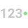

# Visualization Tutorials

Within this section, you will find basic, step-by-step tutorials for the
Analytics visualizations. All sections use the Data Visualizations data
source, which you can download using [this link](https://download.infragistics.com/slingshot/samples/Slingshot_Visualization_Tutorials.xlsx).

|  [Area](tutorials-simple-charts) |  [Bar](tutorials-simple-charts) |  [Bullet Graph](tutorials-gauge#creating-a-bullet-graph) |  [Candlestick](tutorials-candlestick) |  [Circular](tutorials-gauge#creating-a-circular-gauge) |
|---|---|---|---|---|
|  [Column](tutorials-simple-charts) |  [Doughnut](tutorials-simple-charts) |  [Funnel](tutorials-simple-charts) |  [Image](image-chart) |  [KPI](tutorials-kpi-gauge) |
|  [Line](tutorials-simple-charts) |  [Linear](tutorials-gauge#creating-a-linear-gauge) |  [OHLC](tutorials-ohlc) |  [Pie](tutorials-simple-charts) |  [Radial](tutorials-simple-charts) |
|  [Sparkline](tutorials-sparkline-charts) |  [Spline](tutorials-simple-charts) |  [Spline with Area](tutorials-simple-charts) |  [Stacked Area](tutorials-stacked-charts) |  [Stacked Bar](tutorials-stacked-charts) |
|  [Stacked Column](tutorials-stacked-charts) |  [Step Area](tutorials-simple-charts) |  [Step Line](tutorials-simple-charts) |  [Text](tutorials-gauge#creating-a-text-gauge) |  [Text View](tutorials-text-view) |
