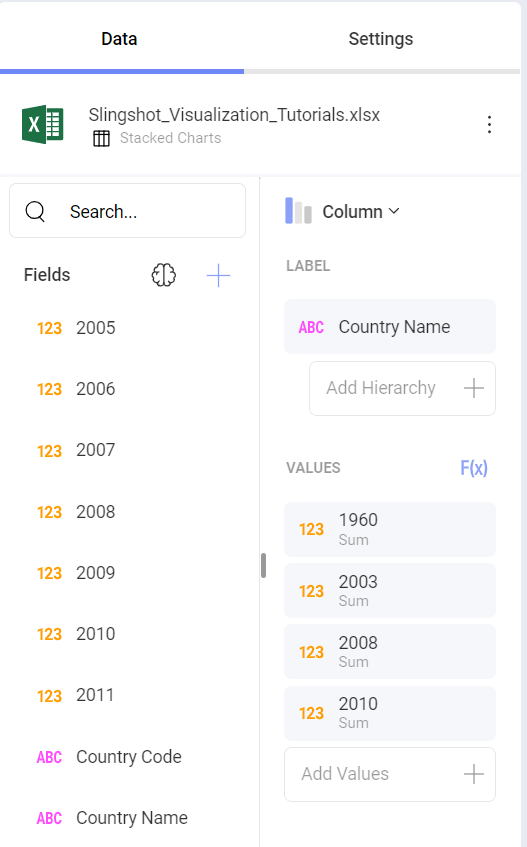
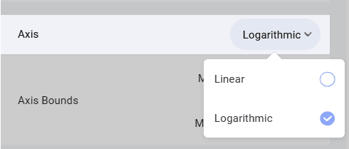
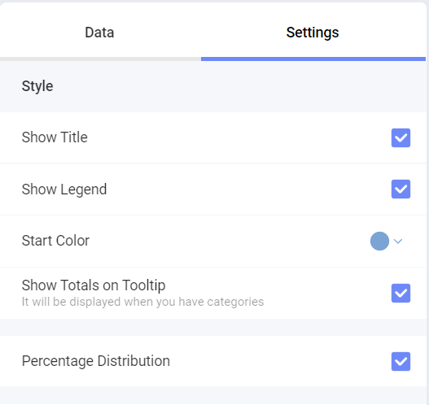

# Creating Stacked Chart Visualizations

In this tutorial, you will learn how to create *Stacked* chart
visualizations using a sample spreadsheet.

  

Access the links below for the Stacked Chart view walkthroughs:

  - [How to create a Stacked Column chart](https://www.slingshotapp.io/en/help/docs/analytics/visualization-tutorials/stacked-charts#creating-a-stacked-chart)

  - [How to change your axis configuration](https://www.slingshotapp.io/en/help/docs/analytics/visualization-tutorials/stacked-charts#changing-your-axis-configuration)

  - [How to set your axis configuration to logarithmic](https://www.slingshotapp.io/en/help/docs/analytics/visualization-tutorials/stacked-charts#setting-your-axis-configuration-as-logarithmic)

  - [How to enable percentage distribution](https://www.slingshotapp.io/en/help/docs/analytics/visualization-tutorials/stacked-charts#enabling-percentage-distribution)

## Key Concepts

There are three different layouts to choose from when using stacked
charts: [Area](#creating-a-stacked-chart),
[Column](#creating-a-stacked-chart) and [Bar](#creating-a-stacked-chart).

You can also configure the following settings:

  - **Axis Configuration**: the axis configuration lets you configure
    the minimum and maximum values for your charts. The minimum value is
    set to 0 by default and the maximum calculated automatically
    depending on your values.

   - **Logarithmic Axis Configuration**: if you check the
        *Logarithmic* checkbox, the scale for your values will be
        calculated with a non-linear scale which takes magnitude into
        account instead of the usual linear scale.

## Sample Data Source

For this tutorial, you will use the *Stacked Charts* sheet in the
[Slingshot Visualization Tutorials](https://download.infragistics.com/slingshot/samples/Slingshot_Visualization_Tutorials.xlsx).

## Creating a Stacked Chart

1. Select the **+ Dashboard** button in *My Analytics*.  

      
                                                      
2. Select your data source (**Slingshot Tutorials Spreadsheet**) from the list of data sources. If the data source is new, you will need to first add it from the **+ Data Source** button in the top-right corner.     

      

3. Choose the **Stacked Charts** sheet.               

     
  
4. Select the **Grid icon** in the top bar of the Visualizations Editor. By default, the visualization type will be set to *Column*. You can always change it by selecting any of the **stack** visualizations.     
 
                                                                                                         
5. Stacked charts require two or more fields to be dragged and dropped into the **Values** placeholder of the data editor. In this case, the *1960*, *2003*, *2008* and *2010* fields have been dropped into **Values** and *Country Name* in **Label**. 

    

## Changing your Axis Configuration

Similarly to the [Gauge bounds](tutorials-gauge#adding-bounds-to-your-gauge), the
chart axis configuration allows you to set the lowest and highest values
in your chart. You can use this feature to include or exclude specific
data.

|                                        |                                                                                      |                                                                                                                                       |
| -------------------------------------- | ------------------------------------------------------------------------------------ | ------------------------------------------------------------------------------------------------------------------------------------- |
| 1\. **Change Settings**                |                | Go to the **Settings** section of the Visualization Editor.                                                                           |
| 2\. **Access the Axis Bounds section** |                            | Navigate to Axis Bounds. Depending on whether you want to set the minimum or maximum value (or both), enter the value you want the chart to start or end with.  |                                                                                                          

## Setting your Axis Configuration as Logarithmic

|                                           |                                                                          |                                                             |
| ----------------------------------------- | ------------------------------------------------------------------------ | ----------------------------------------------------------- |
| 1\. **Change Settings**                   |    | Go to the **Settings** section of the Visualization Editor. |
| 2\. **Access the Axis option**            |                | Expand the Axis dropdown by selecting the down arrow. Then select *Logarithmic*.|      

## Enabling Percentage Distribution

For stacked charts, you can configure the Percentage Distribution. It
allows you to switch between values and percentage distribution scales
for those types of charts. In order to do this:

|                                        |                                                                                    |                                                                                           |
| -------------------------------------- | ---------------------------------------------------------------------------------- | ----------------------------------------------------------------------------------------- |
| 1\. **Change Settings**                |              | Go to the **Settings** section of the Visualization Editor.                               |
| 2\. **Enable Percentage Distribution** |  | Enable the percentage distribution setting by checking the *Percentage Distribution* box. |
