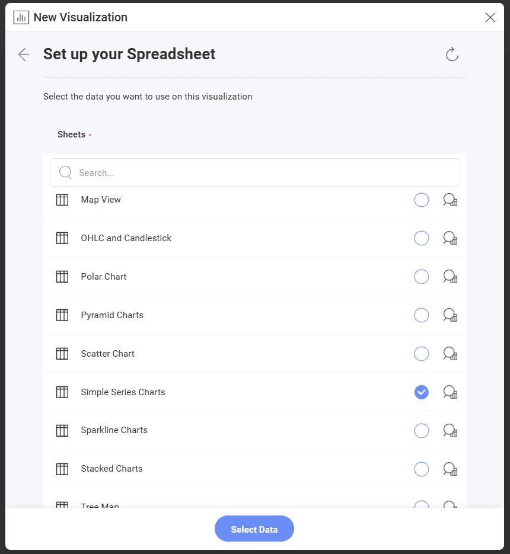
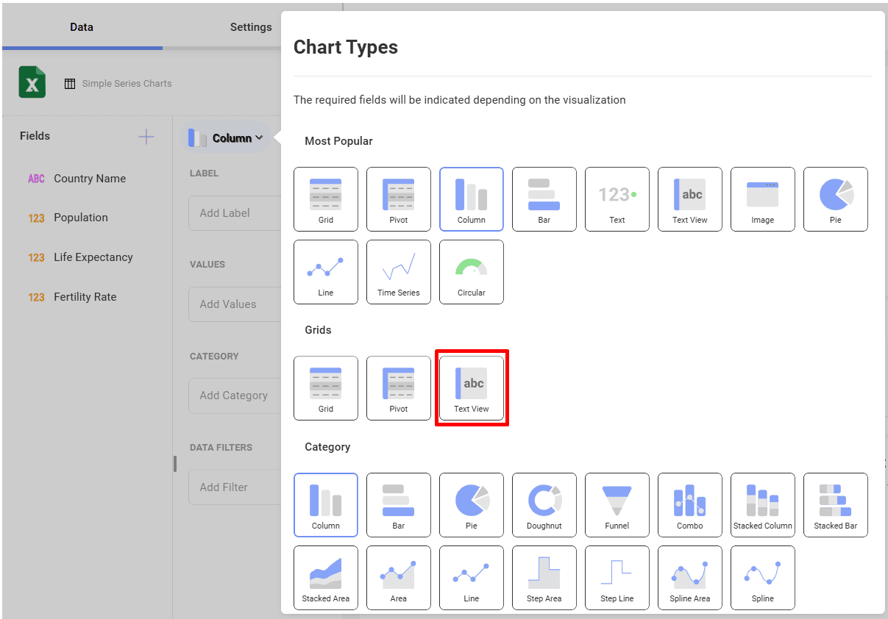
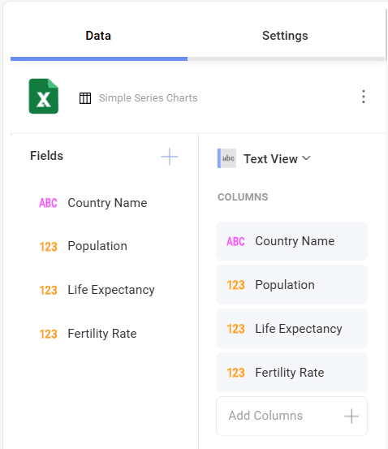
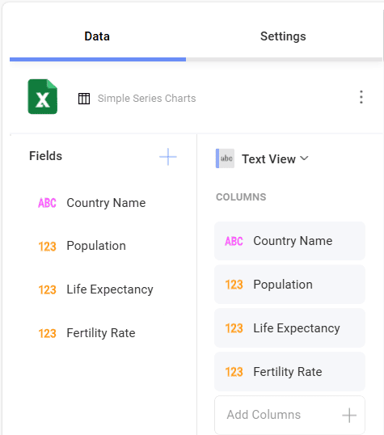
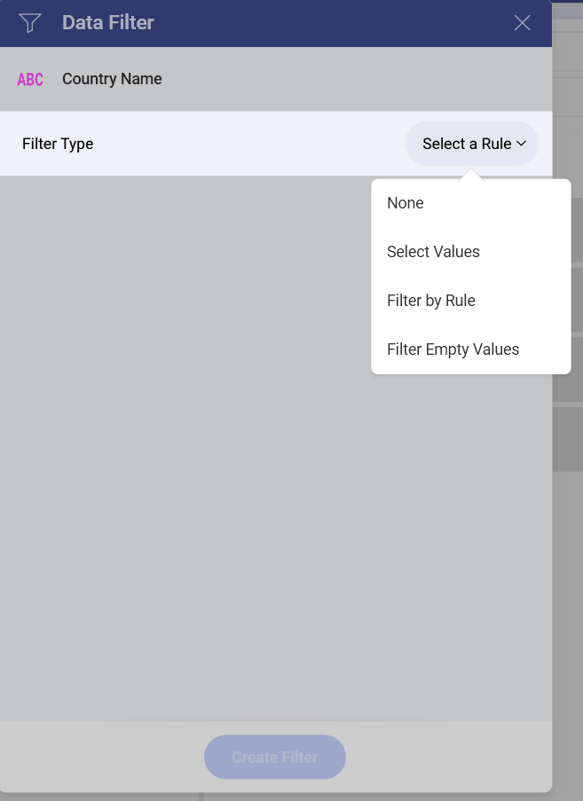
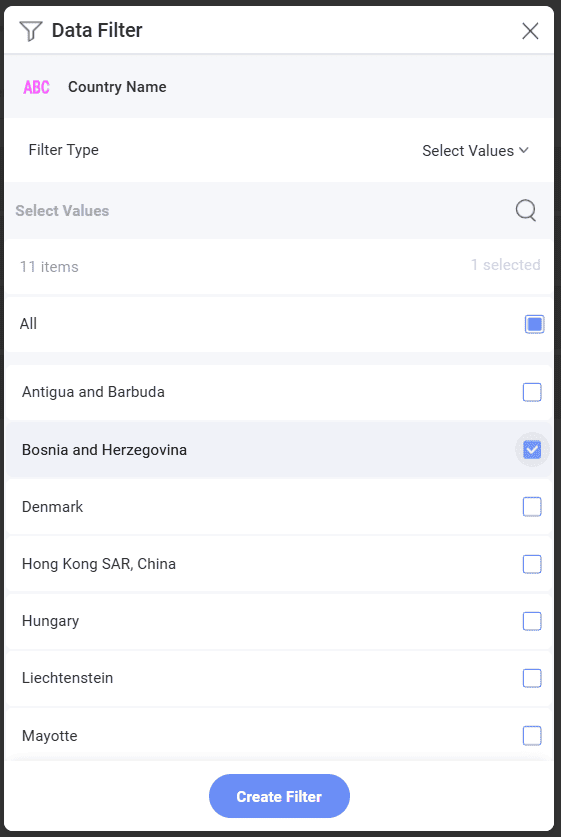

# Creating a Text View

In this tutorial you will learn how to create a *Text View* visualization
using a sample spreadsheet.

## Key Concepts

Text views display information in a key-value pattern, but **they only
display the first row of data paired with a column's label**. You can,
however, add filters to make sure Slingshot displays the row you need.

## Sample Data Source

For this tutorial, you will use the *Simple Series Charts* sheet in the <a href="/data/Reveal_Visualization_Tutorials.xlsx" download>Reveal Visualization Tutorials</a>.

## Creating a Text View

 1. Choose **Edit** in overflow menu.
   
   

2. Select the **+ Visualization** button in the top right-hand corner.

                                         

3. Select your data source from the list of data sources.

   

4. Choose the **Simple Series Charts** sheet.
  
   

5. Open the *Visualization Picker* and select the **Text View** visualization. By default, the visualization type will be set to *Column*. 

   

6. The above text view, for example, displays the Population, Life expectancy and Fertility rate for a specific country. Drag and drop *Country Name*, *Population*, *Life Expectancy* and *Fertility Rate* into **Columns**.

      

## Changing the Selected Row

Text View displays the first row of the sheet by default. You can add a
filter to your data in order to change this. For example, let's make the
text view display row 9 (Bosnia and Herzegovina).

1. Drag and drop the *Country Name* field into **Data Filters**.  
 
                                                          
2. Select *Filter Type* to enable the dropdown menu and then choose **Select Values**. 
 
                                                           
3. By default, all values will be selected. Uncheck the *All* box and select only **Bosnia and Herzegovina**. Then, select **Create Filter**. 

     
