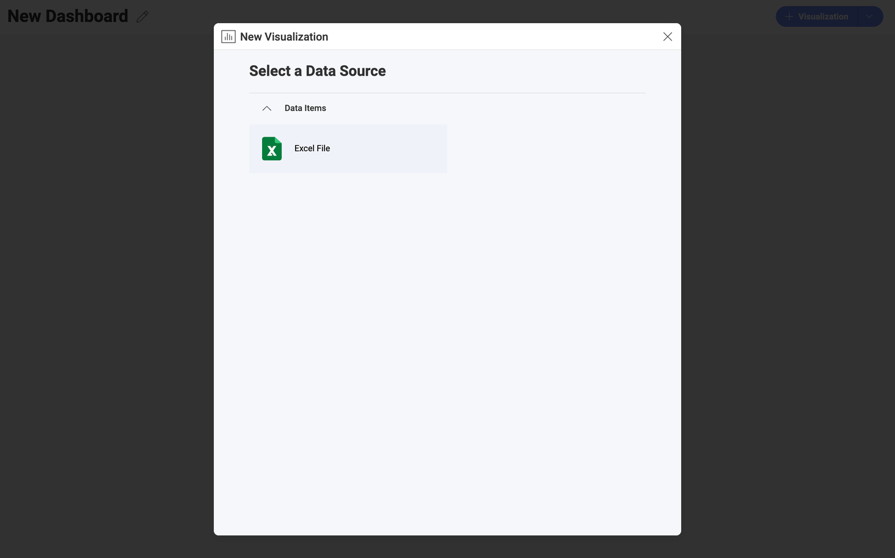
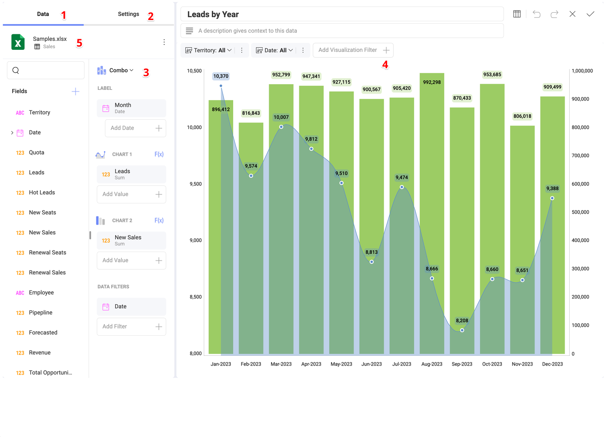

# Visualization Editor

The *Visualization Editor* is where you create and edit your visualizations in Reveal. Here you will find the data from your dataset aggregated and prepared for use as well as great variety of visualizations to build with it.

## How Do You Create a Visualization?

Visualizations are the building blocks of your dashboard. So, when you start creating a visualization, you can choose between two alternative starting points:

* Start with **creating a new dashboard** where the new visualization will be your first and/or only visualization. To do this, click/tap on the **+ Visualization** blue button.

* Start by **adding a new visualization** to an already existing dashboard. To do this, select the overflow button in the top right-hand corner, click/tap on the *Edit* and click/tap on the **+ Visualization** blue button.

After that, you will be prompted to add a new or select an existing data source.

With the data source selected and configured, you will be navigated to the [Visualization Editor](visualization-editor), where you can start creating your visualization.

The *Visualization editor* will help you get the most desired view using your data.

## Accessing the Visualization Editor

You can access the Visualization editor in two ways:

***1. In the visualization creation process***

Once you have selected and configured your data source, the *Visualization editor* will open automatically.

***2. In the dashboard editing process***

After opening a chosen dashboard and entering *Dashboard Edit mode*, you will be able to **access the Visualization editor** by selecting **Edit** from a visualization's overflow button. Alternatively, you can click/tap on the pencil icon, next to the overflow menu.

## Visualization Editor Overview

Below, you will find a list of all sections of the *Editor* with their capabilities.

1. **Data Section** - this section contains two panels:

a. **Fields** - All of the available fields within your data source will appear on the left panel. Each field has an indicator that informs the users what field type each field is: *Date*, *Value*, *Text*. A search bar appears when the available fields are more than ten.
The *plus* icon in this panel allows you to either blend data sources or calculate a field. The *brain* icon allows you to use fields from a BigQuery or Azure *machine learning model* for your visualization. Keep in mind that the BigQuery machine learning model can work only with BigQuery data sources.

b. **Visualization Fields** - Here is where you will drag and drop, or click the *+* mark to see the available fields and select those you want to use for the visualization you are creating.

2. **Settings Section** - This section allows you to customize what you want to show. Each visualization comes with its own settings.

At the bottom of the *Settings* section you will see the option for links. This is a powerful feature, that takes drill down to a whole new level. Read more in the [Dashboard Linking](dashboard-linking) topic.

3. **Visualization Picker** - Here you can choose your desired visualization and preview the final result. As you switch between the different chart types in the dropdown menu, you will notice the visualization fields section change. The fields for each visualization are different, but they change automatically so you only need to fill them in.

4. **Visualization Workspace** - Here is where you will be able to see the visualization you are creating or editing as you drag and drop fields. The visualization won't populate until you have all the necessary fields needed to create that chart type.

5. **Data Source** - The data source that you are currently working with will be displayed here. With a click, you can change between the different sheets, tables or views within your source or change your connection to a new source entirely without having to leave the editor.

Among other things, you will be able to:

- **Sort** & **filter** data.

- **Aggregate data** in the data editor.

- **Search**, **Visualize** & **format** data.

After you're done building the visualization, select the *check* icon to return to the *Dashboard Editor*. In the Dashboard Editor, you can control the layout, size, and location of the visualizations in a dashboard by simply dragging visualizations and their borders. When you are ready formatting and styling your dashboard, click/tap on the *check* icon again to save your dashboard.  