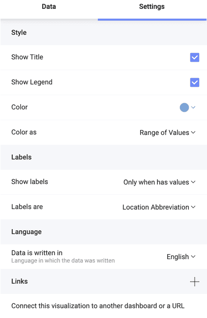

# Working With the Choropleth Map Settings

In the *Settings* section of the Choropleth map visualization you can configure the following:

  - *Show Title* - choose whether to show the visualization’s title

  - *Show Legend* - choose whether to show the color scale range above the map

  - *Color* - select which color to be picked as a base of the color scheme. Areas with average data values will be filled with this color. In contrast, regions on the map with lower and higher data values will be displayed in lighter and darker shades, respectively.

  - *Color as* - here you can choose between:

      * *Range of Values* - use a range of seven colors as a color scheme and fill the regions depending on the data value;
      * *Single Color* - use one color to display all regions that contain data. Regions, where information is missing, are grey.

:::note
If you have added a field in the *Map Color* placeholder, then the *Color as* in the *Settings* will change to *Color based on*. Find more about using the Map Color to create choropleth maps [here](choropleth-map#using-the-map-color-to-create-a-multi-color-choropleth-map).
:::
  - *Show labels* - IF the selected map supports labels, you can choose whether to put them on *all* regions, only on regions that contain information (*Only when has value*), or turn them off (*None*).

  - *Labels are* - You can use labels to indicate the geographical names (abbreviated) of the regions by selecting *Location Abbreviation*. Alternatively, your labels can show *Values* for each area. Value labels can be displayed on the map as numbers, percent, or currency, depending on what formatting you chose for your *Value* field.

  - *[Connect this visualization to another dashboard or a URL](../dashboard-linking.md)* - If you want to provide more details on the information displayed in the visualization, you can connect the visualization in the dashboard with other dashboards or URLs. 
  
## Localization Settings

Currently, you can provide your dataset in English and Japanese.

When your location data is in Japanese, Analytics translates it in English to connect it to the desired map.

If you use a Japanese dataset in Analytics, and your Language and Regional settings are not set to Japanese, then you need to use the *Data is written in* setting to help Analytics recognize the language of your dataset by switching to Japanese (*ja*):

### Language of Labels

The language of labels on the choropleth map is defined by the language and regional settings configured in your OS and/or browser. So if you are running Analytics on a machine with its locale/language set to <a href="https://www.slingshotapp.io/en/help/docs/getting-started-slingshot#contact-us" target="_blank">a language Analytics supports</a>, the app will attempt to localize the labels to that language. This has nothing to do with the *Data is written in* setting.

If a Japanese employee's machine, for example, is set to use their native language (Japanese), but the data given to them is in English, Analytics will still display the labels in Japanese. Then, if they share the dashboard with a German contractor, the German will see the labels in the language their machine is set to use (the German language is supported in Analytics).
