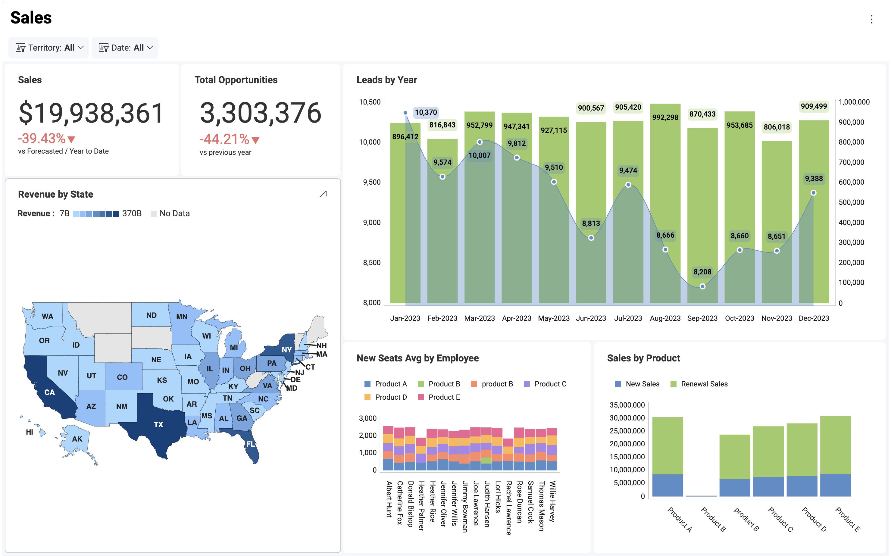

# Data Visualizations

Analytics helps you get the most insight possible out of business data by providing a variety of visualizations.

## What is a Visualization?

For users to get the most insight possible out of business data, Analytics provides several options to customize the way information is visualized. These are called "visualizations". Any dashboard is composed of one or more visualizations.

The dashboard shown below contains a wide variety of visualizations, all of which analyze different aspects of Manufacturing.

## Choosing the Right Chart Type

In choosing the best chart type you need to look at your data and answer the questions that will help you find out what story you are trying to tell with your visualization.

Are you trying to compare data, show data distribution or present it as a part to a whole breakdown? Are you doing a trend analysis of your financial, marketing or sales data, need a date/time axis? Are you looking at relationships between data? Or you just want to show KPIs and gauges, which are really easy to read and tell a quick story? Is it important to plot your data on a map?

Answer what you want to show with your data and use the table below to choose the most suitable chart.

TODO - ADD TABLE

If you need more information about how to use each of these visualizations, use the hyperlinks in the table.

## Visualization Tutorials

Within this section, you will find basic, step-by-step tutorials for the Analytics visualizations. All sections use the Data Visualizations data source, which you can download using [this link](https://download.infragistics.com/slingshot/samples/Slingshot_Visualization_Tutorials.xlsx).

TODO - ADD TABLE