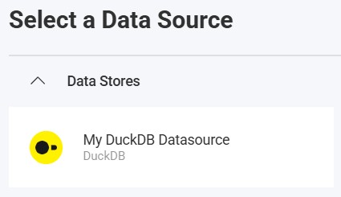
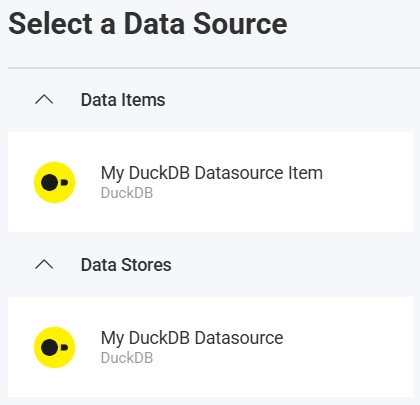

import Tabs from '@theme/Tabs';
import TabItem from '@theme/TabItem';

# DuckDB Data Source

## Introduction

DuckDB is an in-process analytical database designed for fast local analytics. Reveal supports DuckDB database files as well as MotherDuck databases, so you can visualize and analyze embedded data sets, local files, and cloud-hosted DuckDB workloads from the same data-source type.

## Server Configuration

### Installation

<Tabs groupId="code" queryString>
  <TabItem value="aspnet" label="ASP.NET" default>

**Step 1** - Install the Reveal DuckDB connector package.

For ASP.NET applications, you need to install a separate NuGet package to enable DuckDB support:

```bash
dotnet add package Reveal.Sdk.Data.DuckDB
```

**Step 2** - Register the DuckDB data source in your application.

```csharp
builder.Services.AddControllers().AddReveal( builder =>
{
    builder.DataSources.RegisterDuckDB();
});
```

  </TabItem>
  <TabItem value="node" label="Node.js">

For Node.js applications, the DuckDB data source is included in the main Reveal SDK package. No additional installation is required beyond the standard Reveal SDK setup.

  </TabItem>
  <TabItem value="node-ts" label="Node.js - TS">

For Node.js TypeScript applications, the DuckDB data source is included in the main Reveal SDK package. No additional installation is required beyond the standard Reveal SDK setup.

  </TabItem>
  <TabItem value="java" label="Java">

For Java applications, the DuckDB data source is included in the main Reveal SDK package. No additional installation is required beyond the standard Reveal SDK setup.

  </TabItem>
</Tabs>

### Connection Configuration

<Tabs groupId="code" queryString>
  <TabItem value="aspnet" label="ASP.NET" default>

```csharp
// Create a data source provider
public class DataSourceProvider : IRVDataSourceProvider
{
    public async Task<RVDataSourceItem> ChangeDataSourceItemAsync(IRVUserContext userContext, string dashboardId, RVDataSourceItem dataSourceItem)
    {
        // Required: Update the underlying data source
        await ChangeDataSourceAsync(userContext, dataSourceItem.DataSource);

        if (dataSourceItem is RVDuckDBDataSourceItem duckDBItem)
        {
            // Configure specific item properties if needed
            if (duckDBItem.Id == "duckdb_orders")
            {
                duckDBItem.Table = "orders";
                duckDBItem.Schema = "main";

                // Optional: use a custom query instead of a table
                // duckDBItem.CustomQuery = "SELECT * FROM orders WHERE ship_country = 'USA'";

                // Optional: call a DuckDB table macro
                // duckDBItem.Procedure = "top_customers";
                // duckDBItem.ProcedureParameters = new Dictionary<string, object>
                // {
                //     ["min_total"] = 1000
                // };
            }
        }

        return dataSourceItem;
    }

    public Task<RVDashboardDataSource> ChangeDataSourceAsync(IRVUserContext userContext, RVDashboardDataSource dataSource)
    {
        if (dataSource is RVDuckDBDataSource duckDBDS)
        {
            // Configure connection properties
            duckDBDS.Database = "data\\northwind.duckdb";
            duckDBDS.Schema = "main";

            // For MotherDuck use:
            // duckDBDS.Database = "md:your_database_name";
        }

        return Task.FromResult(dataSource);
    }
}
```

  </TabItem>
  <TabItem value="node" label="Node.js">

```javascript
// Create data source providers
const dataSourceItemProvider = async (userContext, dataSourceItem) => {
    // Required: Update the underlying data source
    await dataSourceProvider(userContext, dataSourceItem.dataSource);

    if (dataSourceItem instanceof reveal.RVDuckDBDataSourceItem) {
        // Configure specific item properties if needed
        if (dataSourceItem.id === "duckdb_orders") {
            dataSourceItem.table = "orders";
            dataSourceItem.schema = "main";

            // Optional: call a DuckDB table macro
            // dataSourceItem.procedure = "top_customers";
            // dataSourceItem.procedureParameters = {
            //     min_total: 1000
            // };
        }
    }

    return dataSourceItem;
}

const dataSourceProvider = async (userContext, dataSource) => {
    if (dataSource instanceof reveal.RVDuckDBDataSource) {
        // Configure connection properties
        dataSource.database = "data\\northwind.duckdb";
        dataSource.schema = "main";

        // For MotherDuck use:
        // dataSource.database = "md:your_database_name";
    }

    return dataSource;
}
```

  </TabItem>
  <TabItem value="node-ts" label="Node.js - TS">

```ts
// Create data source providers
const dataSourceItemProvider = async (userContext: IRVUserContext | null, dataSourceItem: RVDataSourceItem) => {
    // Required: Update the underlying data source
    await dataSourceProvider(userContext, dataSourceItem.dataSource);

    if (dataSourceItem instanceof RVDuckDBDataSourceItem) {
        // Configure specific item properties if needed
        if (dataSourceItem.id === "duckdb_orders") {
            dataSourceItem.table = "orders";
            dataSourceItem.schema = "main";

            // Optional: call a DuckDB table macro
            // dataSourceItem.procedure = "top_customers";
            // dataSourceItem.procedureParameters = {
            //     min_total: 1000
            // };
        }
    }

    return dataSourceItem;
}

const dataSourceProvider = async (userContext: IRVUserContext | null, dataSource: RVDashboardDataSource) => {
    if (dataSource instanceof RVDuckDBDataSource) {
        // Configure connection properties
        dataSource.database = "data\\northwind.duckdb";
        dataSource.schema = "main";

        // For MotherDuck use:
        // dataSource.database = "md:your_database_name";
    }

    return dataSource;
}
```

  </TabItem>
  <TabItem value="java" label="Java">

```java
// Create a data source provider
public class DataSourceProvider implements IRVDataSourceProvider {
    public RVDataSourceItem changeDataSourceItem(IRVUserContext userContext, String dashboardId, RVDataSourceItem dataSourceItem) {
        // Required: Update the underlying data source
        changeDataSource(userContext, dataSourceItem.getDataSource());

        if (dataSourceItem instanceof RVDuckDBDataSourceItem duckDBItem) {
            // Configure specific item properties if needed
            if ("duckdb_orders".equals(duckDBItem.getId())) {
                duckDBItem.setTable("orders");
                duckDBItem.setSchema("main");

                // Optional: call a DuckDB table macro
                // duckDBItem.setProcedure("top_customers");
            }
        }

        return dataSourceItem;
    }

    public RVDashboardDataSource changeDataSource(IRVUserContext userContext, RVDashboardDataSource dataSource) {
        if (dataSource instanceof RVDuckDBDataSource duckDBDS) {
            // Configure connection properties
            duckDBDS.setDatabase("data\\northwind.duckdb");
            duckDBDS.setSchema("main");

            // For MotherDuck use:
            // duckDBDS.setDatabase("md:your_database_name");
        }

        return dataSource;
    }
}
```

  </TabItem>
</Tabs>

`Database` accepts both absolute and relative DuckDB file paths. For ASP.NET, relative paths are resolved against `AppContext.BaseDirectory`. For MotherDuck, set the value to `md:databaseName`.

`Schema` is optional on both `RVDuckDBDataSource` and `RVDuckDBDataSourceItem`. If you do not set it, Reveal uses the default DuckDB schema, `main`.

DuckDB supports custom queries and DuckDB table macros on the server. For more information, see [Custom Queries](/web/custom-queries).

:::danger Important
Any changes made to the data source in the `ChangeDataSourceAsync` method are not carried over into the `ChangeDataSourceItemAsync` method. You **must** update the data source properties in both methods. We recommend calling the `ChangeDataSourceAsync` method within the `ChangeDataSourceItemAsync` method passing the data source item's underlying data source as the parameter as shown in the examples above.
:::

### Authentication

Local DuckDB database files do not require authentication. When connecting to MotherDuck, provide a personal access token on the server through your authentication provider.

<Tabs groupId="code" queryString>
  <TabItem value="aspnet" label="ASP.NET" default>

```csharp
public class AuthenticationProvider: IRVAuthenticationProvider
{
    public Task<IRVDataSourceCredential> ResolveCredentialsAsync(IRVUserContext userContext, RVDashboardDataSource dataSource)
    {
        IRVDataSourceCredential userCredential = null;
        if (dataSource is RVDuckDBDataSource duckDBDS && duckDBDS.Database?.StartsWith("md:") == true)
        {
            userCredential = new RVPersonalAccessTokenDataSourceCredential("your_motherduck_access_token");
        }
        return Task.FromResult<IRVDataSourceCredential>(userCredential);
    }
}
```

  </TabItem>
  <TabItem value="node" label="Node.js">

```javascript
const authenticationProvider = async (userContext, dataSource) => {
    if (dataSource instanceof reveal.RVDuckDBDataSource && dataSource.database?.startsWith("md:")) {
        return new reveal.RVPersonalAccessTokenDataSourceCredential("your_motherduck_access_token");
    }
    return null;
}
```

  </TabItem>
  <TabItem value="node-ts" label="Node.js - TS">

```ts
const authenticationProvider = async (userContext: IRVUserContext | null, dataSource: RVDashboardDataSource) => {
    if (dataSource instanceof RVDuckDBDataSource && dataSource.database?.startsWith("md:")) {
        return new RVPersonalAccessTokenDataSourceCredential("your_motherduck_access_token");
    }
    return null;
}
```

  </TabItem>
  <TabItem value="java" label="Java">

```java
public class AuthenticationProvider implements IRVAuthenticationProvider {
    @Override
    public IRVDataSourceCredential resolveCredentials(IRVUserContext userContext, RVDashboardDataSource dataSource) {
        if (dataSource instanceof RVDuckDBDataSource duckDBDS && duckDBDS.getDatabase() != null && duckDBDS.getDatabase().startsWith("md:")) {
            return new RVPersonalAccessTokenDataSourceCredential("your_motherduck_access_token");
        }
        return null;
    }
}
```

  </TabItem>
</Tabs>

## Client-Side Implementation

On the client side, you only need to specify basic properties like id, title, and subtitle for the data source. The actual DuckDB file path, MotherDuck database name, schema, and query configuration happen on the server.

### Creating Data Sources

**Step 1** - Add an event handler for the `RevealView.onDataSourcesRequested` event.

```js
const revealView = new RevealView("#revealView");
revealView.onDataSourcesRequested = (callback) => {
    // Add data source here
    callback(new RevealDataSources([], [], false));
};
```

**Step 2** - In the `RevealView.onDataSourcesRequested` event handler, create a new instance of the `RVDuckDBDataSource` object. Set the `title` and `subtitle` properties. After you have created the `RVDuckDBDataSource` object, add it to the data sources collection.

```js
revealView.onDataSourcesRequested = (callback) => {
    const duckDBDS = new RVDuckDBDataSource();
    duckDBDS.id = "duckdb_ds";
    duckDBDS.title = "My DuckDB Datasource";
    duckDBDS.subtitle = "DuckDB";

    callback(new RevealDataSources([duckDBDS], [], false));
};
```

When the application runs, create a new Visualization and you will see the newly created DuckDB data source listed in the "Select a Data Source" dialog.



### Creating Data Source Items

Data source items represent specific tables, views, or DuckDB table macros within your DuckDB data source that users can select for visualization. On the client side, you only need to specify ID, title, and subtitle.

```js
revealView.onDataSourcesRequested = (callback) => {
    // Create the data source
    const duckDBDS = new RVDuckDBDataSource();
    duckDBDS.id = "duckdb_ds";
    duckDBDS.title = "My DuckDB Datasource";
    duckDBDS.subtitle = "DuckDB";

    // Create a data source item
    const duckDBDSI = new RVDuckDBDataSourceItem(duckDBDS);
    duckDBDSI.id = "duckdb_orders";
    duckDBDSI.title = "Orders";
    duckDBDSI.subtitle = "DuckDB";

    callback(new RevealDataSources([duckDBDS], [duckDBDSI], false));
};
```

When the application runs, create a new Visualization and you will see the newly created DuckDB data source item listed in the "Select a Data Source" dialog.



## Additional Resources

- [DuckDB Documentation](https://duckdb.org/docs/)
- [MotherDuck Documentation](https://motherduck.com/docs/)

## API Reference

<Tabs groupId="code" queryString>
<TabItem value="aspnet" label="ASP.NET" default>

* [RVDuckDBDataSource](https://help.revealbi.io/api/aspnet/latest/Reveal.Sdk.Data.DuckDB.RVDuckDBDataSource.html) - Represents a DuckDB data source
* [RVDuckDBDataSourceItem](https://help.revealbi.io/api/aspnet/latest/Reveal.Sdk.Data.DuckDB.RVDuckDBDataSourceItem.html) - Represents a DuckDB data source item

</TabItem>
<TabItem value="node" label="Node.js">

* [RVDuckDBDataSource](https://help.revealbi.io/api/javascript/latest/classes/rvduckdbdatasource.html) - Represents a DuckDB data source
* [RVDuckDBDataSourceItem](https://help.revealbi.io/api/javascript/latest/classes/rvduckdbdatasourceitem.html) - Represents a DuckDB data source item

</TabItem>
</Tabs>
