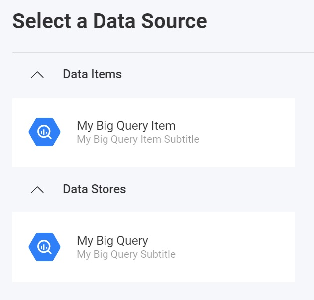

import Tabs from '@theme/Tabs';
import TabItem from '@theme/TabItem';

# Adding a Google Big Query Data Source

:::danger breaking changes

Currently, the Reveal SDK is in the process of decoupling the data sources from the Reveal SDK core package. In order to ensure the project's continued functionality, you might be required to install additional packages into your project. Please see the [Supported Data Sources](web/datasources.md#supported-data-sources) topic for more information.

:::

**Step 1** - Add an event handler for the `RevealView.onDataSourcesRequested` event.

```js
var revealView = new $.ig.RevealView("#revealView");
revealView.onDataSourcesRequested = (callback) => {
    //add code here
    callback(new $.ig.RevealDataSources([], [], false));
};
```

**Step 2** - In the `RevealView.onDataSourcesRequested` event handler, create a new instance of the [RVBigQueryDataSource](https://help.revealbi.io/api/javascript/latest/classes/rvbigquerydatasource.html) object. Set the `Title` property. After you have created the `RVBigQueryDataSource` object, add it to the data source items collection.

```js
revealView.onDataSourcesRequested = (callback) => {
    var bigQuery = new $.ig.RVBigQueryDataSource();
    bigQuery.title = "My Big Query";

    callback(new $.ig.RevealDataSources([bigQuery], [], false));
};
```
When the application runs, create a new Visualization and you will see the newly created Big Query data source listed in the "Select a Data Source" dialog.


:::note

The `RVBigQueryDataSource` loads tables based on the authentication provider registered with the Reveal SDK. Google Big Query authenticates using a `RVBearerTokenDataSourceCredential`. See the [Authentication](../authentication#bearer-token-authentication) topic for more information.

:::

**Step 3** - Create a new Big Query Data Source Item by creating a new instance of the [RVBigQueryDataSourceItem](https://help.revealbi.io/api/javascript/latest/classes/rvbigquerydatasourceitem.html) object. Specify the values for the `Title` and `Subtitle` properties. After you have created the `RVBigQueryDataSourceItem` object, add it to the data source items collection.

```js
revealView.onDataSourcesRequested = (callback) => {
    var bigQuery = new $.ig.RVBigQueryDataSource();
    bigQuery.title = "My Big Query";
    bigQuery.subtitle = "My Big Query Subtitle";

    var bigQueryItem = new $.ig.RVBigQueryDataSourceItem(bigQuery);
    bigQueryItem.title = "My Big Query Item";
    bigQueryItem.subtitle = "My Big Query Item Subtitle";         

    callback(new $.ig.RevealDataSources([bigQuery], [bigQueryItem], false));
};
```

When the application runs, create a new Visualization and you will see the newly created Big Query data source item listed in the "Select a Data Source" dialog.




:::info Get the Code

The source code to this sample can be found on [GitHub](https://github.com/RevealBi/sdk-samples-javascript/tree/main/DataSources/BigQuery-ServiceAccount)

:::
