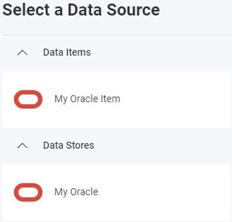

import Tabs from '@theme/Tabs';
import TabItem from '@theme/TabItem';

# Oracle Data Source

## Introduction

Oracle Database is a multi-model database management system produced and marketed by Oracle Corporation. This topic explains how to connect to Oracle data sources in your Reveal application to visualize and analyze your data.

## Server Configuration

### Installation

<Tabs groupId="code" queryString>
  <TabItem value="aspnet" label="ASP.NET" default>

For ASP.NET applications, you need to install a separate NuGet package to enable Oracle support:

```bash
dotnet add package Reveal.Sdk.Data.Oracle
```

Then register the Oracle provider in your application:

```csharp
builder.Services.AddControllers().AddReveal( builder =>
{
    builder.DataSources.RegisterOracle();
});
```

  </TabItem>
  <TabItem value="node" label="Node.js">

For Node.js applications, the Oracle data source is already included in the main Reveal SDK package. No additional installation is required beyond the standard Reveal SDK setup.

  </TabItem>
  <TabItem value="java" label="Java">

For Java applications, the Oracle data source is already included in the main Reveal SDK package. No additional installation is required beyond the standard Reveal SDK setup.

  </TabItem>
</Tabs>

### Connection Configuration

<Tabs groupId="code" queryString>
  <TabItem value="aspnet" label="ASP.NET" default>

```csharp
// Create a data source provider
public class DataSourceProvider : IRVDataSourceProvider
{
    public async Task<RVDataSourceItem> ChangeDataSourceItemAsync(IRVUserContext userContext, string dashboardId, RVDataSourceItem dataSourceItem)
    {
        // Required: Update the underlying data source
        await ChangeDataSourceAsync(userContext, dataSourceItem.DataSource);

        if (dataSourceItem is RVOracleDataSourceItem oracleDataSourceItem)
        {            
            // Configure specific item properties as needed
            if (oracleDataSourceItem.Id == "MyOracleSIDDataSourceItem")
            {
                oracleDataSourceItem.Table = "your-table";
            }
            
            if (oracleDataSourceItem.Id == "MyOracleServiceDataSourceItem")
            {
                oracleDataSourceItem.Table = "your-table";
            }
        }
        
        return dataSourceItem;
    }

    public Task<RVDashboardDataSource> ChangeDataSourceAsync(IRVUserContext userContext, RVDashboardDataSource dataSource)
    {
        // Using SID
        if (dataSource is RVOracleSIDDataSource oracleSidDataSource)
        {
            // Configure connection properties
            oracleSidDataSource.Host = "your-host";
            oracleSidDataSource.Database = "your-database";
            oracleSidDataSource.SID = "your-sid";
        }

        // Using Service Name
        if (dataSource is RVOracleServiceDataSource oracleServiceDataSource)
        {
            // Configure connection properties
            oracleServiceDataSource.Host = "your-host";
            oracleServiceDataSource.Database = "your-database";
            oracleServiceDataSource.Service = "your-service-name";
        }
        
        return Task.FromResult(dataSource);
    }
}
```

  </TabItem>
  <TabItem value="node" label="Node.js">

```javascript
// Create data source providers
const dataSourceItemProvider = async (userContext, dataSourceItem) => {
    // Required: Update the underlying data source
    await dataSourceProvider(userContext, dataSourceItem.dataSource);

    if (dataSourceItem instanceof reveal.RVOracleDataSourceItem) {        
        // Configure specific item properties if needed
        if (dataSourceItem.id === "MyOracleSIDDataSourceItem") {
            dataSourceItem.table = "your-table";
        }

        if (dataSourceItem.id === "MyOracleServiceDataSourceItem") {
            dataSourceItem.table = "your-table";
        }
    }
    
    return dataSourceItem;
}

const dataSourceProvider = async (userContext, dataSource) => {
    // Using SID
    if (dataSource instanceof reveal.RVOracleSIDDataSource) {
        // Configure connection properties
        dataSource.host = "your-host";
        dataSource.database = "your-database";
        dataSource.sID = "your-sid";
    }

    // Using Service Name
    if (dataSource instanceof reveal.RVOracleServiceDataSource) {
        // Configure connection properties
        dataSource.host = "your-host";
        dataSource.database = "your-database";
        dataSource.service = "your-service-name";
    }
    
    return dataSource;
}
```

  </TabItem>
  <TabItem value="node-ts" label="Node.js - TS">

```typescript
// Create data source providers
const dataSourceItemProvider = async (userContext: IRVUserContext | null, dataSourceItem: RVDataSourceItem) => {
    // Required: Update the underlying data source
    await dataSourceProvider(userContext, dataSourceItem.dataSource);

    if (dataSourceItem instanceof RVOracleDataSourceItem) {        
        // Configure specific item properties if needed
        if (dataSourceItem.id === "MyOracleSIDDataSourceItem") {
            dataSourceItem.table = "your-table";
        }

        if (dataSourceItem.id === "MyOracleServiceDataSourceItem") {
            dataSourceItem.table = "your-table";
        }
    }
    
    return dataSourceItem;
}

const dataSourceProvider = async (userContext: IRVUserContext | null, dataSource: RVDashboardDataSource) => {
    // Using SID
    if (dataSource instanceof RVOracleSIDDataSource) {
        // Configure connection properties
        dataSource.host = "your-host";
        dataSource.database = "your-database";
        dataSource.sID = "your-sid";
    }

    // Using Service Name
    if (dataSource instanceof RVOracleServiceDataSource) {
        // Configure connection properties
        dataSource.host = "your-host";
        dataSource.database = "your-database";
        dataSource.service = "your-service-name";
    }
    
    return dataSource;
}
```

  </TabItem>
  <TabItem value="java" label="Java">

```java
// Create a data source provider
public class DataSourceProvider implements IRVDataSourceProvider {

    public RVDataSourceItem changeDataSourceItem(IRVUserContext userContext, String dashboardId, RVDataSourceItem dataSourceItem) {
        // Required: Update the underlying data source
        changeDataSource(userContext, dataSourceItem.getDataSource());

        if (dataSourceItem instanceof RVOracleDataSourceItem oracleDataSourceItem) {            
            // Configure specific item properties if needed
            if ("MyOracleSIDDataSourceItem".equals(dataSourceItem.getId())) {
                oracleDataSourceItem.setTable("your-table");
            }

            if ("MyOracleServiceDataSourceItem".equals(dataSourceItem.getId())) {
                oracleDataSourceItem.setTable("your-table");
            }
        }
        
        return dataSourceItem;
    }

    public RVDashboardDataSource changeDataSource(IRVUserContext userContext, RVDashboardDataSource dataSource) {
        // Using SID
        if (dataSource instanceof RVOracleSIDDataSource oracleSIDDataSource) {
            // Configure connection properties
            oracleSIDDataSource.setHost("your-host");
            oracleSIDDataSource.setDatabase("your-database");
            oracleSIDDataSource.setSID("your-sid");
        }

        // Using Service Name
        if (dataSource instanceof RVOracleServiceDataSource oracleServiceDataSource) {
            // Configure connection properties
            oracleServiceDataSource.setHost("your-host");
            oracleServiceDataSource.setDatabase("your-database");
            oracleServiceDataSource.setService("your-service-name");
        }
        
        return dataSource;
    }
}
```

  </TabItem>
</Tabs>

:::danger Important
Any changes made to the data source in the `ChangeDataSourceAsync` method are not carried over into the `ChangeDataSourceItemAsync` method. You **must** update the data source properties in both methods. We recommend calling the `ChangeDataSourceAsync` method within the `ChangeDataSourceItemAsync` method passing the data source item's underlying data source as the parameter as shown in the examples above.
:::

### Authentication

Authentication for Oracle is handled on the server side. For detailed information on authentication options, see the [Authentication](../authentication.md) topic.

<Tabs groupId="code" queryString>
  <TabItem value="aspnet" label="ASP.NET" default>

```csharp
public class AuthenticationProvider: IRVAuthenticationProvider
{
    public Task<IRVDataSourceCredential> ResolveCredentialsAsync(IRVUserContext userContext, RVDashboardDataSource dataSource)
    {
        IRVDataSourceCredential userCredential = null;
        if (dataSource is RVOracleSIDDataSource || dataSource is RVOracleServiceDataSource)
        {
            userCredential = new RVUsernamePasswordDataSourceCredential("username", "password");
        }
        return Task.FromResult<IRVDataSourceCredential>(userCredential);
    }
}
```

  </TabItem>
  <TabItem value="node" label="Node.js">

```javascript
const authenticationProvider = async (userContext, dataSource) => {
    if (dataSource instanceof reveal.RVOracleSIDDataSource || dataSource instanceof reveal.RVOracleServiceDataSource) {
        return new reveal.RVUsernamePasswordDataSourceCredential("username", "password");
    }
    return null;
}
```

  </TabItem>
  <TabItem value="node-ts" label="Node.js - TS">

```typescript
const authenticationProvider = async (userContext: IRVUserContext | null, dataSource: RVDashboardDataSource) => {
    if (dataSource instanceof RVOracleSIDDataSource || dataSource instanceof RVOracleServiceDataSource) {
        return new RVUsernamePasswordDataSourceCredential("username", "password");
    }
    return null;
}
```

  </TabItem>
  <TabItem value="java" label="Java">

```java
public class AuthenticationProvider implements IRVAuthenticationProvider {
    @Override
    public IRVDataSourceCredential resolveCredentials(IRVUserContext userContext, RVDashboardDataSource dataSource) {
        if (dataSource instanceof RVOracleSIDDataSource || dataSource instanceof RVOracleServiceDataSource) {
            return new RVUsernamePasswordDataSourceCredential("username", "password");
        }
        return null;
    }
}
```

  </TabItem>
</Tabs>

## Client-Side Implementation

On the client side, you only need to specify basic properties like ID, title, and subtitle for the data source. The actual connection configuration happens on the server.

### Creating Data Sources

**Step 1** - Add an event handler for the `RevealView.onDataSourcesRequested` event.

```js
const revealView = new $.ig.RevealView("#revealView");
revealView.onDataSourcesRequested = (callback) => {
    // Add data source here
    callback(new $.ig.RevealDataSources([], [], false));
};
```

**Step 2** - In the `RevealView.onDataSourcesRequested` event handler, create a new instance of the `RVOracleSIDDataSource` or `RVOracleServiceDataSource` object. Set the `title` and `subtitle` properties. After you have created the Oracle data source object, add it to the data sources collection.

```js
revealView.onDataSourcesRequested = (callback) => {
    // Using SID
    const oracleSIDDS = new $.ig.RVOracleSIDDataSource();
    oracleSIDDS.id = "MyOracleSIDDataSource";
    oracleSIDDS.title = "My Oracle SID";
    oracleSIDDS.subtitle = "Oracle";

    // Using Service Name
    const oracleServiceDS = new $.ig.RVOracleServiceDataSource();
    oracleServiceDS.id = "MyOracleServiceDataSource";
    oracleServiceDS.title = "My Oracle Service";
    oracleServiceDS.subtitle = "Oracle";
    
    callback(new $.ig.RevealDataSources([oracleSIDDS, oracleServiceDS], [], false));
};
```

When the application runs, create a new Visualization and you will see the newly created Oracle data source listed in the "Select a Data Source" dialog.


### Creating Data Source Items

Data source items represent specific datasets within your Oracle data source that users can select for visualization. On the client side, you only need to specify ID, title, and subtitle.

```js
revealView.onDataSourcesRequested = (callback) => {
    // Create the data sources
    const oracleSIDDS = new $.ig.RVOracleSIDDataSource();
    oracleSIDDS.id = "MyOracleSIDDataSource";
    oracleSIDDS.title = "My Oracle SID";
    oracleSIDDS.subtitle = "Oracle";

    const oracleServiceDS = new $.ig.RVOracleServiceDataSource();
    oracleServiceDS.id = "MyOracleServiceDataSource";
    oracleServiceDS.title = "My Oracle Service";
    oracleServiceDS.subtitle = "Oracle";
    
    // Create data source items
    const oracleSIDDSI = new $.ig.RVOracleDataSourceItem(oracleSIDDS);
    oracleSIDDSI.id = "MyOracleSIDDataSourceItem";
    oracleSIDDSI.title = "My Oracle SID Item";
    oracleSIDDSI.subtitle = "Oracle";

    const oracleServiceDSI = new $.ig.RVOracleDataSourceItem(oracleServiceDS);
    oracleServiceDSI.id = "MyOracleServiceDataSourceItem";
    oracleServiceDSI.title = "My Oracle Service Item";
    oracleServiceDSI.subtitle = "Oracle";

    callback(new $.ig.RevealDataSources([oracleSIDDS, oracleServiceDS], [oracleSIDDSI, oracleServiceDSI], false));
};
```

When the application runs, create a new Visualization and you will see the newly created Oracle data source item listed in the "Select a Data Source" dialog.



## Additional Resources

- [Sample Source Code on GitHub](https://github.com/RevealBi/sdk-samples-javascript/tree/main/DataSources/Oracle)

## API Reference

<Tabs groupId="code" queryString>
<TabItem value="aspnet" label="ASP.NET" default>

* [RVOracleSIDDataSource](https://help.revealbi.io/api/aspnet/latest/Reveal.Sdk.Data.RVOracleSIDDataSource.html) - Represents an Oracle SID data source
* [RVOracleServiceDataSource](https://help.revealbi.io/api/aspnet/latest/Reveal.Sdk.Data.RVOracleServiceDataSource.html) - Represents an Oracle Service data source
* [RVOracleDataSourceItem](https://help.revealbi.io/api/aspnet/latest/Reveal.Sdk.Data.RVOracleDataSourceItem.html) - Represents an Oracle data source item

</TabItem>
<TabItem value="node" label="Node.js">

* [RVOracleSIDDataSource](https://help.revealbi.io/api/javascript/latest/classes/rvoraclesiddatasource.html) - Represents an Oracle SID data source
* [RVOracleServiceDataSource](https://help.revealbi.io/api/javascript/latest/classes/rvoracleservicedatasource.html) - Represents an Oracle Service data source
* [RVOracleDataSourceItem](https://help.revealbi.io/api/javascript/latest/classes/rvoracledatasourceitem.html) - Represents an Oracle data source item

</TabItem>
</Tabs>
