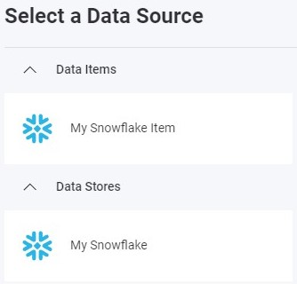

import Tabs from '@theme/Tabs';
import TabItem from '@theme/TabItem';

# Adding a Snowflake Data Source

:::danger breaking changes

Currently, the Reveal SDK is in the process of decoupling the data sources from the Reveal SDK core package. In order to ensure the project's continued functionality, you might be required to install additional packages into your project. Please see the [Supported Data Sources](web/datasources.md#supported-data-sources) topic for more information.

:::

## On the Client

**Step 1** - Add an event handler for the `RevealView.onDataSourcesRequested` event.

```js
var revealView = new $.ig.RevealView("#revealView");
revealView.onDataSourcesRequested = (callback) => {
    //add code here
    callback(new $.ig.RevealDataSources([], [], false));
};
```

**Step 2** - In the `RevealView.onDataSourcesRequested` event handler, create a new instance of the `RVSnowflakeDataSource` object. Set the `Title` property. After you have created the `RVSnowflakeSource` object, add it to the data sources collection.

```js
revealView.onDataSourcesRequested = (callback) => {
    var snowflakeDataSource = new $.ig.RVSnowflakeDataSource();
    snowflakeDataSource.title = "My Snowflake";

    callback(new $.ig.RevealDataSources([snowflakeDataSource], [], false));
};
```

When the application runs, create a new Visualization and you will see the newly created Snowflake data source listed in the "Select a Data Source" dialog.


**Step 3** - Add a new Data Source Item by creating a new instance of the `RVSnowflakeDataSourceItem` object. Set the `Id` and `Title` properties that correspond to your database table. After you have created the `RVSnowflakeDataSourceItem` object, add it to the data source items collection.

```js
revealView.onDataSourcesRequested = (callback) => {
    var mySnowflakeDataSource = new $.ig.RVSnowflakeDataSource();
    mySnowflakeDataSource.id = "MySnowflakeDataSource";
    mySnowflakeDataSource.title = "My Snowflake";

    var mySnowflakeDataSourceItem = new $.ig.RVSnowflakeDataSourceItem(mySnowflakeDataSource);
    mySnowflakeDataSourceItem.id = "MySnowflakeDataSourceItem";
    mySnowflakeDataSourceItem.title = "My Snowflake Item";

    callback(new $.ig.RevealDataSources([mySnowflakeDataSource], [mySnowflakeDataSourceItem], true));
};
```

When the application runs, create a new Visualization and you will see the newly created Snowflake data source item listed in the "Select a Data Source" dialog.



## On the Server

**Step 1** - Create the data source and data source item on the client, but do not provide any connection information. Only provie an `id`, `title`, and/or `subtitle`.

```js
revealView.onDataSourcesRequested = (callback) => {
    var mySnowflakeDataSource = new $.ig.RVSnowflakeDataSource();
    mySnowflakeDataSource.id = "MySnowflakeDataSource";
    mySnowflakeDataSource.title = "My Snowflake";

    var mySnowflakeDataSourceItem = new $.ig.RVSnowflakeDataSourceItem(mySnowflakeDataSource);
    mySnowflakeDataSourceItem.id = "MySnowflakeDataSourceItem";
    mySnowflakeDataSourceItem.title = "My Snowflake Item";

    callback(new $.ig.RevealDataSources([mySnowflakeDataSource], [mySnowflakeDataSourceItem], true));
};
```

**Step 2** - Create the data source provider. In this example, we are providing connection information to connect to our **Snowflake** database that was defined on the client. To achieve this, we determine the type of the data source/item we are working with, and set the available properties on the object.

<Tabs groupId="code" queryString>
  <TabItem value="aspnet" label="ASP.NET" default>

```cs
public class DataSourceProvider : IRVDataSourceProvider
{
    public Task<RVDataSourceItem> ChangeDataSourceItemAsync(IRVUserContext userContext, string dashboardId,
        RVDataSourceItem dataSourceItem)
    {
        if (dataSourceItem is RVSnowflakeDataSourceItem snowflakeDataSourceItem)
        {
            //update underlying data source
            ChangeDataSourceAsync(userContext, snowflakeDataSourceItem.DataSource);

            //only change the table if we have selected our custom data source item
            if (snowflakeDataSourceItem.Id == "MySnowflakeDataSourceItem")
            {
                snowflakeDataSourceItem.Schema = "TPCDS_SF100TCL";
                snowflakeDataSourceItem.Table = "CUSTOMER";
            }
        }

        return Task.FromResult(dataSourceItem);
    }

    public Task<RVDashboardDataSource> ChangeDataSourceAsync(IRVUserContext userContext,
        RVDashboardDataSource dataSource)
    {
        if (dataSource is RVSnowflakeDataSource snowflakeDataSource)
        {
            snowflakeDataSource.Account = "your-account";
            snowflakeDataSource.Host = "your-account-host";
            snowflakeDataSource.Database = "SNOWFLAKE_SAMPLE_DATA";
        }

        return Task.FromResult(dataSource);
    }
}
```

  </TabItem>

  <TabItem value="java" label="Java">

```java
public class DataSourceProvider implements IRVDataSourceProvider {
    public RVDataSourceItem changeDataSourceItem(IRVUserContext userContext, String dashboardsID, RVDataSourceItem dataSourceItem) {

        if (dataSourceItem instanceof RVSnowflakeDataSourceItem snowflakeDataSourceItem) {

            //update underlying data source
            changeDataSource(userContext, dataSourceItem.getDataSource());

            //only change the table if we have selected our custom data source item
            if (Objects.equals(dataSourceItem.getId(), "MySnowflakeDataSourceItem")) {
                snowflakeDataSourceItem.setSchema("TPCDS_SF100TCL");
                snowflakeDataSourceItem.setTable("CUSTOMER");
            }
        }
        return dataSourceItem;
    }

    public RVDashboardDataSource changeDataSource(IRVUserContext userContext, RVDashboardDataSource dataSource) {

        if (dataSource instanceof RVSnowflakeDataSource snowflakeDataSource) {
            snowflakeDataSource.setAccount("your-account");
            snowflakeDataSource.setHost("your-account-host");
            snowflakeDataSource.setDatabase("SNOWFLAKE_SAMPLE_DATA");
        }
        return dataSource;
    }
}
```

  </TabItem>

  <TabItem value="node" label="Node.js">

```js
const dataSourceItemProvider = async (userContext, dataSourceItem) => {
    if (dataSourceItem instanceof reveal.RVSnowflakeDataSourceItem) {

        //update underlying data source
        dataSourceProvider(userContext, dataSourceItem.dataSource);

        //only change the table if we have selected our data source item
        if (dataSourceItem.id === "MySnowflakeDataSourceItem") {
            dataSourceItem.schema = "TPCDS_SF100TCL";
            dataSourceItem.table = "CUSTOMER";
        }
    }
    return dataSourceItem;
}

const dataSourceProvider = async (userContext, dataSource) => {
    if (dataSource instanceof reveal.RVSnowflakeDataSource) {
        dataSource.account = "your-account";
        dataSource.host = "your-account-host";
        dataSource.database = "SNOWFLAKE_SAMPLE_DATA";
    }
    return dataSource;
}
```

  </TabItem>

  <TabItem value="node-ts" label="Node.js - TS">    

```ts
const dataSourceItemProvider = async (userContext: IRVUserContext | null, dataSourceItem: RVDataSourceItem) => {
    if (dataSourceItem instanceof RVSnowflakeDataSourceItem) {

        //update underlying data source
        dataSourceProvider(userContext, dataSourceItem.dataSource);

        //only change the table if we have selected our data source item
        if (dataSourceItem.id === "MySnowflakeDataSourceItem") {
            dataSourceItem.schema = "TPCDS_SF100TCL";
            dataSourceItem.table = "CUSTOMER";
        }
    }
    return dataSourceItem;
}

const dataSourceProvider = async (userContext: IRVUserContext | null, dataSource: RVDashboardDataSource) => {
    if (dataSource instanceof RVSnowflakeDataSource) {
        dataSource.account = "your-account";
        dataSource.host = "your-account-host";
        dataSource.database = "SNOWFLAKE_SAMPLE_DATA";
    }
    return dataSource;
}
```

  </TabItem>

</Tabs>

:::info Get the Code

The source code to this sample can be found on [GitHub](https://github.com/RevealBi/sdk-samples-javascript/tree/main/DataSources/Snowflake)

:::
