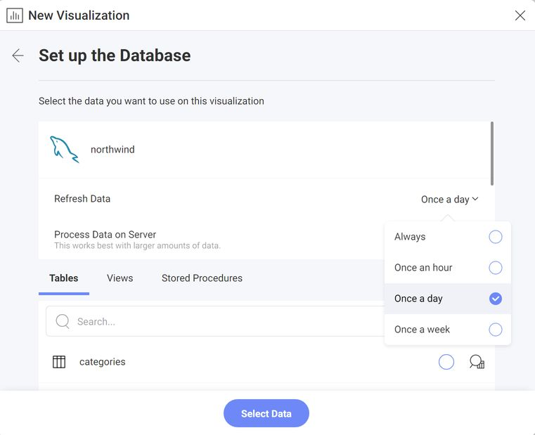

import Tabs from '@theme/Tabs';
import TabItem from '@theme/TabItem';

# Caching

In Reveal SDK, caching is a default mechanism designed to optimize performance by storing all queried data in a faster and embedded database, referred to as a cache. This process ensures that frequently accessed data is readily available, and upon initiating a query, the SDK automatically checks if the requested data is already present in the cache. In the event of a cache hit, the SDK swiftly retrieves the information without the need for an additional request to the original source.

## How caching works
When you query data through the SDK, a new *key* is created, encompassing all the options used to obtain that data, for each pipeline step. This *key* is stored alongside the resultant data from the pipeline step. Upon repeating the same operation, the key specific to each pipeline step will be recognized, and the corresponding data will be retrieved from the cache. However, if you alter any aspect of the data query for a particular step, such as ordering or filtering, the *key* won't match, and only the affected step and subsequent steps will perform the process. This new query will be saved alongside its results. For instance, changing the order of data obtained from an Excel file won't trigger the file to be downloaded again; only the specific step requiring modification, like the filter and the steps after it, will perform the process.

### Processing pipeline
The processing pipeline outlines the sequential stages through which data is systematically processed. Understanding the processing pipeline is important to discern where and how the cache comes into action, playing a significant role in optimizing data retrieval and enhancing overall processing efficiency.


<br/>

- The `[Download Resource]` stage only applies when using resource-based data sources, from which we typically download CSV/Json/Excel files.
- Some stages may be skipped or end up not making any changes, depending on the requested data. For instance, there might be no post-pivot calculated fields to process, or perhaps all filters are included in a query sent to the data source, making the `[Filter]` step unnecessary.
- These stages do not apply to the SSAS datasource, as it uses a different processing pipeline.

### Cache files
By default, cache files are stored in a folder inside the current user's temporary directory named `RevealCache_XXXX`, where `XXXX` is a number that identifies our instance. Two configuration properties, `CachePath` and `DataCachePath`, can be used to override this default behavior.

```cs
builder.Services
    .AddControllers()
    .AddReveal(revealSetupBuilder =>
    {
        revealSetupBuilder.AddSettings(settings =>
        {
            settings.CachePath = "your-cache-path";
            settings.DataCachePath = "your-data-cache-path";
        });
    });
```

- `CachePath` refers to the directory where the rest of cache files (like downloaded files) will be stored, it defaults to a directory named `RevealCache_XXXX` in the temporary directory in the system.
- `DataCachePath` refers to Directory where files caching data will be stored, it defaults to `CachePath`.

You can configure additional properties to exert control over the cache size:

```cs
builder.Services.AddControllers().AddReveal(revealSetupBuilder =>
{
    revealSetupBuilder.AddSettings(settings =>
    {
        settings.MaxStorageCells = 10000000;
        settings.MaxDownloadSize = 209715200;
        settings.MaxStringCellSize = 256;
        settings.MaxTotalStringsSize = 64000000;
    });
});
```

- `MaxStorageCells` refers to the expected maximum size of cells to be processed from any data source. The engine avoids using too much disk space for its cache, and this setting provides a hint for its caching management. The default is 10 million cells.
- `MaxDownloadSize` refers to the maximum size of a single download (e.g., a CSV file), expressed in bytes. The default is 200 MB.
- `MaxStringCellSize` refers to the limit on the number of characters any string in a dataset column may have. The default is 256.
- `MaxTotalStringsSize` refers to the expected maximum size of pivot tables or grids, given as the total number of characters in all of its cells. The engine avoids using too much memory, and this setting provides a hint for its memory management. The default is 64 million.

### Cache types
**Download** - Utilized by the `[Download Resource]` stage, this cache stores the downloaded resource when reading data from CSV/Excel/Json files. The filesystem cache is saved in `[RevealCache]/download`, with associated metadata stored in `[RevealCache]/download.sqlite`.

Individual downloads are constrained by the number of bytes specified in the `MaxDownloadSize` setting. Please note that the overall size of the downloads cache is fixed at 5GB, and as of now, there is no available API to modify this limit.

**Dataset** - Utilized by the `[Create Dataset]` and `[Calculate Fields]` stages.

Sqlite files are stored in `[RevealCache]/dataset`, with metadata residing in `dataset.sqlite`.

Some datasets are generated in memory and are also saved in an in-memory dataset cache.

The size of individual datasets is indirectly restricted by a set of parameters: `MaxStorageCells` and `MaxTotalStringsSize`. The total size of the dataset cache is fixed at 5GB, and as of now, there is no available API to modify this limit.

**Tabular Data** - This cache holds the result after executing all stages.

The data is serialized as JSON and temporarily stored in an in-memory cache.

## Refreshing the cache
Refreshing the cache involves updating or renewing the stored data within the cache to maintain accuracy and reflect the most recent information. By default, the cache is set to update `Once a day`. The behavior of cache refreshing can be modified from the visualization UI, allowing users to change the update period or trigger a manual update based on their specific requirements.

You can trigger a manual update just by clicking the refresh option in the menu (indicated by three dots).


You can change the update frequency by selecting another value from the refresh data frequency combo box. This option is available in the data source configuration dialog.

The available options are the following:
- Always
- Once an hour
- Once a day
- Once a week



## Redis Cache

The Reveal SDK supports using Redis as a distributed cache provider, enabling cache sharing across multiple server instances. This is particularly useful in load-balanced environments where multiple instances of your application need to access the same cached data.

### Installation

<Tabs groupId="code" queryString>
  <TabItem value="aspnet" label="ASP.NET" default>

For ASP.NET applications, you need to install a separate NuGet package to enable Redis cache support:

```bash
dotnet add package Reveal.Sdk.Cache.Redis
```

  </TabItem>
  <TabItem value="node" label="Node.js">

For Node.js applications, the Redis cache is already included in the main Reveal SDK package. No additional installation is required beyond the standard Reveal SDK setup.

  </TabItem>
  <TabItem value="java" label="Java">

For Java applications, the Redis cache is already included in the main Reveal SDK package. No additional installation is required beyond the standard Reveal SDK setup.

  </TabItem>
</Tabs>

### Configuration

To enable Redis cache, configure the connection in your application initialization:

<Tabs groupId="code" queryString>
  <TabItem value="aspnet" label="ASP.NET" default>

```cs
builder.AddRedisCache((options) => {
    options.ConnectionString = "localhost:6379";
});
```

  </TabItem>

  <TabItem value="node" label="Node.js">    

```js
const revealOptions = {
    ...
    redisOptions: { connectionString: "localhost:6379" }
};
```

  </TabItem>

  <TabItem value="node-ts" label="Node.js - TS">    

```ts
const revealOptions: RevealOptions = {
    ...
    redisOptions: { connectionString: "localhost:6379" }
};
```

  </TabItem>

  <TabItem value="java" label="Java">

```java
initializeParameterBuilder.enableRedisCache((options) -> {
    options.setConnectionString("localhost:6379");
});
```

  </TabItem>
</Tabs>

### Redis Configuration Options

The Redis cache provider supports various configuration options to customize the connection and behavior:

- **ConnectionString** - The Redis server connection string or endpoint (e.g., "localhost:6379"). Default: empty string.
- **EndPoints** - A list of endpoint URLs used for connecting to Redis cluster or multiple Redis instances. Default: null.
- **User** - The username for Redis authentication. Default: null.
- **Password** - The password for Redis authentication. Default: null.
- **UseSsl** - Indicates whether SSL/TLS encryption is enabled. Default: false.
- **DefaultDatabase** - The default database number to use. Default: 0.
- **ClientName** - The client name for identification. Default: null.
- **ConnectTimeoutMs** - The connection timeout in milliseconds. Default: 5000.
- **SyncTimeoutMs** - The synchronous operation timeout in milliseconds. Default: 5000.
- **AsyncTimeoutMs** - The asynchronous operation timeout in milliseconds. Default: 5000.
- **ConnectRetry** - The number of connection retry attempts. Default: 3.
- **KeepAliveSeconds** - The keep-alive interval in seconds (-1 to disable). Default: 60.
- **AbortOnConnectFail** - Indicates whether to abort on connection failure. Default: false.
- **AllowAdmin** - Indicates whether admin commands (FLUSHDB, CONFIG, etc.) are allowed. Default: false.
- **ReconnectRetryPolicy** - The reconnection retry policy: "Linear" or "Exponential". Default: "Linear".
- **RetryDelayMs** - The base delay in milliseconds for the retry policy. Default: 1000.

Example with additional configuration options:

<Tabs groupId="code" queryString>
  <TabItem value="aspnet" label="ASP.NET" default>

```cs
builder.AddRedisCache((options) => {
    options.ConnectionString = "localhost:6379";
    options.Password = "your-password";
    options.UseSsl = true;
    options.DefaultDatabase = 1;
    options.ConnectTimeoutMs = 10000;
});
```

  </TabItem>

  <TabItem value="node" label="Node.js">    

```js
const revealOptions = {
    ...
    redisOptions: { 
        connectionString: "localhost:6379",
        password: "your-password",
        useSsl: true,
        defaultDatabase: 1,
        connectTimeoutMs: 10000
    }
};
```

  </TabItem>

  <TabItem value="node-ts" label="Node.js - TS">    

```ts
const revealOptions: RevealOptions = {
    ...
    redisOptions: { 
        connectionString: "localhost:6379",
        password: "your-password",
        useSsl: true,
        defaultDatabase: 1,
        connectTimeoutMs: 10000
    }
};
```

  </TabItem>

  <TabItem value="java" label="Java">

```java
initializeParameterBuilder.enableRedisCache((options) -> {
    options.setConnectionString("localhost:6379");
    options.setPassword("your-password");
    options.setUseSsl(true);
    options.setDefaultDatabase(1);
    options.setConnectTimeoutMs(10000);
});
```

  </TabItem>
</Tabs>

## Disabling caching
Disabling caching is not an available option; however, you can achieve a similar result by setting the data source refresh data frequency to `Always`. This configuration ensures that the application consistently retrieves fresh data, bypassing the cache. It's essential to note that even if the cache is not consulted during queries, the processed data will still be saved. While this approach guarantees access to the most up-to-date information, it's important to be mindful of potential performance impacts due to the increased load on the data source when utilizing real-time access. Developers may opt for this configuration temporarily for debugging purposes or when working with dynamic data that frequently changes.

To bypass caching, set the data source refresh data frequency to `Always`.


## FAQ

**Q: Does the cache consume a lot of disk space?**

**A:** The cache is engineered to utilize approximately 20GB, automatically removing older entries if necessary. Currently, there is no public setting to adjust this size.

**Q: My disk is filling up, and I think Reveal is to blame**

**A:** Before reporting a bug, check if the OS temporary directory is not being cleared. Reveal and other processes can generate temporary files that the OS might not remove until it restarts. Consider scheduling a cleanup process to manage this directory periodically. Reveal does create some temporary files that are automatically deleted, so ensure that your cleanup process does not delete recently created files, as they may be part of ongoing operations in Reveal. Additionally, if Reveal's cache folder resides within the OS temporary directory, it should not be deleted by the cleanup process.

**Q: How can I segregate cache entries for different users?**

**A:** This is often done for security reasons. However, if different users have equal access rights to the underlying data source, sharing cache entries can enhance the overall performance. Reveal, by default, leans toward the later approach. When it comes to security, you need to:
  - Set the `IRVUserContext.UserId` property in the `IRVUserContextProvider` to identify the current user. This context is accessible in the `IRVDataSourceProvider` and `IRVAuthenticationProvider`, enabling user-specific decisions.
  - Configure the data source in the `IRVDataSourceProvider` for the current user. Limit data sources to those relevant to the user's role, and adjust properties accordingly (e.g., ensure Database/Table/CustomQuery properties align with the user's permissions).
  - Assign appropriate credentials for the user in the `IRVAuthenticationProvider`.

  These steps are crucial for security, regardless of caching. Regarding caching, Reveal utilizes provided information (data source, credentials, and sometimes UserId) to create cache entries. These entries may be shared among users only if they share the same data source and credentials, indicating they can execute identical queries with matching permissions.

**Q: How does `IRVUserContext.UserId` impact cache entries?**

**A:** Currently, there's no assurance that distinct UserId values will generate separate entries in the cache. However, it's crucial to ensure that the UserId is correctly set when using `RVHeadersDataSourceCredentials` credentials type, as not doing so can lead to cache issues.

**Q: How does the `RVBearerTokenDataSourceCredential.UserId` property impact cache entries?**

**A:** If the `RVBearerTokenDataSourceCredential.UserId` is set, it will be used when creating the cache entry key, and it is recommended to do so to improve performance. Note that the UserId in `RVBearerTokenDataSourceCredential` may differ from the one in `IRVUserContext`; it corresponds to the UserId linked with the `RVBearerTokenDataSourceCredential' access token.

**Q: In my deployment, there will be several instances of the Reveal server. How can they share the cache?**

**A:** The Reveal SDK now supports Redis cache, which enables cache sharing across multiple server instances. By configuring Redis cache as described in the [Redis Cache](#redis-cache) section, all your server instances can access the same distributed cache. This is the recommended approach for load-balanced deployments.

Alternatively, if Redis is not available, you can configure your load balancer to direct the same group of users to the same Reveal server instance. This will ensure that cache entries are created within a specific instance, and subsequent requests from those users will hit the same instance, utilizing the cached data efficiently.
