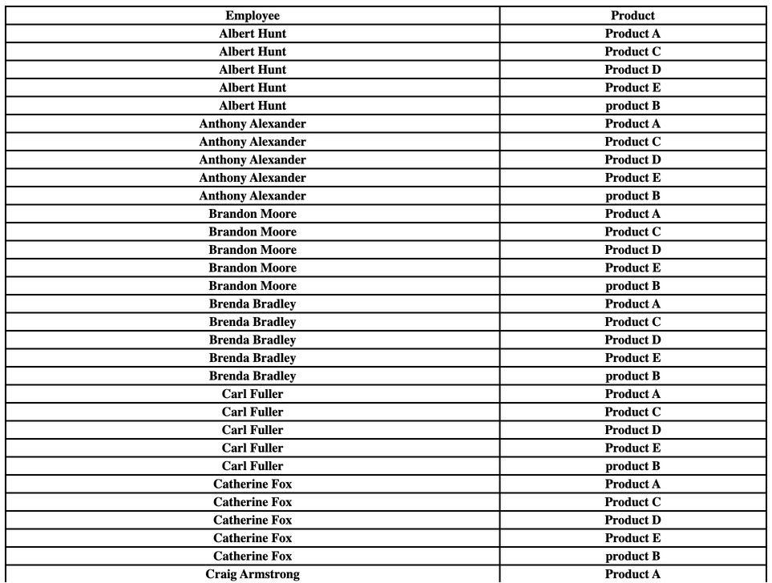

# Custom Visualizations

The Reveal SDK provides users with a comprehensive set of predefined visualizations that seamlessly integrate into your application by default. These visualizations offer a quick and efficient way to showcase your data. However, in certain unique situations or edge cases, you may find the need to tailor the presentation of your data according to specific requirements. In such instances, the Reveal SDK offers a solution through Custom Visualizations.

Custom Visualizations serve as bespoke components that you have the flexibility to define. These components have the capability to receive data directly from the Reveal SDK, empowering you to present your information in a highly customized and non-standard manner. This level of customization ensures that you can meet the specific visual and analytical needs of your application, offering a more tailored and user-centric experience. Whether it's a specialized chart, a unique graph, or a distinctive representation of your data, Custom Visualizations provide the tools for developers to craft a truly personalized and effective data presentation solution.

To create a custom visualization, you require both a **pre-defined component** (indicating what the visualization will render) and a **bridge** (acting as the connection between your component and the data managed by the Reveal SDK). The bridge should expose an event for data changes, and your component should subscribe to this event to retrieve the updated data.

# Setting up the bridge

As mentioned earlier, to consume data from the SDK, you must define the bridge. The following demonstrates how the bridge should be structured:

```js
var host;
window.revealBridge = {
  sendMessageToHost: function (data) {
    try {
      var iframe = document.createElement("IFRAME");
      var message = encodeURIComponent(JSON.stringify(data));
      iframe.setAttribute("src", "js-frame:" + message);
      document.documentElement.appendChild(iframe);
      iframe.parentNode.removeChild(iframe);
      iframe = null;
    }
    catch (e) {
      // The frame couldn't be created. 
      // This could happen in web environments when the host is not in the same domain than the custom view webpage.
      // Is not a problem as we are using window.postMessage for the communication in this case.
    }

    try {
      if (window.top && window.top.location) {
        window.top.postMessage(data, "*");
      }
    } catch (e) {
      // window.top.postMessage couldn't be executed.
      // This sould never happen but...
    }
  },

  notifyExtensionIsReady: function (formatting) {

    if (formatting) {
      this.sendMessageToHost({ message: "ready", formatting: true });
    } else {
      this.sendMessageToHost({ message: "ready" });
    }
  },

  runAction: function (actionName, data) {
    this.sendMessageToHost({ message: "runAction", action: actionName, rowData: data });
  },

  openUrl: function (url) {
    this.sendMessageToHost({ message: "openURL", URL: url });
  },
}

function processMessageFromHost(message) {
  if (!message || !message.data || !message.data.metadata) {
    return;
  }

  if (message.data.message) {
    // This is the same message that I'm sending to notify that the extension is ready and the iPad is sending it back here.
    return;
  }

  if (!window.revealBridgeListener) {
    return;
  }

  window.revealBridgeListener.dataReady(message.data);
};

window.addEventListener('message', processMessageFromHost, false);
```

# Defining a Custom Visualization

In this example, we are using Angular. Let's create an Angular component. Within the component, we should include an event handler for the `window.revealBridgeListener` that was previously defined in the bridge.

```ts
export class TableComponent implements OnInit {

    data: any = [];
    headers: any = [];

    constructor(private ref: ChangeDetectorRef) { }

    ngOnInit(): void {
        window.revealBridgeListener = {
            dataReady: (incomingData: any) => {
                this.data = this.dataToJson(incomingData);
                this.createTableHeaders(this.data);
                this.ref.detectChanges();
            }
        };
        window.revealBridge.notifyExtensionIsReady();
    }

    createTableHeaders(data: any) {
        if (data.length === 0) {
            return;
        }

        Object.keys(this.data[0]).map((propertyName: string) => {
            this.headers.push(propertyName)
        })
    }

    dataToJson(data: any) {
        let propertyNames = [];

        if (!data.metadata.columns) {
            return [];
        }

        for (var c = 0; c < data.metadata.columns.length; c++) {
            var column = data.metadata.columns[c];
            propertyNames.push(column.name);
        }

        let dataObjects = [];
        for (var i = 0; i < data.data.length; i++) {
            var rowData = data.data[i];
            let dataObject: any = {};
            for (var j = 0; j < rowData.length; j++) {
                dataObject[propertyNames[j]] = rowData[j];
            }
            dataObjects.push(dataObject);
        }

        return dataObjects;
    }
}
```

We are now ready to present our data as desired. The following represents our template.

```html
<div class="container">
    <table>
        <thead>
        <tr>
            <th *ngFor="let header of headers">{{header}}</th>
        </tr>
        </thead>
        <tbody>
        <tr *ngFor="let row of data">
            <th *ngFor="let header of headers">{{ row[header] }} </th>
        </tr>
        </tbody>
    </table>
</div>
```

As a final step, we need to register the custom visualization with the SDK, referencing the previously defined component. This code should be called within the component that contains the Reveal view.

Add an `RVChartTypeItem` object to the `revealView.chartTypes` array. Ensure that you specify the required properties: `title`, `url`, `icon`, and `groups`. The `url` property should reference the location of your previously defined component.

If you require additional information on registering a chart type, please refer to the documentation on [adding custom chart types](chart-types.md#add-custom-chart-type).

```ts
export class DashboardViewerComponent implements AfterViewInit {

    @ViewChild('revealView') el!: ElementRef;

    async ngAfterViewInit() {
        let dashboard = await $.ig.RVDashboard.loadDashboard("Sales");
        var revealView = new $.ig.RevealView(this.el.nativeElement);
        revealView.dashboard = dashboard;

        //add custom vizualization to chart types drop down
        revealView.chartTypes.push({
            title: "HTML Table",
            url: "http://localhost:4200/table", //provide the url to your custom vizualization
            icon: "https://help.revealbi.io/img/logo.png",
            groups: ["Custom Vizualizations"]
        });
    }
}
```

We should see the previously added visualization in the **Chart Types** drop down.


After our visualization has been added to the dashboard, it should look like this:



:::info Get the Code

The source code to this sample can be found
on [GitHub](https://github.com/RevealBi/sdk-samples-javascript/tree/main/CustomVisualization)

:::