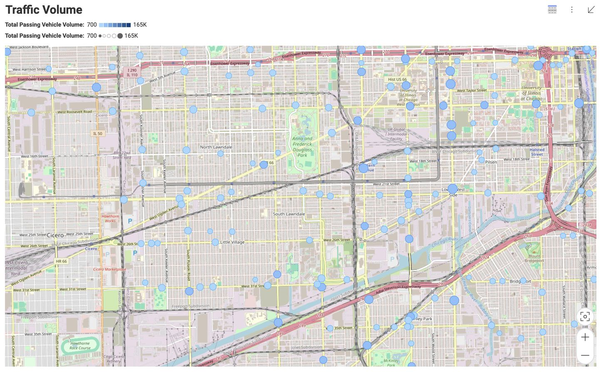
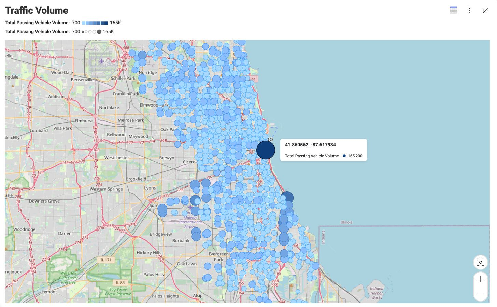

# Customizing Map Tiles

The Reveal SDK includes a scatter map visualization type. By default, this visualization positions data points directly on the map without providing additional context. Yet, developers enjoy the flexibility to tailor this behavior according to their needs. Rather than a straightforward display of raw data, they can choose to employ a map tile, enhancing the visualization by presenting map information alongside the fed data. This option offers a more comprehensive and visually engaging representation of geographical data.

Currently, the following tile map providers are supported in our system: `Bing`, `Esri`, `MapBox`, and `OpenStreetMap`.

To get started, you first need to create a default scatter map. This serves as the initial step in the process, allowing you to explore the basic functionality of the scatter map.



As you can observe, the generated map lacks context, even if the points are generated correctly. To address this issue, you need to add tiles to the map. By incorporating tiles, you provide the necessary background and visual framework that enhances the overall context of the map, making it more informative and engaging for users.

To incorporate the tiles, you must establish a connection between the SDK and the chosen provider. In this case, we are utilizing `OpenStreetMap` as the selected provider. 

```js
const url = 'https://tile.openstreetmap.org/{Z}/{X}/{Y}.png'
$.ig.RevealSdkSettings.visualizations.scatterMaps = $.ig.ScatterMapVisualizationsConfiguration.createOpenStreetMapConfiguration(url);
```



## Other providers

### Bing

**Step 1** - Create an account at [Bing Maps Portal](https://www.bingmapsportal.com/)

**Step 2** - Create a new key in `My account` -> `My Keys`

**Step 3** - Add the previously generated key to your application

```js
$.ig.RevealSdkSettings.visualizations.scatterMaps = new $.ig.ScatterMapVisualizationsConfiguration("Bing", "your-key");
```

### Esri

**Step 1** - Create an account at [ArcGIS](https://www.arcgis.com/)

**Step 2** - [Generate a new token](https://developers.arcgis.com/rest/users-groups-and-items/generate-token.htm)

**Step 3** - Add the generated token to your application

```js
$.ig.RevealSdkSettings.visualizations.scatterMaps = new $.ig.ScatterMapVisualizationsConfiguration("Esri", "your-token");
```

### MapBox

**Step 1** - Create an account at [MapBox](https://www.mapbox.com/)

**Step 2** - Go to `Tokens` -> `Create a token` (or use the public one)

**Step 3** - Add the generated token to your application

```js
$.ig.RevealSdkSettings.visualizations.scatterMaps = new $.ig.ScatterMapVisualizationsConfiguration("MapBox", "your-token");
```

:::info Get the Code

The source code to this sample can be found
on [GitHub](https://github.com/RevealBi/sdk-samples-javascript/tree/main/CustomizingMapTiles)

:::