# Customizing the Reveal View

The `RevealView` exposes a set of properties that control which UI elements end-users see and what actions they can take. Use these to enforce permissions, hide unused features, or simplify the dashboard for non-technical users.

Properties on this page are grouped by purpose. For the Visualization Editor lifecycle events (`onVisualizationEditorOpening` / `Opened` / `Closing` / `Closed`), see [Editor Events](editor-events.md).

## Edit Permissions

These properties control what end-users can do in edit mode.

### canEdit

This property shows/hides the **Edit** menu item for the Dashboard.


```js
revealView.canEdit = false;
```

When the `RevealView.canEdit` property is set to `false`, dashboard editing is completely disabled.

### canAddVisualization

This property shows/hides the dashboard's **+ Visualization** button when in edit mode.

```js
revealView.canAddVisualization = false;
```

### canAddDashboardFilter

This property shows/hides the **Add Dashboard Filter** menu item for the Dashboard.

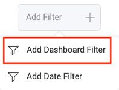

```js
revealView.canAddDashboardFilter = false;
```

### canAddDateFilter

This property shows/hides the **Add Date Filter** menu item for the Dashboard.

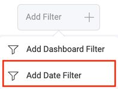

```js
revealView.canAddDateFilter = false;
```

### canAddCalculatedFields

This property shows/hides the **Calculated Field** menu item for the Visualization Editor.

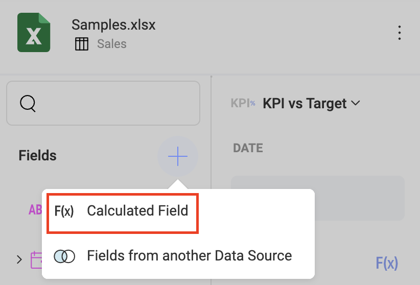

```js
revealView.canAddCalculatedFields = false;
```

### canAddPostCalculatedFields

This property shows/hides the **F(x)** menu item in the "Visualization Fields" section of the Visualization Editor.

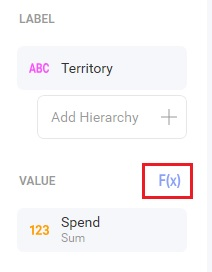

```js
revealView.canAddPostCalculatedFields = false;
```

### canChangeVisualizationBackgroundColor

This property enables the ability to provide a background color for a visualization in the **Settings** tab of the visualization editor.

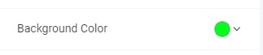

```js
revealView.canChangeVisualizationBackgroundColor = true;
```

When using this property, you must install the following dependencies into your client application:

- Spectrum v 1.8.0 or newer

``` html
<link href="https://cdnjs.cloudflare.com/ajax/libs/spectrum/1.8.0/spectrum.min.css" rel="stylesheet" type="text/css" >
<script src="https://cdnjs.cloudflare.com/ajax/libs/spectrum/1.8.0/spectrum.min.js"></script>
```

### canCopyVisualization

This property shows/hides the **Copy** menu item for a Visualization.

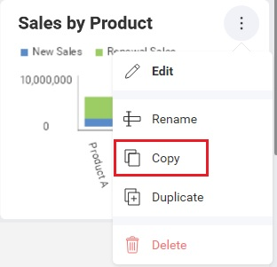

```js
revealView.canCopyVisualization = false;
```

### canDuplicateVisualization

This property shows/hides the **Duplicate** menu item for a Visualization.

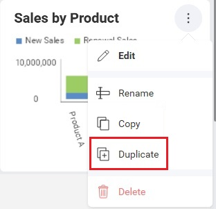

```js
revealView.canDuplicateVisualization = false;
```

### showChangeDataSource

This property shows/hides the **Change Data Source** button on the Data tab in the visualization editor.

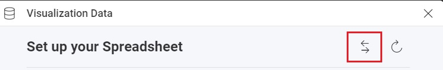

```js
revealView.showChangeDataSource = false;
```

### showEditDataSource

This property shows/hides the **Edit** menu item for the DataSource in the Visualization Editor.

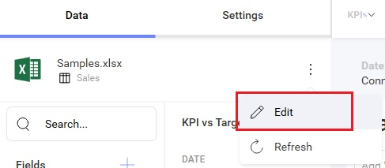

```js
revealView.showEditDataSource = false;
```

### startInEditMode

When set to `true`, this property will place the `RevealView` into "Edit Mode" when a dashboard is first loaded.

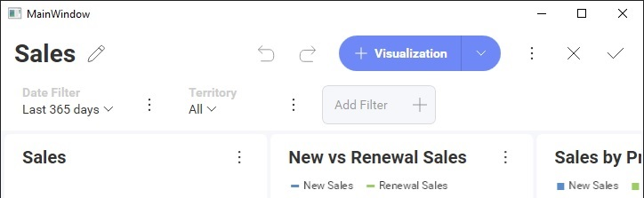

```js
revealView.startInEditMode = false;
```

### startWithNewVisualization

When set to `true`, this property will immediately launch the "New Visualization" dialog prompting you to choose a data source.


```js
revealView.startWithNewVisualization = false;
```

:::info

This property will not function if you are loading an existing dashboard and have not set the `RevealView.startInEditMode` property to `true` 

:::

## Save

### canSaveAs

This property shows/hides the **Save As** button in the dashboard menu.

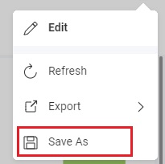

```js
revealView.canSaveAs = false;
```

For the full save lifecycle (server-side save, custom save handlers, the `onSave` event), see [Saving Dashboards](saving-dashboards.md).

## Dashboard Chrome

These properties control the dashboard header, menu, and viewer interactions.

### showHeader

This property shows/hides the entire dashboard header, which include the dashboard Title and the dashboard menu.

```js
revealView.showHeader = false;
```

### showMenu

This property shows/hides the dashboard menu that is placed in the top right corner of the `RevealView`.

```js
revealView.showMenu = false;
```

### showRefresh

This property shows/hides the **Refresh** button from the dashboard menu.

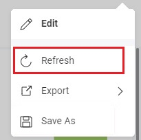

```js
revealView.showRefresh = false;
```

### canMaximizeVisualization

This property shows/hides the **Maximize** button on a visualization.

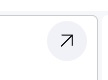

```js
revealView.canMaximizeVisualization = false;
```

## Export Menu

These properties control the visibility of individual items in the **Export** menu. For the full export story (end-user export, server-side export, configuration), see the [Exporting](exporting-dashboards.md) topics.

### showExportImage

This property shows/hides the **Image** item from the export menu.

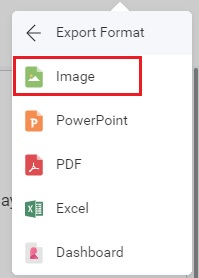

```js
revealView.showExportImage = false;
```

### showExportToExcel

This property shows/hides the **Excel** item from the export menu.

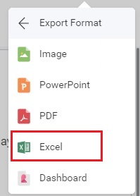

```js
revealView.showExportToExcel = false;
```

### showExportToPDF

This property shows/hides the **PDF** item from the export menu.

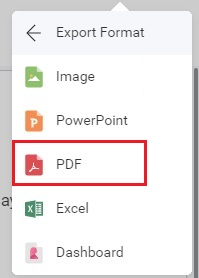

```js
revealView.showExportToPDF = false;
```

### showExportToPowerPoint

This property shows/hides the **PowerPoint** item from the export menu.

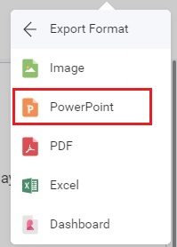

```js
revealView.showExportToPowerPoint = false;
```

## Filters

### showFilters

This property shows/hides the panel containing the date and dashboard filters in the `RevealView`. Use this when you provide a custom filter UI or want to prevent end-users from interacting with filters directly.

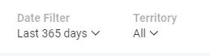

```js
revealView.showFilters = false;
```

For the developer API to read and set filter values programmatically, see [Filtering Dashboards](filtering-dashboards.md).
