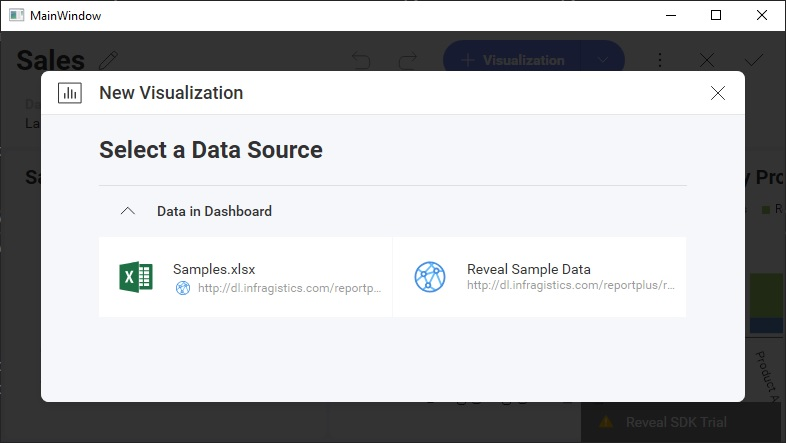

# Editor-on-Load Kiosk

## Goal

Land users **directly in the editor** with the new-visualization dialog already open. Useful for kiosk-style authoring apps where the entire purpose is to create a new visualization — skip the empty-dashboard view, drop the user straight into "pick a data source."

## Result



The `RevealView` opens already in edit mode, with the data-source picker prompting the user to start a new visualization.

## Properties used

- [`startInEditMode`](https://help.revealbi.io/api/javascript/latest/classes/RevealView.html#startInEditMode) — `true` puts the `RevealView` into edit mode the moment a dashboard loads.
- [`startWithNewVisualization`](https://help.revealbi.io/api/javascript/latest/classes/RevealView.html#startWithNewVisualization) — `true` immediately launches the "New Visualization" dialog. Has no effect unless `startInEditMode = true`.

## Code

```js
const revealView = new RevealView("#revealView");
revealView.startInEditMode = true;
revealView.startWithNewVisualization = true;

revealView.dashboard = new RVDashboard();
```

A fresh `RVDashboard()` gives the editor an empty canvas to start from. If you load an existing dashboard instead, the editor opens against that dashboard's first visualization.

## Variations

- **Edit mode without the new-viz dialog** — set only `startInEditMode = true`. Drops users into edit mode but lets them pick what to do.
- **Hide the "+ Visualization" button afterward** — pair with `revealView.canAddVisualization = false` if the kiosk should permit only the initial visualization, no more.
- **Open against an existing dashboard** — replace `new RVDashboard()` with `RVDashboard.loadDashboard("Template")` to start editing a pre-built template.

## See also

- [Creating Dashboards](../creating-dashboards.md) — instantiating a fresh `RVDashboard`.
- [Loading Dashboards](../loading-dashboards.md) — loading an existing `.rdash` file as the editor's starting point.
