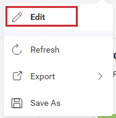

# View-only Embed

## Goal

Embed a dashboard for users who should be able to **view, refresh, and filter** the data — but never edit it. Common in customer-facing portals, internal read-only reporting, and any scenario where editing isn't part of the user role.

## Result



The kebab menu loses its "Edit" entry, the "+ Visualization" button is gone, and the visualization editor cannot be opened.

## Properties used

- [`canEdit`](https://help.revealbi.io/api/javascript/latest/classes/RevealView.html#canEdit) — master switch. When `false`, all editor entry points disappear and most other `canX` / `showX` toggles become irrelevant.

That's it. `canEdit = false` does the heavy lifting on its own.

## Code

```js
const revealView = new RevealView("#revealView");
revealView.canEdit = false;

RVDashboard.loadDashboard("Sales").then(dashboard => {
    revealView.dashboard = dashboard;
});
```

## Variations

- **Hide the refresh button too** — set `revealView.showRefresh = false`.
- **Hide the entire dashboard header** (title + menu) — set `revealView.showHeader = false`.
- **Hide just the menu, keep the title** — set `revealView.showMenu = false`.
- **Also lock down filters** (custom filter UI elsewhere) — set `revealView.showFilters = false`. See [Filtering Dashboards](../filtering-dashboards.md#hiding-filters).
