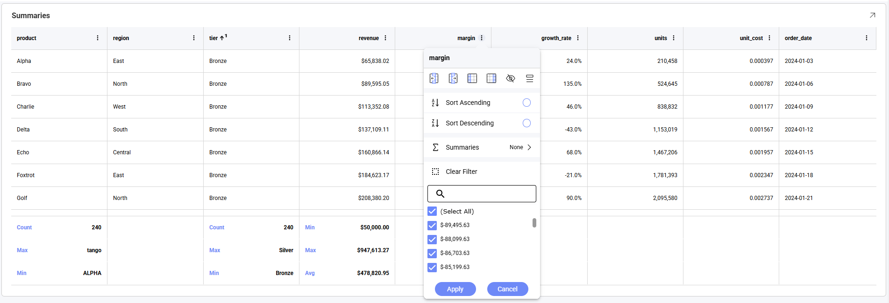
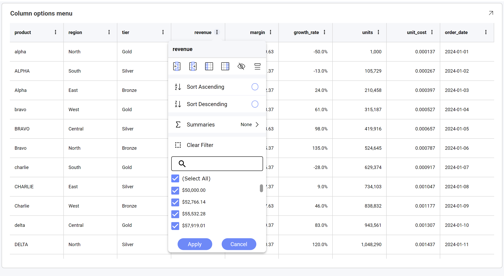
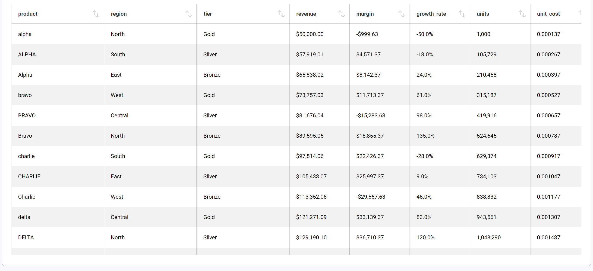
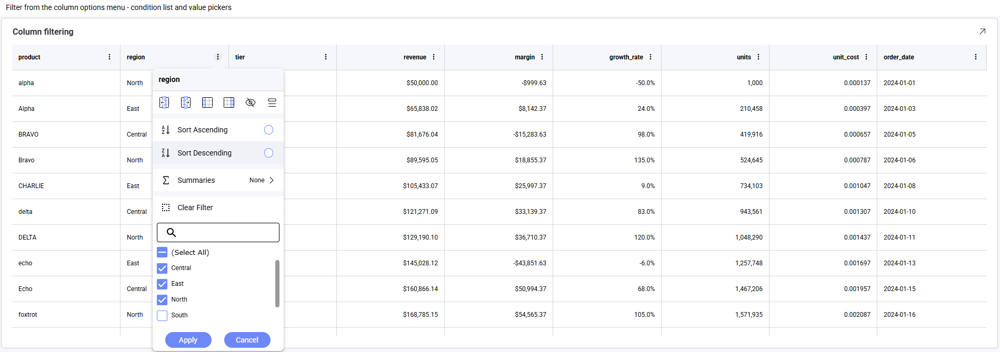
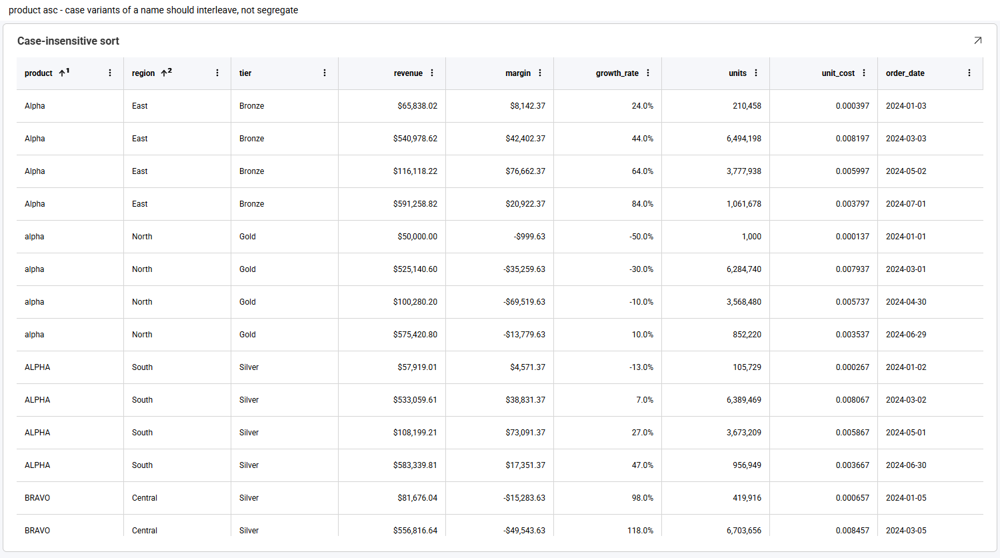
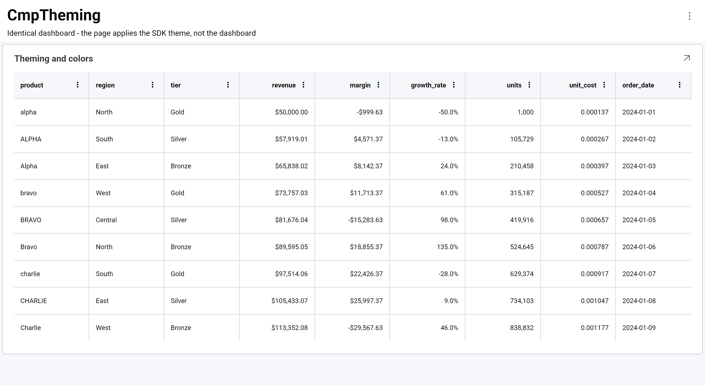
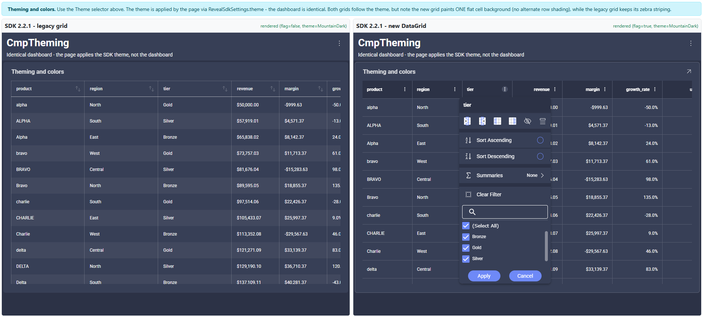
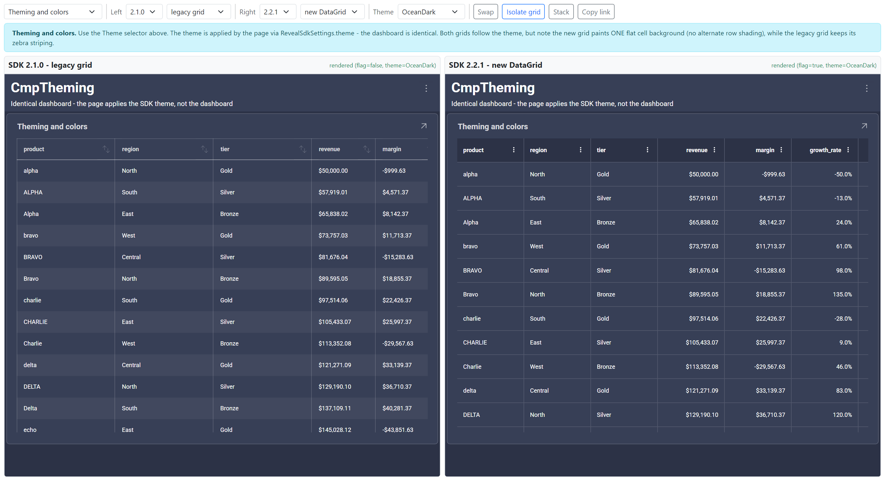
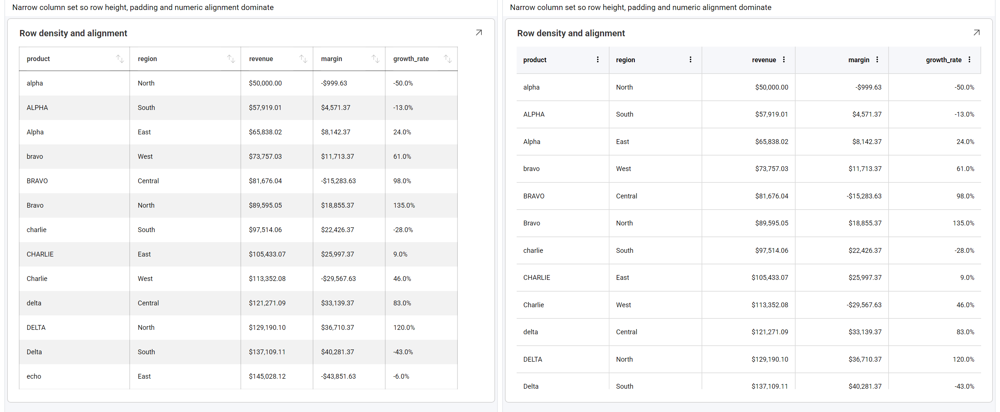
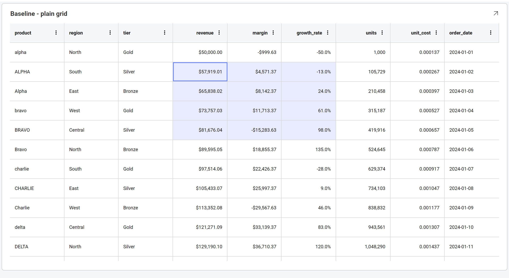

# Data Grid

The **Data Grid** is a modern implementation of the Grid visualization. It adds a per-column options menu — with filtering, summaries, grouping and pinning — on top of the tabular layout the classic Grid already provides.



The Data Grid is **the default grid visualization** as of version 2.2.0. It is not a new chart type: the same `Grid` visualization renders either as the classic grid or as the Data Grid, depending on the `newDataGrid` feature. Existing dashboards render with the Data Grid without being re-authored, and nothing in the dashboard file changes.

:::note

**Already using the Data Grid? Nothing here is new to you.** If you turned on the `newDataGrid` feature in an earlier version, you have been using exactly this grid all along — this topic introduces no new functionality, except the Grid Hyperlink Columns, and nothing changes for your application.

What changed in 2.2.0 is the *default*: applications that never touched the feature flag now get the Data Grid too. This topic exists to lay out, in one place, everything the Data Grid gives you over the classic grid — so that everyone arriving at it for the first time can see what they gained, and anyone comparing the two knows exactly where they differ.

:::

## What's New in the Data Grid

Everything in this list is **new in the Data Grid** — the classic grid has none of it.

| Feature | What the end-user gets | How to enable |
|---|---|---|
| [Column options menu](#the-column-options-menu) | A **⋮** button on every column header, gathering sorting, filtering, summaries, grouping, pinning and column visibility in one menu | Automatic |
| [Column filtering](#column-filtering) | Filter any column from its header, using a searchable checkbox list of that column's values | Automatic |
| [Column summaries](#column-summaries) | Sum, average, count, minimum and maximum on numeric columns, shown in a summary row | Automatic — but see [Summaries and Paging](#summaries-and-paging) |
| [Grouping](#grouping) | Collapsible group rows, nested to any depth, grouped from the column menu | Automatic from the menu; a saved grouping requires the dashboard |
| [Column pinning](#the-column-options-menu) | Freeze a column against the left or right edge while the grid scrolls | Automatic |
| [Column resizing and reordering](#column-resizing-and-reordering) | Drag a header's edge to resize a column, or its middle to move it. The classic grid's widths are fixed | Automatic |
| [Show / hide columns](#the-column-options-menu) | Choose which columns are visible without editing the dashboard | Automatic |
| [Multi-column sorting](#multi-column-sorting) | Sorting a second column adds to the sort, with a **sort ordinal** on each sorted header; sorting is case-insensitive | Automatic |
| [Cell selection and copying](#cell-selection-and-copying) | Click a cell or drag a range, then **Ctrl+C** to copy it as CSV, with values formatted as displayed | Automatic |
| [Theming](#theming) | The grid follows the active Reveal theme across every surface, including the column menu | `RevealSdkSettings.theme` |
| Hyperlink columns | Cells rendered as links, with per-row destinations | Configured on the dashboard — see [Hyperlink Columns](hyperlink-columns.md) |

### Do I Need to Enable These Individually?

**No.** There is no per-feature switch, on the client or the server, and nothing to add to a `.rdash` file. The single `newDataGrid` feature selects which grid implementation renders, and everything in the table above comes with it, configured by the SDK itself.

That means there is currently **no supported way to turn an individual feature off** — you cannot, for example, keep the column options menu but remove the filter section, or disable copying. The choice available to you is which grid renders:

```js
// Data Grid (the default from 2.2.0) - every feature above is active
RevealSdkSettings.betaFeatures.enable("newDataGrid");

// Classic grid - none of the features above
RevealSdkSettings.betaFeatures.disable("newDataGrid");
```

:::info

**Client-side only.** Which grid renders is decided in the browser while the visualization is built, so the server SDK plays no part in it and needs no configuration. A single server can back applications using either grid.

:::

The two exceptions — the things that *are* yours to configure — are the **theme**, applied with `RevealSdkSettings.theme` (see [Theming](#theming)), and anything authored on the dashboard itself: grouping, sorting, field formatting, renamed captions and hyperlink columns.

## Switching Between the Grids

Because the Data Grid is enabled by default, no code is needed to use it. To go back to the classic grid, disable the feature before any `RevealView` is created:

```js
RevealSdkSettings.betaFeatures.disable("newDataGrid");
```

And to enable it explicitly — for example on version 2.1.0, where it is available but off by default:

```js
RevealSdkSettings.betaFeatures.enable("newDataGrid");
```

See [Beta Features](beta-features.md) for the full feature API.

:::info

The feature is read while a visualization is being constructed, so change it during application start-up — before any `RevealView` is created. Toggling it after a view has rendered does not change a grid that is already on screen.

:::

:::caution

**Upgrading from an earlier version?** Because the Data Grid became the default in 2.2.0, dashboards that previously rendered with the classic grid now render with the Data Grid. The most visible differences are right-aligned numeric columns and the loss of alternate row shading — see [Layout and Alignment](#layout-and-alignment) and [Row Shading](#row-shading).

Conditional formatting also behaves differently: when several rules match the same cell, the Data Grid applies all of them in list order, with later rules winning for any overlapping properties.

:::

## The Column Options Menu

Every column in the Data Grid carries a **⋮** button in its header. It opens the column options menu, which brings sorting, filtering, summaries, grouping, pinning and column visibility together in one place.



| Section | What it does |
|---|---|
| **Pin left / Pin right** | Freezes the column against the left or right edge so it stays visible while the grid scrolls horizontally. |
| **Group by / Show columns / Hide column** | Groups the rows by this column, chooses which columns are visible, or hides this one. |
| **Sort Ascending / Sort Descending** | Sorts by this column. Sorting more than one column builds a multi-column sort rather than replacing the previous one. |
| **Summaries** | Aggregates the column — see [Column Summaries](#column-summaries). Numeric columns only. |
| **Clear Filter** and the value list | Filters the column — see [Column Filtering](#column-filtering). |

The classic grid has no equivalent. Its headers offer sort arrows only, with no menu, no filtering and no summaries:



:::tip

Clicking the **header text** sorts the column; the menu opens only from the **⋮** button. This differs from the classic grid, where clicking a header selects the column.

:::

## Column Filtering

Each column can be filtered from its own options menu. The value list is built from the column's distinct values, and is searchable — useful when a column has many values.


Use **(Select All)** to toggle everything at once, clear the values to exclude, then choose **Apply**. Here the `region` column has been filtered to **Central** and **East**:



**Clear Filter** removes the filter from that column only.

Filters on different columns combine, so filtering `region` and then `tier` narrows the rows to those matching both.

:::info

Values appear in the list **formatted**, exactly as they appear in the cells — a currency column lists `$50,000.00` rather than `50000`. Filtering matches on the underlying value.

:::

Column filtering is applied in addition to any dashboard filters. It is a Data Grid capability only; in the classic grid, grids can be filtered only through dashboard filters.

## Column Summaries

Numeric columns can display an aggregate in a summary row. Open the column's **⋮** menu and choose **Summaries**:


Five aggregates are available — **Average**, **Minimum**, **Maximum**, **Count** and **Sum**. They are checkboxes rather than a single choice, so one column can show more than one aggregate at a time.

### Summaries and Paging

When paging is enabled on a grid, summaries are turned off and the **Summaries** entry is removed from the column options menu. A paged grid holds one page of rows at a time, so a summary computed from it would describe the current page rather than the full result set.

The same grid with paging enabled — the menu goes straight from **Sort Descending** to **Clear Filter**:


Sorting, filtering and grouping are unaffected by paging and continue to work normally.

:::caution

If column summaries disappear after paging is turned on for a grid, this is the reason. To show totals on a paged grid, add them as a separate visualization instead.

:::

## Grouping

The Data Grid renders grouped rows. Group by a column from its options menu, or author `Grouped Columns` on the visualization in the editor.


Grouping can go more than one level deep, and each level expands and collapses independently:


:::info

Grouping is a **Data Grid capability**. The classic grid ignores a dashboard's grouping configuration and renders a flat table, so the same dashboard file looks very different depending on whether the feature is enabled.

Groups render collapsed by default, except on a paged grid, where they render expanded.

:::

## Multi-Column Sorting

Sorting a second column **adds** to the sort rather than replacing it. Each sorted header shows a superscript **sort ordinal** giving its position in the sort order:



Here `product ↑¹` sorts first and `region ↑²` second. Sorting is case-insensitive, so `Alpha`, `alpha` and `ALPHA` sort together instead of being separated into upper- and lower-case blocks.

## Theming

The Data Grid follows the theme applied through `RevealSdkSettings.theme`. Header and cell backgrounds, text and separator colors, scrollbars, the selected-cell highlight, the summary row and every part of the column options menu — including its tooltips — are all derived from the active theme.

```js
RevealSdkSettings.theme = new OceanDarkTheme();
```

Mountain Light:



Ocean Dark — the same dashboard, with only the theme changed:



Custom themes work the same way. See [Theming Dashboards](theming-dashboards.md) for the full list of theme properties.

:::info

Set the theme **before** creating the `RevealView`. The grid resolves theme colors as it renders, so assigning a theme afterwards does not repaint a grid that is already on screen.

The theme colors the visualization, not the page hosting it. To match the surrounding page, apply `theme.dashboardBackgroundColor` to your own layout — otherwise a dark theme renders a dark grid on a light page.

:::

## Row Shading

The classic grid shades alternate rows. The Data Grid does not: rows sit on a single flat background and are separated by horizontal rules.

Classic grid on the left, Data Grid on the right, on the same theme:



:::caution

Alternate row shading is **not currently available** in the Data Grid, and there is no property to enable it. This is the most visible styling difference when switching a dashboard over from the classic grid.

Alternate rows were **intentionally disabled** in the Data Grid, because the feature conflicts with advanced capabilities such as grouping, cell merging and conditional formatting, resulting in inconsistent visual behavior. The underlying code exists, but it was turned off pending a design that works consistently across all grid features.

:::

## Layout and Alignment

Beyond the menu, the Data Grid differs from the classic grid in how it lays rows out. Classic grid on the left, Data Grid on the right:



| | Classic Grid | Data Grid |
|---|---|---|
| **Numeric alignment** | Left-aligned, like text | **Right-aligned**, so magnitudes line up and are easy to compare |
| **Cell borders** | Vertical and horizontal rules on every cell | Horizontal rules only, lighter weight |
| **Row shading** | Alternate row shading | Flat background |
| **Row height** | Denser | Taller, with more cell padding |
| **Header** | Sort arrows on every column | A **⋮** menu per column, with sort ordinals on sorted columns |
| **Column widths** | Fixed, and can overflow the visualization | Fitted to the available width, and resizable by dragging |

The right-alignment of numeric columns is usually the first difference people notice, and it is worth mentioning to end users before rolling the Data Grid out.

## Column Resizing and Reordering

Both gestures live on the column header, and both are **Data Grid capabilities** — the classic grid responds to neither.

| Gesture | Result |
|---|---|
| Drag a header's **right edge** | Resizes that column. Neighbouring columns keep their widths, and any overflow becomes a horizontal scroll region. |
| Drag a header's **middle** | Reorders the column, dropping it at the new position. |

The two grids also start from different width strategies, which is visible before any drag: the Data Grid fits its columns to the available width, while the classic grid uses fixed widths that can overflow the visualization and push later columns out of view.

:::caution

In the classic grid, column widths are **fixed**. An end-user who cannot read a truncated column has no way to widen it and no way to move it. In the Data Grid, both are a single drag.

:::

Column **visibility** and **pinning** are separate, and live in the column options menu rather than on the header — see [The Column Options Menu](#the-column-options-menu).

## Cell Selection and Copying

Clicking a cell selects it. Dragging across cells selects a rectangular range, which is highlighted with the anchor cell outlined:



Press **Ctrl+C** (**⌘+C** on macOS) to copy the selection to the clipboard. A single cell copies as one value; a range copies as **CSV** — comma-separated, one line per row:

```
alpha,North,"$50,000.00",-50.0%,2024-01-01
ALPHA,South,"$57,919.01",-13.0%,2024-01-02
Alpha,East,"$65,838.02",24.0%,2024-01-03
```

Two things to know about that output:

- **Values are copied formatted, not raw.** A currency cell copies as `$50,000.00` rather than `50000`, and a percentage as `-50.0%` rather than `-0.5` — matching what is on screen, and consistent with the filter value list. There is no option to copy underlying values instead.
- **A value containing a comma is quoted**, so the separator is never ambiguous.

:::note

The payload is CSV rather than tab-separated. Spreadsheet applications differ in how they treat CSV arriving on the clipboard: some place it straight into cells, while others route it through a text-import step. Pasting into a plain-text editor always gives the exact content above.

:::

:::info

Cell selection and clipboard copy are **Data Grid capabilities**. The classic grid supports neither.

**One range at a time.** Ctrl+dragging a second range replaces the first rather than adding to it, so a copy always contains a single rectangular block.

:::

## Responding to Cell Clicks

The Data Grid raises the same click event as every other visualization. Use `onVisualizationDataPointClicked` to respond when an end-user clicks a cell:

```js
revealView.onVisualizationDataPointClicked = (visualization, cell, row) => {
    console.log(visualization.title);
    console.log(cell.columnName, cell.value, cell.formattedValue);
    console.log(row[0].columnLabel);
};
```

The `cell` argument carries the clicked cell's `columnName`, `columnLabel`, `value` and `formattedValue`; `row` carries every cell in that row. See [Click Events](click-events.md).

## Other Column Features

Hyperlink columns, renamed field captions and cell formatting — currency, percentages, decimal precision and dates — are all supported. Hyperlink columns are configured in the visualization editor and are rendered by the Data Grid as clickable links; see [Hyperlink Columns](hyperlink-columns.md).

## Current Limitations

The following are not available through the SDK today. Note the distinction the table draws: **"not configurable" is not the same as "does not happen"** — cell selection and clipboard copy work for the end-user, they simply cannot be controlled from code.

| Feature | Status |
|---|---|
| **Alternate row shading** | **Intentionally disabled**, and there is no property to enable it — it conflicts with grouping, cell merging and conditional formatting. Pending a design that works across all grid features. See [Row Shading](#row-shading) |
| **Configuring selection** | Selection and copying **work for the end-user** ([Cell Selection and Copying](#cell-selection-and-copying)), but there is no API to choose a selection mode, disable copying, or set and read the selection from code. Use `onVisualizationDataPointClicked` to respond to a clicked cell |
| **Copying raw values** | Copied values are always formatted as displayed; there is no option to copy the underlying values |
| **Multiple selected ranges** | Only one cell range can be selected at a time; selecting another replaces it |
| **Turning individual features off** | The grid's features are configured by the SDK and cannot be enabled or disabled one by one. See [Do I Need to Enable These Individually?](#do-i-need-to-enable-these-individually) |
| **Grid toolbar** | There is no toolbar above the grid. Column pinning and column visibility are available from the column options menu instead |
| **Cell, header and pager templating** | No API for supplying custom cell, header or pager templates. Cell appearance is controlled through field formatting and the theme |

Customization that **is** available: the theme ([Theming Dashboards](theming-dashboards.md)), the visualization's overflow menu (`onMenuOpening` — see [Custom Menu Items](custom-menu-items.md)), tooltips ([Tooltips](tooltips.md)), click handling ([Click Events](click-events.md)), and field-level formatting, captions and hyperlinks authored on the dashboard.

:::info

The Data Grid is still delivered behind the `newDataGrid` feature flag, so this list is expected to change between releases. Check the [Release Notes](release-notes.md) and [Beta Features](beta-features.md) for the current state.

:::
