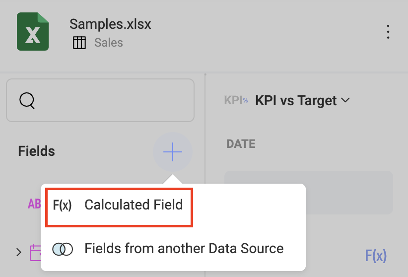
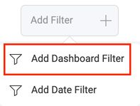
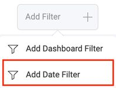
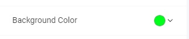
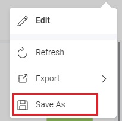
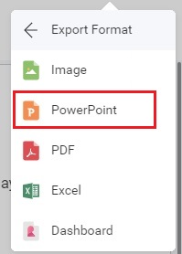
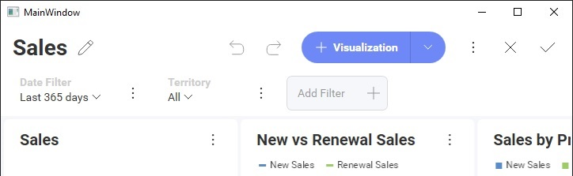

# Editing Dashboards

While editing dashboards is primarily an end-user function, there are a number of APIs available to help developers respond to different editing events, control the editing experience by showing/hiding UI elements, or disable editing altogether.

## Properties

### canAddCalculatedFields

This property shows/hides the **Calculated Field** menu item for the Visualization Editor.



```js
revealView.canAddCalculatedFields = false;
```

### canAddDashboardFilter

This property shows/hides the **Add Dashboard Filter** menu item for the Dashboard.



```js
revealView.canAddDashboardFilter = false;
```

### canAddDateFilter

This property shows/hides the **Add Date Filter** menu item for the Dashboard.



```js
revealView.canAddDateFilter = false;
```

### canAddPostCalculatedFields

This property shows/hides the **F(x)** menu item in the "Visualization Fields" section of the Visualization Editor.


```js
revealView.canAddPostCalculatedFields = false;
```

### canAddVisualization

This property shows/hides the dashboard's **+ Visualization** button when in edit mode.

```js
revealView.canAddVisualization = false;
```

### canChangeVisualizationBackgroundColor

This property enables the ability to provide a background color for a visualization in the **Settings** tab of the visualization editor.



```js
revealView.canChangeVisualizationBackgroundColor = true;
```

When using this property, you must install the following dependencies into your client application:

- Spectrum v 1.8.0 or newer

``` html
<link href="https://cdnjs.cloudflare.com/ajax/libs/spectrum/1.8.0/spectrum.min.css" rel="stylesheet" type="text/css" >
<script src="https://cdnjs.cloudflare.com/ajax/libs/spectrum/1.8.0/spectrum.min.js"></script>
```

### canCopyVisualization

This property shows/hides the **Copy** menu item for a Visualization.


```js
revealView.canCopyVisualization = false;
```

### canDuplicateVisualization

This property shows/hides the **Duplicate** menu item for a Visualization.


```js
revealView.canDuplicateVisualization = false;
```

### canEdit

This property shows/hides the **Edit** menu item for the Dashboard.


```js
revealView.canEdit = false;
```

When the `RevealView.canEdit` property is set to `false`, dashboard editing is completely disabled.

### canMaximizeVisualization

This property show/hides the **Maximize** button on a visualization.


```js
revealView.canMaximizeVisualization = false;
```

### canSaveAs

This property shows/hides the **Save As** button in the dashboard menu.



```js
revealView.canSaveAs = false;
```

### showChangeDataSource

This property shows/hides the **Change Data Source** button on the Data tab in the visualization editor.


```js
revealView.showChangeDataSource = false;
```

### showEditDataSource

This property shows/hides the **Edit** menu item for the DataSource in the Visualization Editor.


```js
revealView.showEditDataSource = false;
```

### showExportImage

This property shows/hides the **Image** item from the export menu.


```js
revealView.showExportImage = false;
```

### showExportToExcel

This property shows/hides the **Excel** item from the export menu.


```js
revealView.showExportToExcel = false;
```

### showExportToPDF

This property shows/hides the **PDF** item from the export menu.


```js
revealView.showExportToPDF = false;
```

### showExportToPowerPoint

This property shows/hides the **PowerPoint** item from the export menu.



```js
revealView.showExportToPowerPoint = false;
```

### showFilters

This property shows/hides the dashboard filters.


```js
revealView.showFilters = false;
```

### showHeader

This property shows/hides the entire dashboard header, which include the dashboard Title and the dashboard menu

```js
revealView.showHeader = false;
```

### showMenu

This property shows/hides the dashboard menu that is placed in the top right corner of the `RevealView`

```js
revealView.showMenu = false;
```

### showRefresh

This property shows/hides the **Refresh** button from the dashboard menu.


```js
revealView.showRefresh = false;
```

### startInEditMode

When set to `true`, this property will place the `RevealView` into "Edit Mode" when a dashboard is first loaded.



```js
revealView.startInEditMode = false;
```

### startWithNewVisualization

When set to `true`, this property will immediately launch the "New Visualization" dialog prompting you to choose a data source.


```js
revealView.startWithNewVisualization = false;
```

:::info

This property will not function if you are loading an existing dashboard and have not set the `RevealView.startInEditMode` property to `true` 

:::

## Events

### onVisualizationEditorOpening

There may be times when you want to execute some application logic **before** the visualization editor has opened, and you may want to even prevent the editor from opening until a condition is met. To do this, you can add an event handler to the `RevealView.onVisualizationEditorOpening` event.

```js
revealView.onVisualizationEditorOpening = function (args) {
    if(args.isNewVisualization == false){ //the user is trying to edit an existing visualization
        args.cancel = true; //prevent it
    }
};
```

The `VisualizationEditorOpeningArgs` contains the following properties:
- **cancel** - gets or sets a value indicating whether the event should be canceled. `true` if the event should be canceled; otherwise `false`
- **isNewVisualization** - if `true`, the visualization is a newly added visualization. If `false`, it is an existing visualization
- **visualization** - the visualization that was edited and/or added

:::info

If you set `VisualizationEditorOpeningArgs.cancel` to `true`, then the Visualization Editor will not open.

:::

### onVisualizationEditorOpened

If you would like to be notified **after** the Visualization Editor has been opened, either when editing an existing visualization or creating a new one, you can add an event handler to the `RevealView.onVisualizationEditorOpened` event.

```js
revealView.onVisualizationEditorOpened = function (args) {
    if(args.isNewVisualization == false) { 
        //the user is editing an existing visualization
    }
};
```

The `VisualizationEditorOpenedEventArgs` contains the following properties:
- **isNewVisualization** - if `true`, the visualization is a newly added visualization. If `false`, it is an existing visualization
- **visualization** - the visualization that was edited and/or added

### onVisualizationEditorClosing

There may be times when you want to execute some application logic **before** the visualization editor has closed, and you may want to even prevent the editor from closing until a condition is met. To do this, you can add an event handler to the `RevealView.onVisualizationEditorClosing` event.

```js
revealView.onVisualizationEditorClosing = function (args) {
    if(args.isNewVisualization == false) {  //the user is editing
         args.resetVisualization = true; //puts the widget to the state when it was when the user started editing it
    }
};
```

The `VisualizationEditorClosingArgs` contains the following properties:
- **cancel** - gets or sets a value indicating whether the event should be canceled. `true` if the event should be canceled; otherwise `false`
- **isNewVisualization** - if `true`, the visualization is a newly added visualization. If `false`, it is an existing visualization
- **resetVisualization** - if `true`, resets the visualization back to the state prior to being edited.
- **visualization** - the visualization that was edited and/or added

:::info

If you set `VisualizationEditorClosingArgs.cancel` to `true`, then the Visualization Editor will not close.

:::

### onVisualizationEditorClosed
Anytime an end-user edits a single visualization in the `RevealView`, the `RevealView.onVisualizationEditorClosed` event is fired **after** the editor is closed. This can be in response to editing an existing visualization, or adding a new visualization. You can respond to this event by adding an event handler to the `RevealView.onVisualizationEditorClosed` event.

```js
revealView.onVisualizationEditorClosed = function (args) {
    if(args.isNewVisualization == false) { 
    }
};
```

The `VisualizationEditorClosedEventArgs` contains the following properties:
- **isCancelled** - determines if the visualization editor was closed via the **X button** (`false`) or the **Check Button** (`true`)
- **isNewVisualization** - if `true`, the visualization is a newly added visualization. If `false`, it is an existing visualization
- **visualization** - the visualization that was edited and/or added
