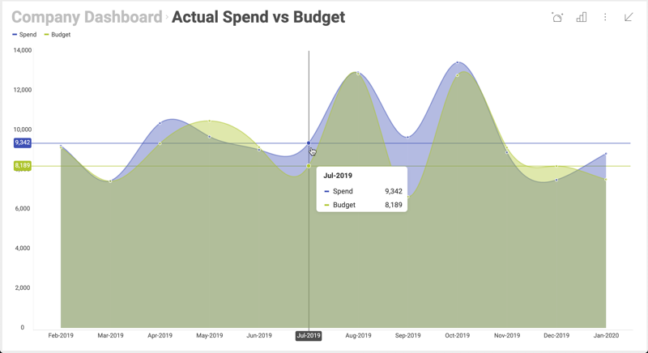

# Embed a Single Visualization

Show a single chart inline in your app — a KPI on a homepage, a sales chart in a product page, a metric in a sidebar. The Reveal SDK supports this directly: load a dashboard, pick the visualization you want, and the rest of the dashboard stays out of the way.

## Before you start

The setup is identical to embedding a full dashboard — server SDK installed, client SDK installed, a `.rdash` file on the server. See [Embed a Dashboard](dashboard.md) for the basics. The only difference is the two extra lines that pick a single visualization.

## Two ways to do it

| | Single Visualization Mode | Maximized Visualization |
|---|---|---|
| **What it does** | Locks the view to one chart. The dashboard menu and other visualizations are inaccessible. | Opens the dashboard zoomed in on one chart, but the user can navigate back to the full dashboard. |
| **Use when** | You want a permanent single-chart embed (KPI tile, inline metric, kiosk). | You want a focused initial view but full dashboard navigation. |
| **Property** | `revealView.singleVisualizationMode = true` | (no extra property — just set `maximizedVisualization`) |

Both patterns use the same `maximizedVisualization` property to specify *which* visualization. Single Visualization Mode just adds the lock.

## Single Visualization Mode (locked)

Most common pattern for embedding a chart inline:

```html
<div id="revealView" style="height: 400px; width: 100%;"></div>
```

```js
RVDashboard.loadDashboard("AllDivisions").then(dashboard => {
    const revealView = new RevealView("#revealView");
    revealView.singleVisualizationMode = true;
    revealView.dashboard = dashboard;
    revealView.maximizedVisualization = dashboard.visualizations.getByTitle("Sales");
});
```

The user sees only the "Sales" visualization. Filters, the dashboard header, and other visualizations are hidden.



## Maximized Visualization (with navigation)

Same code, minus the `singleVisualizationMode` line:

```js
RVDashboard.loadDashboard("AllDivisions").then(dashboard => {
    const revealView = new RevealView("#revealView");
    revealView.dashboard = dashboard;
    revealView.maximizedVisualization = dashboard.visualizations.getByTitle("Sales");
});
```

The dashboard opens on the "Sales" visualization, but a back button lets the user expand to the full dashboard.

## Variations

### Switch which visualization is shown, dynamically

In a single-page app where the user picks which chart to view (e.g., a button bar of departments), update `maximizedVisualization` on the existing `RevealView`:

```html
<section style="display:grid;grid-template-rows:30px auto;">
    <section style="display:grid;grid-template-columns:auto auto auto;">
        <button onclick="showVisualization('Sales')">Sales</button>
        <button onclick="showVisualization('HR')">HR</button>
        <button onclick="showVisualization('Marketing')">Marketing</button>
    </section>
    <div id="revealView" style="height:500px;"></div>
</section>
```

```js
let revealView;

RVDashboard.loadDashboard("AllDivisions").then(dashboard => {
    revealView = new RevealView("#revealView");
    revealView.singleVisualizationMode = true;
    revealView.dashboard = dashboard;
    revealView.maximizedVisualization = dashboard.visualizations.getByTitle("Sales");
});

function showVisualization(title) {
    revealView.maximizedVisualization = revealView.dashboard.visualizations.getByTitle(title);
}
```

No reload, no flicker — the view swaps in place.

### Pick the visualization by index instead of title

If the visualization titles aren't stable, use the index:

```js
revealView.maximizedVisualization = dashboard.visualizations[0];
```

### Customize the chart's appearance

The same property toggles that work on a full dashboard work here — for example, hiding the menu (`showMenu = false`) or specific export formats. See [Common Patterns](../scenarios/index.md).

## What's next

- [Embed a Dashboard](dashboard.md) — the full-dashboard alternative.
- [Common Patterns](../scenarios/index.md) — customizations that apply to either embed mode (read-only, locked-down export, etc.).
- [`RevealView` API reference](https://help.revealbi.io/api/javascript/latest/classes/RevealView.html) — full property and event surface.
