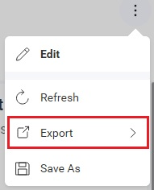
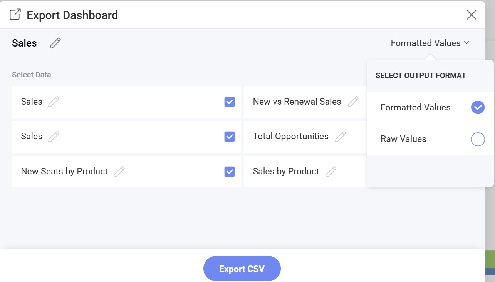
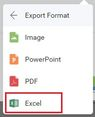
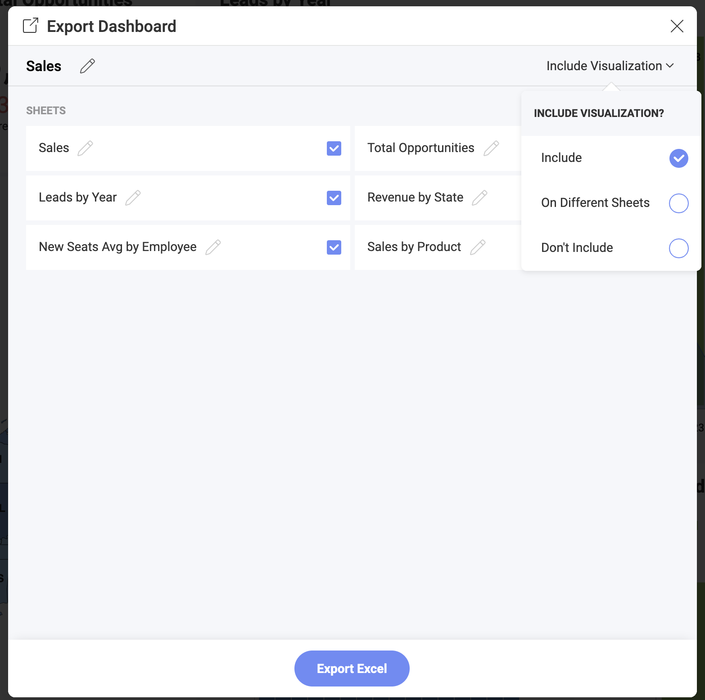
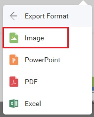
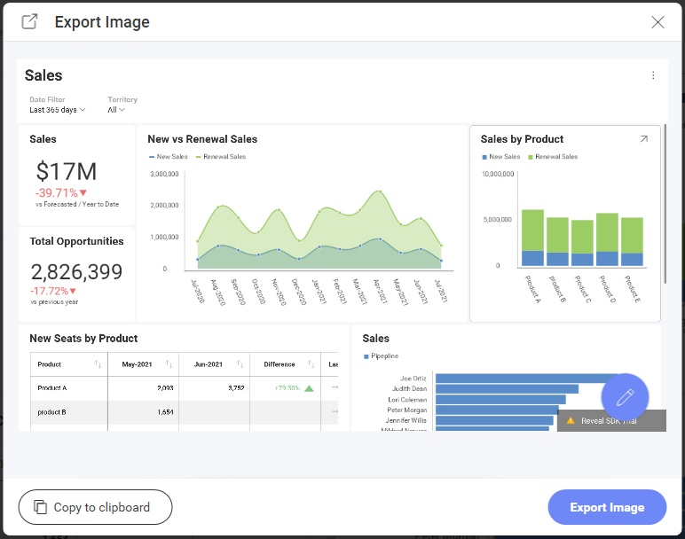
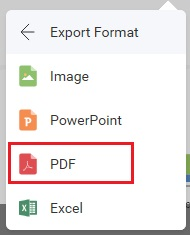
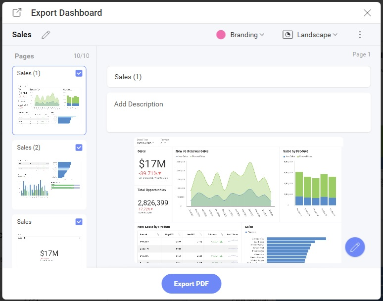
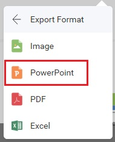
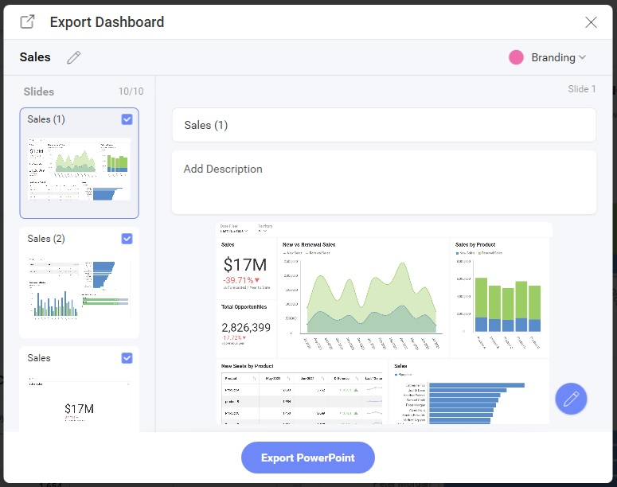

# Exporting

The Reveal SDK allows you to export both dashboards and visualizations to generate new document types or images.

Supported dashboard export formats:
- CSV
- Excel
- Image
- PDF
- Powerpoint

Supported visualization export formats:
- Excel
- Image

All export options can be found under the **Export** menu item in the `RevealView` overflow menu when a dashboard is opened or a visualization is maximized



When the user clicks the **Export** button, they can choose one of the enabled export options.

## Export to CSV
A CSV export is performed when the end-user clicks the **CSV** menu item from the **Export** overflow menu.


The **CSV** menu item can be shown/hidden by setting the `RevealView.showExportToCSV` property.

```js
revealView.showExportToCSV = false;
```

When the **CSV** menu item is clicked, the end-user is prompted with various options which allow them to change the name of the export, choose which visualization's data to include in the export, and whether to use formatted values or raw values.



## Export to Excel
An Excel export is performed when the end-user clicks the **Excel** menu item from the **Export** overflow menu.



The **Excel** menu item can be shown/hidden by setting the `RevealView.showExportToExcel` property.

```js
revealView.showExportToExcel = false;
```

When the **Excel** menu item is clicked, the end-user is prompted with various options which allow them to change the title of the workbook, the title of the worksheets, which worksheets to create, and whether or not to include the visualizations.




## Export to Image
There are two ways to export a dashboard or visualization to an image in the Reveal SDK:
- End-User export
- Programmatic export

### End-User Image Export
An end-user image export is performed when the end-user clicks the **Image** menu item from the **Export** overflow menu.



The **Image** menu item can be shown/hidden by setting the `RevealView.showExportImage` property.

```js
revealView.showExportImage = false;
```

When the **Image** menu item is clicked, the end-user is prompted with a dialog which allows them to choose either to copy the image to the clipboard, edit them image using the built-in image editor, or save the image to disk as a PNG.



#### Custom Image Export
By default, when an end-user clicks the **Export Image** button in the **Export Image Dialog** the image will be exported and added to the browsers Downloads for the end-user to choose a location to save the image file. However, this behavior can be intercepted and custom image export logic can be used instead.

To use a custom image export, you must add an event handler to the `RevealView.onImageExported` event.

```js
revealView.onImageExported = (image) => {

};
```

The `RevealView.onImageExported` event provides the following parameter to help you save image exports:
- **image** - the screenshot of the dashboard that was taken

#### Example: A Custom Image Export

```js
revealView.onImageExported = (image) => {
    var body = window.open("about:blank").document.body;
    body.appendChild(image);
};
```

### Programmatic Image Export
To export an image of a dashboard programmatically, without the end-user interaction, you will need to invoke the `RevealView.toImage` method. Calling the `RevealView.toImage` method will create a screenshot of the RevealView component as it is displayed on the screen. The ``RevealView.toImage`` method **does not** prompt the user with the Export Image Dialog.

```cs
revealView.toImage( image => {
    //handle image
});
```

#### Example: Programmatic Image Export

```html
<button onclick="exportToImage()">Export to Image</button>
```

```js
function exportToImage() {
    revealView.toImage(image => {
        console.log(image);
        var body = window.open("about:blank").document.body;
        body.appendChild(image);
    });
}
```

:::info Get the Code

The source code to these sample can be found on [GitHub](https://github.com/RevealBi/sdk-samples-javascript/tree/master/Exporting-Image)

:::

## Export to PDF
A PDF export is performed when the end-user clicks the **PDF** menu item from the **Export** overflow menu.



The **PDF** menu item can be shown/hidden by setting the `RevealView.ShowExportToPDF` property.

```js
revealView.showExportToPDF = false;
```

When the **PDF** menu item is clicked, the end-user is prompted with various options which allows them to change the title of the PDF document, choose which visualizations to include in the document, a title and description of each visualization, as well as branding, page orientation, and language.



### Text length in exported Grid and Pivot cells

String values in Grid and Pivot exports follow the same character limit as the dashboard itself, set by `MaxStringCellSize` and defaulting to 256 characters. Values longer than the limit are truncated, so the exported document shows exactly as much text per cell as the visualization on screen does.

To show more characters in an export, raise `MaxStringCellSize`. It is a server-wide data-loading setting rather than an export option, so the longer text appears in the dashboard as well, for every dashboard on the server. Because the limit is applied as data is loaded, a new value applies to existing data once the application is restarted with a fresh cache. See [Data Limits](https://help.revealbi.io/web/data-size-limits/#maxstringcellsize-and-long-text-values) for the trade-offs and the steps.

### Cache update

If a cache update is needed, start the application with a fresh cache:

1. Shut down the application.
2. Delete the cache folder — `RevealCache_XXXX` in the system temporary directory by default, or the locations set through `CachePath` and `DataCachePath`. See [Cache files](https://help.revealbi.io/web/caching/#cache-files).
3. Restart the application.

Data is loaded again on first use and picks up the new limit. The **Refresh** option in the visualization menu updates a single data source and is not a substitute for this.

Grid and Pivot cells have a fixed width, so the exported document does not adjust its layout to fit long values — they wrap onto multiple lines, increasing row heights and page count.

## Export to PowerPoint
A PowerPoint export is performed when the end-user clicks the **PowerPoint** menu item from the **Export** overflow menu. 



The **PowerPoint** menu item can be shown/hidden by setting the `RevealView.ShowExportToPowerpoint` property.

```js
revealView.showExportToPowerPoint = false;
```

When the **PowerPoint** menu item is clicked, the end-user is prompted with various options which allows them to change the title of the PowerPoint document, choose which visualizations to include in the document, a title and description of each visualization, and branding.

