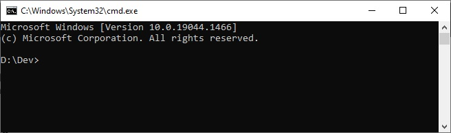

# Getting Started with Reveal SDK for Angular

## Step 1 - Create the Angular App

1 - Open your favorite terminal



2 - Create a new Angular application using the Angular CLI

```bash
ng new getting-started
```

3 - Change directories into the newly created app directory and open the project in your favorite Editor. In this example, we are using Visual Studio Code.

```bash
cd getting-started
code .
```

## Step 2 - Add Reveal JavaScript API

1 - Install the Reveal SDK npm package:

```bash
npm install reveal-sdk
```

2 - Open the `src/app/app.component.ts` file and add the following import at the top:

```ts
import { RevealView, RevealSdkSettings } from "reveal-sdk";
```

## Step 3 - Initialize the Reveal view

1 - Open and modify the `src/app/app.component.html` file. Delete all the contents of the file and add a new `<div>` tag and set the reference to `revealView`.

```html
<div #revealView style="height: 100vh; width: 100%; position:relative;"></div>
```

2 - Open and modify the `src/app/app.component.ts` file.

First, add a property to hold the `ViewChild` reference to the `revealView` element.

```ts title="src/app/app.component.html"
export class AppComponent {
  
  // highlight-next-line
  @ViewChild('revealView') el!: ElementRef;
  
}
```

Now, we need to implement the `AfterViewInit` interface on our component.

```ts title="src/app/app.component.html" {5-7}
export class AppComponent implements AfterViewInit {
  
  @ViewChild('revealView') el!: ElementRef;

  ngAfterViewInit(): void {

  }
  
}
```

Once that is complete, we can now initialize the `RevealView`.

```ts title="src/app/app.component.html"
export class AppComponent implements AfterViewInit {
  
  @ViewChild('revealView') el!: ElementRef;

  ngAfterViewInit(): void {
    // highlight-next-line
    var revealView = new RevealView(this.el.nativeElement);
  }
  
}
```

Next, we instantiate a new instance of the `RevealView` by creating a new `RevealView` and passing in the `revealView` element that has been stored in the `ViewChild` property.

The final `app.component.ts` file should look like this:

```ts title="src/app/app.component.html"
import { AfterViewInit, Component, ElementRef, ViewChild } from '@angular/core';
import { RevealView, RevealSdkSettings } from "reveal-sdk";

@Component({
  selector: 'app-root',
  templateUrl: './app.component.html',
  styleUrls: ['./app.component.scss']
})
export class AppComponent implements AfterViewInit {
  
  @ViewChild('revealView') el!: ElementRef;

  ngAfterViewInit(): void {
    var revealView = new RevealView(this.el.nativeElement);
  }
  
}
```

:::caution

Clients apps must set the `RevealSdkSettings.setBaseUrl("url-to-server");` to the server address hosting the dashboards if the client is being hosting on a different URL.

:::

## Step 4 - Run the Application

In the Visual Studio Code terminal, type the `npm start` command

```bash npm2yarn
npm start
```


**Congratulations!** You have written your first Reveal SDK Angular application.

:::info Get the Code

The source code to this sample can be found on [GitHub](https://github.com/RevealBi/sdk-samples-javascript/tree/main/01-GettingStarted/client/angular).

:::