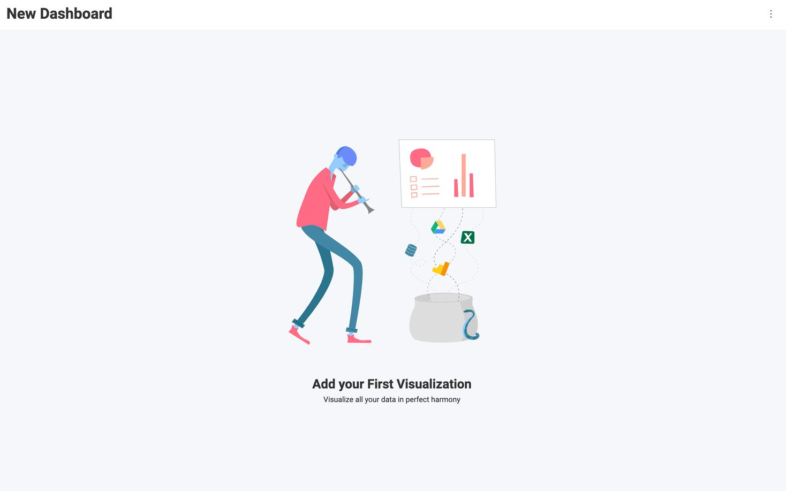

# Getting Started with Reveal SDK for Angular

## Step 1 - Create the Angular App

1 - Open your favorite terminal


2 - Create a new Angular application using the Angular CLI

```bash
ng new getting-started
```

3 - Change directories into the newly created app directory and open the project in your favorite Editor. In this example, we are using Visual Studio Code.

```bash
cd getting-started
code .
```

## Step 2 - Add Reveal JavaScript API

1 - Open and modify the `index.html` file to include the `infragistics.reveal.js` script at the bottom of the page just before the closing `</body>` tag.

```html
<script src="https://dl.revealbi.io/reveal/libs/[var:sdkVersion]/infragistics.reveal.js"></script>
```

2 - Install the remaining Reveal JavaScript API dependencies:

- Day.js 1.8.15 or greater

```html
<script src="https://unpkg.com/dayjs@1.8.21/dayjs.min.js"></script>
```

The final `index.html` files should look similar to this:

```html title="index.html"
<!doctype html>
<html lang="en">
<head>
  <meta charset="utf-8">
  <title>GettingStarted</title>
  <base href="/">
  <meta name="viewport" content="width=device-width, initial-scale=1">
  <link rel="icon" type="image/x-icon" href="favicon.ico">  
</head>
<body>
  <app-root></app-root>

  //highlight-start
  <script src="https://unpkg.com/dayjs@1.8.21/dayjs.min.js"></script>
  <script src="https://dl.revealbi.io/reveal/libs/[var:sdkVersion]/infragistics.reveal.js"></script>
  //highlight-end
</body>
</html>
```

## Step 3 - Initialize the Reveal view

1 - Open and modify the `src/app/app.component.html` file. Delete all the contents of the file and add a new `<div>` tag and set the reference to `revealView`.

```html
<div #revealView style="height: 100vh; width: 100%; position:relative;"></div>
```

2 - Open and modify the `src/app/app.component.ts` file.  First, we need to make sure that we can use jQuery by declaring a new variable named `$`, of type `any`, at the top of the file just under the import statements. This will make sure TypeScript will compile our JavaScript.

```ts
declare let $: any;
```

Next, we need access to the `revalView` that we defined in HTML as a `ViewChild`. Add a property to hold this reference.

```ts title="src/app/app.component.html"
export class AppComponent {
  
  // highlight-next-line
  @ViewChild('revealView') el!: ElementRef;
  
}
```

Now, we need to implement the `AfterViewInit` interface on our component.

```ts title="src/app/app.component.html" {5-7}
export class AppComponent implements AfterViewInit {
  
  @ViewChild('revealView') el!: ElementRef;

  ngAfterViewInit(): void {

  }
  
}
```

Once that is complete, we can now initialize the `RevealView`.

```ts title="src/app/app.component.html"
export class AppComponent implements AfterViewInit {
  
  @ViewChild('revealView') el!: ElementRef;

  ngAfterViewInit(): void {
    // highlight-next-line
    var revealView = new $.ig.RevealView(this.el.nativeElement);
  }
  
}
```

Next, we instantiate a new instance of the `RevealView` by creating a new `$.ig.RevealView` and passing in the `revealView` element that has been stored in the `ViewChild` property.

The final `app.component.ts` file should look like this:

```ts title="src/app/app.component.html"
import { AfterViewInit, Component, ElementRef, ViewChild } from '@angular/core';

declare let $: any;

@Component({
  selector: 'app-root',
  templateUrl: './app.component.html',
  styleUrls: ['./app.component.scss']
})
export class AppComponent implements AfterViewInit {
  
  @ViewChild('revealView') el!: ElementRef;

  ngAfterViewInit(): void {
    var revealView = new $.ig.RevealView(this.el.nativeElement);
  }
  
}
```

:::caution

Clients apps must set the `$.ig.RevealSdkSettings.setBaseUrl("url-to-server");` to the server address hosting the dashboards if the client is being hosting on a different URL.

:::

## Step 4 - Run the Application

In the Visual Studio Code terminal, type the `npm start` command

```bash npm2yarn
npm start
```



**Congratulations!** You have written your first Reveal SDK Angular application.

:::info Get the Code

The source code to this sample can be found on [GitHub](https://github.com/RevealBi/sdk-samples-javascript/tree/main/01-GettingStarted/client/angular).

:::