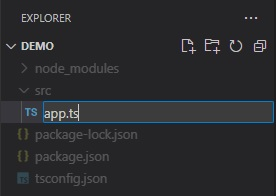

# Setting up the Reveal SDK Server with Node.js and TypeScript

## Step 1 - Create the Node.js Project

1 - Open a command line and create a directory named **reveal-server-node**

```bash
mkdir reveal-server-node
```

2 - Change the command line path to the newly created directory

```bash
cd reveal-server-node
```

3 - Initialize **npm** in the directory

```bash npm2yarn
npm init -y
```

4 - Install the **express** framework

```bash npm2yarn
npm install express
```

5 - Install **TypeScript** and other package types.

```bash npm2yarn
npm install typescript @types/node @types/express @types/cors --save-dev
```

6 - Install **Nodemon** and **ts-node** packages.

```bash npm2yarn
npm install nodemon ts-node --save-dev
```

7 - Configure **TypeScript**. In this example, we are setting the root directory to "src" and the output directory to "dist".

```bash
npx tsc --init --rootDir src --outDir dist
```

8 - Open the project in **VS Code**

```bash
code .
```

9 - Create a new file named **app.ts** in a directory called **src**



Add the following code:

```js title="app.ts"
import express, { Application } from 'express';

const app: Application = express();

app.listen(5111, () => {
	console.log(`Reveal server accepting http requests`);
});
```

## Step 2 - Add Reveal SDK

1 - Install the **Reveal SDK** for Node.js

```bash npm2yarn
npm install reveal-sdk-node
```

2 - Modify the `app.ts` file to add Reveal

```js title="app.ts"
import express, { Application } from 'express';
// highlight-next-line
import reveal from 'reveal-sdk-node';

const app: Application = express();

// highlight-next-line
app.use("/", reveal());

app.listen(5111, () => {
	console.log(`Reveal server accepting http requests`);
});
```

## Step 3 - Create the Dashboards Folder

1 - In Visual Studio Code, click the **New Folder** button in the Explorer and name it **dashboards**. The folder MUST be named **dashboards** and created in the working directory of the application.


By default, the Reveal SDK uses a convention that will load all dashboards from the **dashboards** folder. You can change this convention by creating a custom `IRVDashboardProvider`.

## Step 4 - Setup CORS Policy (Debugging)

While developing and debugging your application, it is common to host the server and client app on different URLs. For example; your Server my be running on `https://localhost:24519`, while your Angular app may be running on `https://localhost:4200`. If you were to try and load a dashboard from the client application, it would fail because of a Cross-Origin Resource Sharing (CORS) policy. To enable this scenario, you must create a CORS policy and enable it in the server project.

1 - Install **cors** package and the TypeScript types.
```bash npm2yarn
npm install cors
npm install @types/cors --save-dev
```

2 - Modify the `app.ts` file to enable **cors**

```js title="app.ts"
import express, { Application } from 'express';
import reveal from 'reveal-sdk-node';
// highlight-next-line
import cors from "cors";

const app: Application = express();

// highlight-next-line
app.use(cors());

app.use("/", reveal());

app.listen(5111, () => {
	console.log(`Reveal server accepting http requests`);
});
```

## Step 5 - Start the Node.js Server

The final step is to start the Node.js server by runnning the following command:

```bash
npx nodemon src/app.ts
```

Optionally you can add the following scripts to the `package.json` file.

```json title="package.json"
"scripts": {
  "start": "node dist/app.js", //runs the app.js file in the dist folder that was generated from the build script
  "dev": "npx nodemon src/app.ts", //runs the server and watches for changes during development
  "build": "tsc -p .", //builds the app and generates javascript files in the dist folder
},
```

Then execute the **dev** script during development.

```bash npm2yarn
npm run dev
```

:::info Get The Code

The source code to this sample can be found on [GitHub](https://github.com/RevealBi/sdk-samples-javascript/tree/main/01-GettingStarted/server/nodejs-ts).

:::
