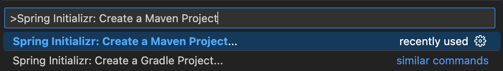
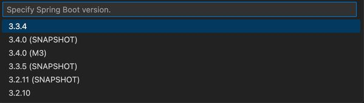
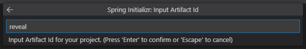
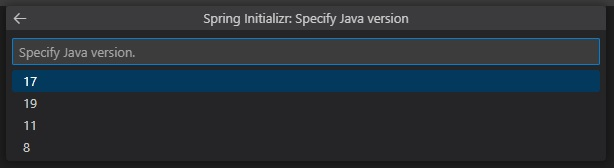
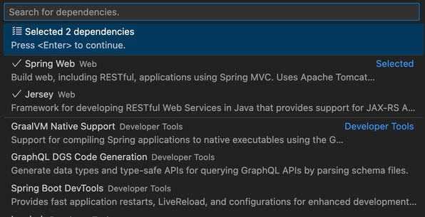
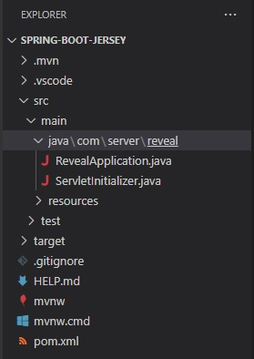

# Setting up the Reveal SDK Server with Spring Boot

## Step 1 - Create a Spring Boot Project

The steps below describe how to create a new Java Spring Boot project. If you want to add the Reveal SDK to an existing application, go to Step 2.

To develop a Spring Boot application in Visual Studio Code, you need to install the following:
- [Development Kit (JDK)](https://www.microsoft.com/openjdk)
- [Extension Pack for Java](https://marketplace.visualstudio.com/items?itemName=vscjava.vscode-java-pack)
- [Spring Boot Extension Pack](https://marketplace.visualstudio.com/items?itemName=pivotal.vscode-boot-dev-pack)

More information about how to get started with Visual Studio Code and Java can be found at [Getting Started with Java](https://code.visualstudio.com/docs/java/java-tutorial) tutorial.

1 - Start Visual Studio Code, open the Command Palette and type **>Spring Initializr: Create a Maven Project** and press **Enter**.



2 - Select the Spring Boot version **3.3.2**.



:::caution
Version 2.x is not supported since Reveal 1.7.x
:::

3 - Select **Java**  as the language.


4 - Provide the Group Id. In this example, we are using **com.server**.


5 - Provide the Artifact Id. In this example we are using **reveal**.



6 - Select the **War** package type.


7 - Select the Java version. For Spring Boot 3.x, we need to use at least **17**.



8 - Choose the **Spring Web** dependency.



9 - Save and open the newly created project.



## Step 2 - Add Reveal SDK

The Java SDK requires Java 17 or higher and a Jakarta EE 9 compliant server. Because the new Java SDK wraps native .NET components, some rare platforms that cannot run .NET, such as AIX, are no longer supported. Also, if you use Jetty as your server, its version might conflict with the Jetty version used internally by Reveal SDK, which is currently 12.0.12.

1 - Update the **pom.xml** file.

First, add the Reveal Maven repository.

```xml title="pom.xml"
<repositories>
    <repository>
        <id>reveal.public</id>
        <url>https://maven.revealbi.io/repository/public</url>
    </repository>	
</repositories>
```

Next, add the Reveal SDK as a dependency.

```xml title="pom.xml"
<dependency>
    <groupId>io.revealbi</groupId>
    <artifactId>reveal-sdk-servlet</artifactId>
    <version>[var:sdkVersion]</version>
</dependency>
```

2 - Register `RevealEngineServlet` as a Spring Boot servlet. The current Java SDK no longer sits on top of JAX-RS, so you do not need to register Reveal SDK classes in a JAX-RS context. The `RevealEngineServlet` constructor also receives the request and creates the `RVUserContext`, replacing the previous container-aware user context provider setup.

```java title="Application.java"
@SpringBootApplication
public class Application {

    public static void main(String[] args) {
       SpringApplication.run(Application.class, args);
    }

    @Bean
    ServletRegistrationBean<RevealEngineServlet> revealServlet() {
       RevealEngineServlet revealEngineServlet = new RevealEngineServlet(() -> new RevealServerBuilder()
                .setAuthenticationProvider(new MyIRVAuthenticationProvider())
                .setDashboardProvider(new RVDashboardProvider("c:\\your-path"))
                .setDataSourceProvider(new MyIRVDataSourceProvider())
                .addSettings(settings -> {
                    // settings.setLicense("your license or remove to use ~/.revealbi-sdk/license.key");
                })
                .build(), request -> new RVUserContext("whatever", createPropertiesFrom(request)));

       return new ServletRegistrationBean<>(revealEngineServlet, "/reveal-api/*");
    }
}
```

## Step 3 - Create Dashboards Folder

1 - Create a folder for your dashboards.

2 - Configure `RVDashboardProvider` with the folder that contains your dashboards.

```java title="Application.java"
new RevealServerBuilder()
    .setDashboardProvider(new RVDashboardProvider("c:\\your-path"))
    .build();
```

## Step 4 - Packaging and Deployment

Reveal SDK includes native components built for specific platform and architecture combinations. When you package an application, Maven selects the native component for the current machine. If the deployment platform or architecture is different from the packaging machine, use the Maven profile parameter `-P os_arch` to select the target platform and architecture.

The native .NET binary is included as a resource in the platform-specific artifacts and is extracted to the temporary directory at runtime. The extracted folder uses the `platform-arch-version` format, such as `linux-aarch64-3`.

:::info Get the Code

The source code to this sample can be found on [GitHub](https://github.com/RevealBi/sdk-samples-javascript/tree/main/01-GettingStarted/server/spring-boot-jersey).

:::
