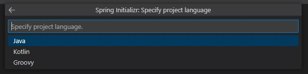
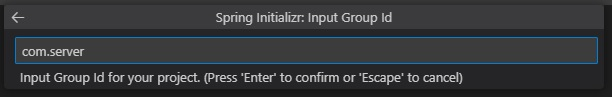
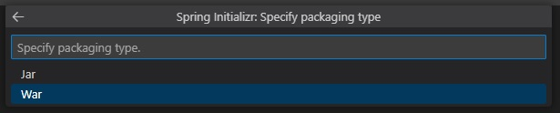

# Setting up the Reveal SDK Server with Spring Boot

## Step 1 - Create a Spring Boot Project

The steps below describe how to create a new Java Spring Boot project. If you want to add the Reveal SDK to an existing application, go to Step 2.

To develop a Spring Boot application in Visual Studio Code, you need to install the following:
- [Development Kit (JDK)](https://www.microsoft.com/openjdk)
- [Extension Pack for Java](https://marketplace.visualstudio.com/items?itemName=vscjava.vscode-java-pack)
- [Spring Boot Extension Pack](https://marketplace.visualstudio.com/items?itemName=pivotal.vscode-boot-dev-pack)

More information about how to get started with Visual Studio Code and Java can be found at the [Getting Started with Java](https://code.visualstudio.com/docs/java/java-tutorial) tutorial.

1 - Start Visual Studio Code, open the Command Palette and type **>Spring Initializr: Create a Maven Project** and press **Enter**.


2 - Select the Spring Boot version **3.3.2**.


:::caution
Version 2.x is not supported since Reveal 1.7.x
:::

3 - Select **Java** as the language.



4 - Provide the Group Id. In this example, we are using **com.server**.



5 - Provide the Artifact Id. In this example, we are using **reveal**.


6 - Select the **War** package type.



7 - Select the Java version. For Spring Boot 3.x, we need to use at least **17**.


8 - Choose the **Spring Web** dependency.

9 - Save and open the newly created project.


## Step 2 - Add Reveal SDK

The Java SDK requires Java 17 or higher and a Jakarta EE 9 compliant server. The supported platforms are Linux, Windows, and macOS, with both x64 and arm64 architectures. Also, if you use Jetty as your server, its version might conflict with the Jetty version used internally by Reveal SDK, which is currently 12.0.12.

1 - Update the **pom.xml** file.

First, add the Reveal Maven repository.

```xml title="pom.xml"
<repositories>
    <repository>
        <id>reveal.public</id>
        <url>https://maven.revealbi.io/repository/public</url>
    </repository>	
</repositories>
```

Next, add the Reveal SDK as a dependency.

```xml title="pom.xml"
<dependency>
    <groupId>io.revealbi</groupId>
    <artifactId>reveal-sdk-servlet</artifactId>
    <version>[var:sdkVersion]</version>
</dependency>
```

2 - Register `RevealEngineServlet` as a Spring Boot servlet. Replace the sample provider classes with your application's implementations. If you need to pass request-based properties to the user context, replace `null` with a `Properties` object built from the request.

```java title="Application.java"
@SpringBootApplication
public class Application {

    public static void main(String[] args) {
       SpringApplication.run(Application.class, args);
    }

    @Bean
    ServletRegistrationBean<RevealEngineServlet> revealServlet() {
       RevealEngineServlet revealEngineServlet = new RevealEngineServlet(() -> new RevealServerBuilder()
                .setAuthenticationProvider(new MyIRVAuthenticationProvider())
                .setDashboardProvider(new RVDashboardProvider("c:\\your-path"))
                .setDataSourceProvider(new MyIRVDataSourceProvider())
                .addSettings(settings -> {
                    // settings.setLicense("your license or remove to use ~/.revealbi-sdk/license.key");
                })
                .build(), request -> new RVUserContext("whatever", null /* replace null with a Properties built from the request if needed */));

       return new ServletRegistrationBean<>(revealEngineServlet, "/reveal-api/*");
    }
}
```

## Step 3 - Create Dashboards Folder

1 - Create a folder for your dashboards.

2 - Configure `RVDashboardProvider` with the folder that contains your dashboards.

```java title="Application.java"
new RevealServerBuilder()
    .setDashboardProvider(new RVDashboardProvider("c:\\your-path"))
    .build();
```

## Step 4 - Setup CORS Policy (Debugging)

While developing and debugging your application, it is common to host the server and client app on different URLs. For example, your server may be running on `https://localhost:8080`, while your Angular app may be running on `https://localhost:4200`. If you try to load a dashboard from the client application, it will fail because of a Cross-Origin Resource Sharing (CORS) policy. To enable this scenario for the Reveal servlet endpoint, add a servlet CORS filter bean to your `Application.java`:

```java title="Application.java"
@Bean
FilterRegistrationBean<CorsFilter> revealCorsFilter() {
    CorsConfiguration config = new CorsConfiguration();
    config.addAllowedOriginPattern("*");
    config.addAllowedHeader("*");
    config.addAllowedMethod("*");

    UrlBasedCorsConfigurationSource source = new UrlBasedCorsConfigurationSource();
    source.registerCorsConfiguration("/reveal-api/**", config);
    return new FilterRegistrationBean<>(new CorsFilter(source));
}
```

## Step 5 - Packaging and Deployment

Reveal SDK includes native components built for specific platform and architecture combinations. When you package an application, Maven selects the native component for the current machine. If the deployment platform or architecture is different from the packaging machine, use the Maven profile parameter `-P os_arch` to select the target platform and architecture.

The native binary is included as a resource in the platform-specific artifacts and is extracted to the temporary directory at runtime. The extracted folder uses the `platform-arch-version` format, such as `linux-aarch64-3`.

:::info Get the Code

The source code to this sample can be found on [GitHub](https://github.com/RevealBi/sdk-samples-javascript/tree/main/01-GettingStarted/server/spring-boot).

:::
