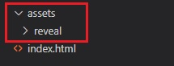
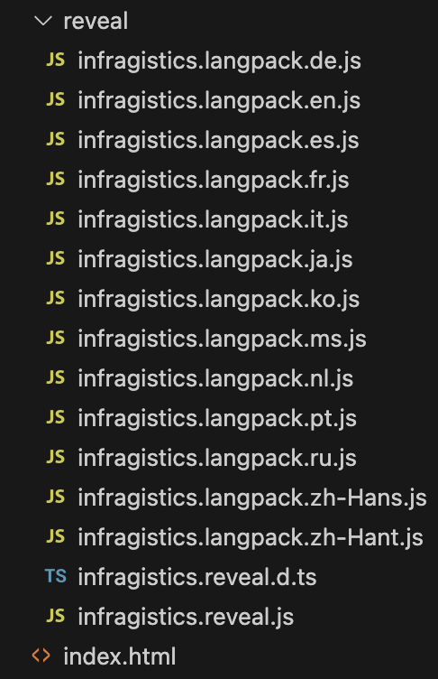

# Installing the Client SDK

## Install Using Script Files

### Using the CDN
Modify the `index.html` file to include the `reveal-sdk.js` script at the bottom of the page just before the closing `</body>` tag.

```html
<script src="https://cdn.jsdelivr.net/npm/reveal-sdk@[var:sdkVersion]/dist/reveal-sdk.js"></script>
```

:::caution Not for Production

The Reveal SDK CDN is intended **only** for prototyping, onboarding, demos, and trial scenarios.

For production applications, you **must self-host** the Reveal SDK libraries. Relying on the CDN in production is not recommended, as it does not provide the guarantees required for production workloads such as availability guarantees, version control, performance optimization, and long-term stability.

To ensure predictable behavior and full control over updates, download the SDK assets and serve them from your own infrastructure when deploying to production environments.

:::

### Using JavaScript Files
If using the Reveal CDN is not an option, you can also host the Reveal SDK JavaScript files on your own domain. The Reveal SDK Distribution files can be downloaded from the following link:

https://dl.revealbi.io/reveal/libs/[var:sdkVersion]/reveal-sdk-distribution-js.zip

1 - In your client application, create a new folder called `assets` and then create another folder called `reveal` within the `assets` folder.



2 - Copy all the JavaScript files from the Reveal SDK Distribution files into the `assets/reveal` folder you created previously.



3 - Modify the `index.html` file to include the `reveal-sdk.js` script at the bottom of the page just before the closing `</body>` tag.

```html
<script src="./assets/reveal/reveal-sdk.js"></script>
```

Modify the `index.html` file to include the script at the bottom of the page just before the closing `</body>` tag.

The final `index.html` files should look similar to this:

```html title="index.html"
<!DOCTYPE html>
<html lang="en">
<head>
    <meta charset="UTF-8">
    <meta http-equiv="X-UA-Compatible" content="IE=edge">
    <meta name="viewport" content="width=device-width, initial-scale=1.0">
    <title>Reveal Sdk - HTML/JavaScript</title> 
</head>
<body>

    // highlight-start 
    <script src="./assets/reveal/reveal-sdk.js"></script>   
    // highlight-end
</body>
</html>
```