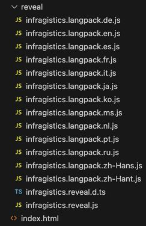

# Installing the Client SDK

## Install Using Script Files

### Using the CDN
Modify the `index.html` file to include the `infragistics.reveal.js` script at the bottom of the page just before the closing `</body>` tag.

```html
<script src="https://dl.revealbi.io/reveal/libs/[var:sdkVersion]/infragistics.reveal.js"></script>
```

### Using JavaScript Files
If using the Reveal CDN is not an option, you can also host the Reveal SDK JavaScript files on your own domain. The Reveal SDK Distribution files can be downloaded from the following link:

https://download.infragistics.com/reveal/libs/[var:sdkVersion].0/reveal-sdk-distribution-js.zip

1 - In your client application, create a new folder called `assets` and then create another folder called `reveal` within the `assets` folder.


2 - Copy all the JavaScript files from the Reveal SDK Distribution files into the `assets/reveal` folder you created previously.



3 - Modify the `index.html` file to include the `infragistics.reveal.js` script at the bottom of the page just before the closing `</body>` tag.

```html
<script src="./assets/reveal/infragistics.reveal.js"></script>
```

### Add Dependencies
The Reveal SDK requires the following dependencies in order to properly function.

**Day.js 1.8.15 or greater**

```html
<script src="https://unpkg.com/dayjs@1.8.21/dayjs.min.js"></script>
```

**Spectrum v 1.8.0 or newer (Optional)** - this is only needed if you enable the UI for the end user to set the background color for a particular visualization.

``` html
<link href="https://cdnjs.cloudflare.com/ajax/libs/spectrum/1.8.0/spectrum.min.css" rel="stylesheet" type="text/css" >
<script src="https://cdnjs.cloudflare.com/ajax/libs/spectrum/1.8.0/spectrum.min.js"></script>
```

Modify the `index.html` file to include all depedency scripts at the bottom of the page just before the `infragistics.reveal.js` script.

The final `index.html` files should look similar to this:

```html title="index.html"
<!DOCTYPE html>
<html lang="en">
<head>
    <meta charset="UTF-8">
    <meta http-equiv="X-UA-Compatible" content="IE=edge">
    <meta name="viewport" content="width=device-width, initial-scale=1.0">
    <title>Reveal Sdk - HTML/JavaScript</title> 
</head>
<body>

    // highlight-start 
    <script src="https://unpkg.com/dayjs@1.8.21/dayjs.min.js"></script>    
    <script src="./assets/reveal/infragistics.reveal.js"></script>   
    // highlight-end
</body>
</html>
```