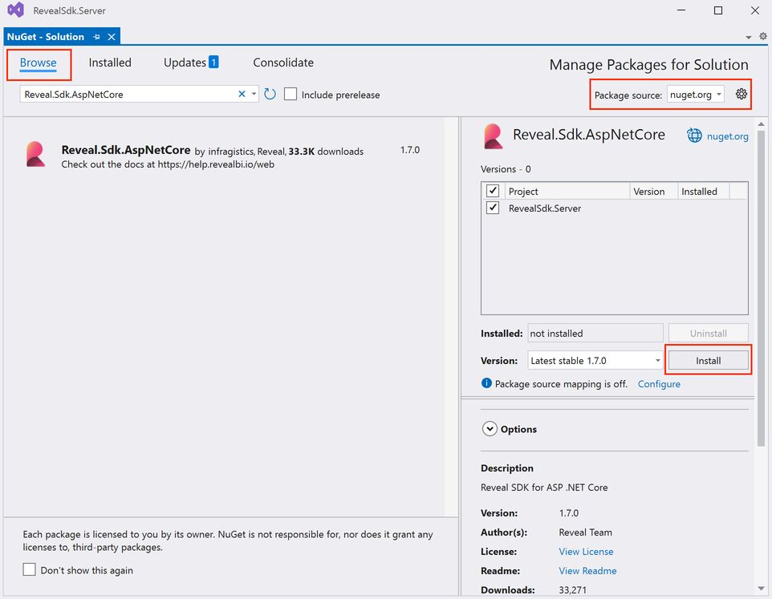
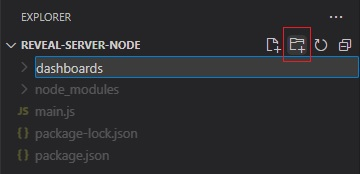

# Installing the Server SDK

## ASP.NET

The steps below describe how to install the Reveal SDK into an existing ASP.NET Core project.

1 - Right click the Solution, or Project, and select **Manage NuGet Packages** for Solution.


2 - In the package manager dialog, open the **Browse** tab, select the **nuget.org** package source, or the **Infragistics (Local)** package source is available, and install the **Reveal.Sdk.AspNetCore** NuGet package into the project.



3 - Open and modify the `Program.cs` file to add the namespace `using Reveal.Sdk;`. Then, add the call to `IMcvBuilder.AddReveal()` to the existing `builder.Services.AddControllers()` method as follows:

```cs
using Reveal.Sdk;

builder.Services.AddControllers().AddReveal();
```

4 - Right-click the project and select **Add -> New Folder**. The folder MUST be named **Dashboards** .


By default, the Reveal SDK uses a convention that will load all dashboards from the **Dashboards** folder. You can change this convention by creating a custom `IRVDashboardProvider`. You can learn more about this in the [Loading Dashboards](loading-dashboards.md) topic.

## Node.js

1 - Install the **Reveal SDK** for Node.js

```bash npm2yarn
npm install reveal-sdk-node
```

2 - Modify the `main.js` file to add Reveal

```js
var express = require('express');
// highlight-next-line
var reveal = require('reveal-sdk-node');

const app = express();

// highlight-next-line
app.use('/', reveal());

app.listen(8080, () => {
	console.log(`Reveal server accepting http requests`);
});
```

3 - In Visual Studio Code, click the **New Folder** button in the Explorer and name it **dashboards**. The folder MUST be named **dashboards**



By default, the Reveal SDK uses a convention that will load all dashboards from the **dashboards** folder. You can change this convention by creating a custom `IRVDashboardProvider`.

## Java

The steps below describe how to install the Reveal SDK into an existing Java application.

1 - Update the **pom.xml** file, and add the Reveal Maven repository.

```xml title="pom.xml"
<repositories>
    <repository>
        <id>reveal.public</id>
        <url>https://maven.revealbi.io/repository/public</url>
    </repository>	
</repositories>
```

2 -Add the Reveal SDK as a dependency.

```xml title="pom.xml"
<dependency>
    <groupId>com.infragistics.reveal.sdk</groupId>
    <artifactId>reveal-sdk</artifactId>
    <version>1.3.1</version>
</dependency>
```

### Spring Boot - Jersey

Create a Jersey Config class and initialize the Reveal SDK by calling the `RevealEngineInitializer.initialize` method. In order for the Reveal SDK to function properly with Jersey, we need to register all of the Reveal SDK classes with Jersey. To register the Reveal SDK classes, loop through the classes returned by the `RevealEngineInitializer.getClassesToRegister` method, and register them with the Jersey Config.

```java title="RevealJerseyConfig.java"
import org.glassfish.jersey.server.ResourceConfig;
import org.springframework.stereotype.Component;

import com.infragistics.reveal.engine.init.RevealEngineInitializer;

import javax.ws.rs.ApplicationPath;

@Component
@ApplicationPath("/")
public class RevealJerseyConfig extends ResourceConfig 
{
    public RevealJerseyConfig()
    {
        RevealEngineInitializer.initialize();
        
        //register all Reveal classes in JAX-RS context
        for (Class<?> clazz : RevealEngineInitializer.getClassesToRegister()) {
        	register(clazz);
        }
    }
}
```

### Tomcat

1 - Add a dependency to a Jakarta RESTful Web Services (JAX-RS) implementation. You can choose between multiple options like Jersey, RESTeasy, Apache CXF, etc. Please follow the steps described by the provider of your preference.

As an example, here the dependencies you need to add for Jersey:

```xml
<dependency>
    <groupId>org.glassfish.jersey.containers</groupId>
    <artifactId>jersey-container-servlet</artifactId>
    <version>2.32</version>
</dependency>
<dependency>
    <groupId>org.glassfish.jersey.inject</groupId>
    <artifactId>jersey-cdi2-se</artifactId>
    <version>2.32</version>
</dependency>
```

2 - Create a ServletContextListener class and initialize the Reveal SDK by calling the `RevealEngineInitializer.initialize` method.

```java
import javax.servlet.ServletContextEvent;
import javax.servlet.ServletContextListener;
import javax.servlet.annotation.WebListener;

import com.infragistics.reveal.engine.init.RevealEngineInitializer;

@WebListener
public class RevealServletContextListener implements ServletContextListener {

	@Override
	public void contextDestroyed(ServletContextEvent ctx) {
		
	}

	@Override
	public void contextInitialized(ServletContextEvent ctx) {
		
		//initialize Reveal
		RevealEngineInitializer.initialize();
	}
}
```