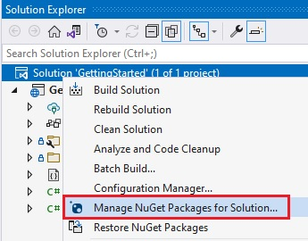
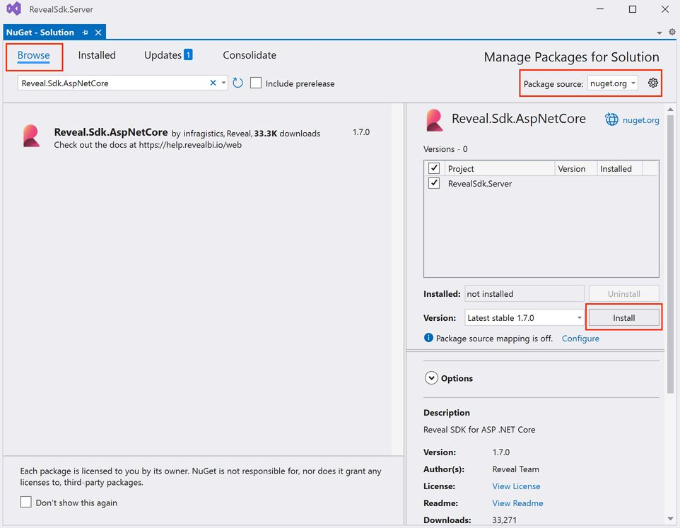
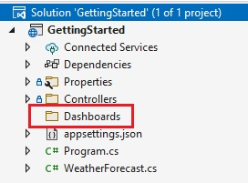

# Installing the Server SDK

## ASP.NET

The steps below describe how to install the Reveal SDK into an existing ASP.NET Core project.

1 - Right click the Solution, or Project, and select **Manage NuGet Packages** for Solution.



2 - In the package manager dialog, open the **Browse** tab, select the **nuget.org** package source, or the **Infragistics (Local)** package source is available, and install the **Reveal.Sdk.AspNetCore** NuGet package into the project.



3 - Open and modify the `Program.cs` file to add the namespace `using Reveal.Sdk;`. Then, add the call to `IMcvBuilder.AddReveal()` to the existing `builder.Services.AddControllers()` method as follows:

```cs
using Reveal.Sdk;

builder.Services.AddControllers().AddReveal();
```

4 - Right-click the project and select **Add -> New Folder**. The folder MUST be named **Dashboards** .



By default, the Reveal SDK uses a convention that will load all dashboards from the **Dashboards** folder. You can change this convention by creating a custom `IRVDashboardProvider`. You can learn more about this in the [Loading Dashboards](loading-dashboards.md) topic.

## Node.js

1 - Install the **Reveal SDK** for Node.js

```bash npm2yarn
npm install reveal-sdk-node
```

2 - Modify the `main.js` file to add Reveal

```js
var express = require('express');
// highlight-next-line
var reveal = require('reveal-sdk-node');

const app = express();

// highlight-next-line
app.use('/', reveal());

app.listen(8080, () => {
	console.log(`Reveal server accepting http requests`);
});
```

3 - In Visual Studio Code, click the **New Folder** button in the Explorer and name it **dashboards**. The folder MUST be named **dashboards**


By default, the Reveal SDK uses a convention that will load all dashboards from the **dashboards** folder. You can change this convention by creating a custom `IRVDashboardProvider`.

## Java

The steps below describe how to install the Reveal SDK into an existing Java application.

The Java SDK requires Java 17 or higher and a Jakarta EE 9 compliant server. Supported platforms are Windows, Linux, and OSX, in both x64 and ARM64 for all three. Also, if you use Jetty as your server, its version might conflict with the Jetty version used internally by Reveal SDK, which is currently 12.0.12.

1 - Update the **pom.xml** file, and add the Reveal Maven repository.

```xml title="pom.xml"
<repositories>
    <repository>
        <id>reveal.public</id>
        <url>https://maven.revealbi.io/repository/public</url>
    </repository>	
</repositories>
```

2 -Add the Reveal SDK as a dependency.

```xml title="pom.xml"
<dependency>
    <groupId>io.revealbi</groupId>
    <artifactId>reveal-sdk-servlet</artifactId>
    <version>[var:sdkVersion]</version>
</dependency>
```

### Spring Boot

Register `RevealEngineServlet` as a Spring Boot servlet. Replace the sample provider classes with your application's implementations. If you need to pass request-based properties to the user context, replace `null` with a `Properties` object built from the request.

```java title="Application.java"
@SpringBootApplication
public class Application {

    public static void main(String[] args) {
       SpringApplication.run(Application.class, args);
    }

    @Bean
    ServletRegistrationBean<RevealEngineServlet> revealServlet() {
       RevealEngineServlet revealEngineServlet = new RevealEngineServlet(() -> new RevealServerBuilder()
                // Replace these sample providers with your application's implementations.
                .setAuthenticationProvider(new MyIRVAuthenticationProvider())
                .setDashboardProvider(new RVDashboardProvider("c:\\your-path"))
                .setDataSourceProvider(new MyIRVDataSourceProvider())
                .addSettings(settings -> {
                    // settings.setLicense("your license or remove to use ~/.revealbi-sdk/license.key");
                })
                .build(), request -> new RVUserContext("whatever", null /* replace null with a Properties built from the request if needed */));

       return new ServletRegistrationBean<>(revealEngineServlet, "/reveal-api/*");
    }
}
```

### Tomcat

Use a Jakarta EE 9 compliant servlet container, such as Tomcat 10 or later. Create a `ServletContextListener` class and register `RevealEngineServlet`. Replace the sample provider classes with your application's implementations. If you need to pass request-based properties to the user context, replace `null` with a `Properties` object built from the request.

```java
@WebListener
public class AppInitializer implements ServletContextListener {

	@Override
	public void contextInitialized(ServletContextEvent sce) {
        RevealEngineServlet revealEngineServlet = new RevealEngineServlet(() -> new RevealServerBuilder()
                // Replace these sample providers with your application's implementations.
                .setAuthenticationProvider(new MyIRVAuthenticationProvider())
                .setDashboardProvider(new RVDashboardProvider("c:\\your-path"))
                .setDataSourceProvider(new MyIRVDataSourceProvider())
                .addSettings(settings -> {
                    // settings.setLicense("your license or remove to use ~/.revealbi-sdk/license.key");
                })
                .build(), request -> new RVUserContext("whatever", null /* replace null with a Properties built from the request if needed */));

        ServletRegistration.Dynamic reg = sce.getServletContext().addServlet("myServlet", revealEngineServlet);
        reg.setAsyncSupported(true);
        reg.addMapping("/reveal-api/*");
	}
}
```

### Packaging and Deployment

Reveal SDK includes native components built for specific platform and architecture combinations. When you package an application, Maven selects the native component for the current machine. If the deployment platform or architecture is different from the packaging machine, use the Maven profile parameter `-P os_arch` to select the target platform and architecture.

The native binary is included as a resource in the platform-specific artifacts and is extracted to the temporary directory at runtime. The extracted folder uses the `platform-arch-version` format, such as `linux-aarch64-3`.
