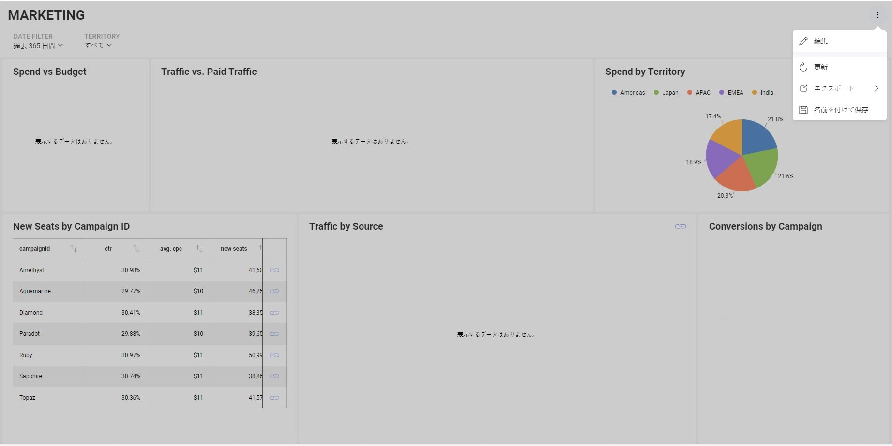
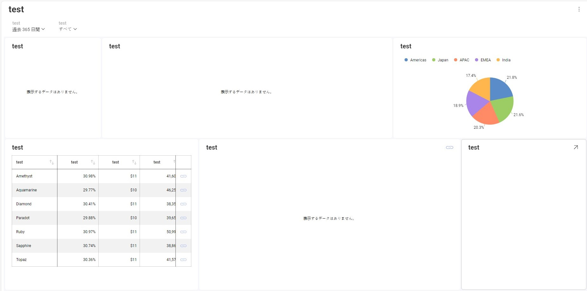
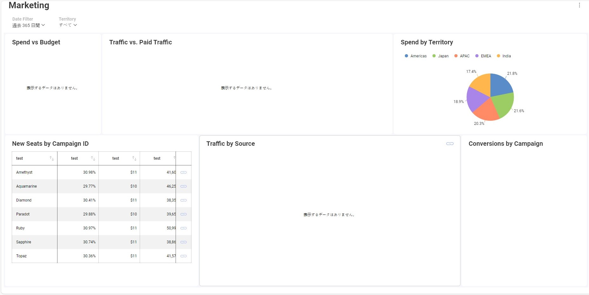

# Localizing

The Reveal SDK offers robust support for localization, enhancing its versatility and appeal across diverse global markets. Featuring a user-friendly and comprehensive localization framework, developers can seamlessly adapt the application to various languages.

The current localization locale is automatically determined by the user's browser by default. However, to enable string localization, it is necessary to set the locale for the SDK itself. This step allows for the customization of the display language for internal strings. The SDK supports the following locales: `de`, `es`, `fr`, `it`, `ja`, `ko`, `ms`, `nl`, `pt`, `ru`, `zh-cn`, and `zh-tw`. You can reference this list by examining the `SupportedLocales` property.

To set the locale, use the method `RevealSdkSettings.overrideLocale` and pass the desired locale from the aforementioned list as a parameter. It is crucial to await the promise before attempting to override the locale again. Ensure that you follow this sequence to avoid potential issues.

```js
RevealSdkSettings.overrideLocale('ja').then(_ => {
    ...
})
```

It should change all internal text to japanese.



After that, we are ready to start localizing our strings, such as visualization titles and column names.

To provide your custom translations, you need to add a handler for the `RevealSdkSettings.localizedStringsProvider` event on the client. This event receives an `RVLocalizationElement` and an `RVLocalizationContext` and should return a localized string.

```js
RevealSdkSettings.localizedStringsProvider = function (element, context) {
    ...
    return localizedString;
};
```

We will add an event handler to consistently return the localized string `test` for any input string.

```js
RevealSdkSettings.localizedStringsProvider = function (element, context) {
    return "test";
};
```

After being added, the dashboard should appear as follows.



Let's delve a bit deeper. Instead of returning `test` for everything, let's return `test` only for visualization field labels.

```js
RevealSdkSettings.localizedStringsProvider = function (element, context) {
    if (element.elementType === RVLocalizationElementType.VisualizationFieldLabel) {
        return "test";
    }
    return element.title ?? element.name;
};
```



`localizedStringsProvider` is a dashboard-model pass: it walks the dashboard title, global filters, and widgets that are already part of the dashboard, and only ever sees elements that have been bound into that model. It does not hook into UI surfaces that are populated directly from a data source's schema, such as the field picker shown when adding a dashboard filter. The table below shows where each element type is actually raised.

| Element type | Raised for |
| --- | --- |
| `DashboardTitle` | The dashboard's title |
| `DashboardFilterTitle` | The title of a global (dashboard) filter that has already been added to the dashboard |
| `VisualizationTitle` | A visualization's title |
| `FieldLabel` | A field that is bound to the dashboard but not (yet) part of any visualization, nor used in a summarization definition |
| `VisualizationFieldLabel` | A field that is being used in a visualization, and can have an aggregation applied to it |

In other words, `FieldLabel` and `VisualizationFieldLabel` only cover fields that are already bound into a dashboard or a visualization — they are not raised for schema-driven pickers such as the field list shown when adding a dashboard filter. See [Localizing dashboard filter fields](#localizing-dashboard-filter-fields) below for how to localize that list.

## Localizing dashboard filter fields {#localizing-dashboard-filter-fields}

When you choose **Add Dashboard Filter** and then **Select a field**, the field list shown there is populated directly from the data source's schema, not from the dashboard model. Because `localizedStringsProvider` only processes elements already bound into the dashboard, it is never invoked for this list, and returning a translation from it has no effect on the field picker.

To customize the field names shown in this list, use the `revealView.onFieldsInitializing` event instead. It is raised whenever a field list is being populated from a data source's schema — including the dashboard filter field picker — and lets you rename, remove, or reorder the fields shown.

```js
revealView.onFieldsInitializing = function (args) {
    var editedFields = args.fields;
    // change name to show to Spend field to Spent
    var fieldToChange = editedFields.find(f => f.name == "Spend");
    if (fieldToChange) { fieldToChange.label = "Spent"; }
    args.fields = editedFields;
}
```

Once a field is selected as a dashboard filter, the filter control continues to display the label assigned through `onFieldsInitializing`, consistent with what was shown in the picker.

## Example: Selecting the locale from a combo box

**Step 1** - Add a combo box to the page with the available localization options

```html
<div class="dropdown">
    <button class="dropbtn">Language
        <i class="fa fa-caret-down"></i>
    </button>
    <div class="dropdown-content">
        <a href="#" onclick="changeLang('en')">English</a>
        <a href="#" onclick="changeLang('ja')">Japanese</a>
        <a href="#" onclick="changeLang('es')">Spanish</a>
        <a href="#" onclick="changeLang('it')">Italian</a>
        <a href="#" onclick="changeLang('fr')">French</a>
    </div>
</div>
```

**Step 2** - Add the `changeLang` method

```js
//function to set the language from the combobox and save it on sessionStorage
function changeLang(lang) {
    sessionStorage.setItem('lang', lang);
    location.reload();
}
```

**Step 3** - Create a dictionary with the required words

```js
//this map helps us get the index by lang
const lang = {
    "en": 0, "ja": 1, "es": 2, "it": 3, "fr": 4
};

//this is a map with the word we want to translate and a list of words in each language
const dictionaryTable = {
    "Date Filter": ["Date Filter", "日付フィルター", "Filtro de Fecha", "Filtro data", "Filtre de date"],
    "Date": ["Date", "日にち", "Fecha", "Data", "Date"],
    "Marketing": ["Marketing", "マーケティング", "Marketing", "Marketing", "Commercialisation"],
    "Spend": ["Spend", "費やす", "Gastado", "Spendere", "Dépenser"],
    "Budget": ["Budget", "バジェット", "Presupuesto", "Bilancio", "Budget"],
    "CTR": ["CTR", "クリック率", "CTR", "CTR", "CTR"],
    "Spend by Territory": ["Spend by Territory", "テリトリー別支出額", "Gastos por territorios", "Spese per territorio", "Dépenses par territoire"],
    "Spend vs Budget": ["Spend vs Budget", "支出対予算", "Gasto vs Presupuesto", "Spesa vs budget", "Dépenses vs budget"],
    "Organic Traffic": ["Organic Traffic", "オーガニックトラフィック", "Tráfico orgánico", "Traffico organico", "Trafic organique"],
};
```

**Step 4** - Create a function to translate from our dictionary

```js
//function to translate, expects an RVLocalizationElement and returns a localized string
function translate(element) {
    const selectedLang = sessionLang.toLowerCase();
    const elementDesc = element.title ? element.title : element.name;
    const candidateList = dictionaryTable[elementDesc];
    const candidate = candidateList ? candidateList[lang[selectedLang]] : undefined;
    return candidate ? candidate : elementDesc;
}
```

**Step 5** - Add a handler for the `RevealSdkSettings.localizedStringsProvider` event.

```js
RevealSdkSettings.overrideLocale(sessionLang).then(_ => {
    RevealSdkSettings.localizedStringsProvider = function (element, context) {
        return translate(element);
    };
})
```

**Step 6** - Add the remaining the code to load our dashboard

```js
const sessionLang = sessionStorage.getItem('lang') ?? 'en';

const lang = {
    "en": 0, "ja": 1, "es": 2, "it": 3, "fr": 4
};

const dictionaryTable = {
    //"OriginalWord": ["English", "Japanese", "Spanish", "Italian", "French"], => example guide
    "Date Filter": ["Date Filter", "日付フィルター", "Filtro de Fecha", "Filtro data", "Filtre de date"],
    "Date": ["Date", "日にち", "Fecha", "Data", "Date"],
    "Marketing": ["Marketing", "マーケティング", "Marketing", "Marketing", "Commercialisation"],
    "Spend": ["Spend", "費やす", "Gastado", "Spendere", "Dépenser"],
    "Budget": ["Budget", "バジェット", "Presupuesto", "Bilancio", "Budget"],
    "CTR": ["CTR", "クリック率", "CTR", "CTR", "CTR"],
    "Spend by Territory": ["Spend by Territory", "テリトリー別支出額", "Gastos por territorios", "Spese per territorio", "Dépenses par territoire"],
    "Spend vs Budget": ["Spend vs Budget", "支出対予算", "Gasto vs Presupuesto", "Spesa vs budget", "Dépenses vs budget"],
    "Organic Traffic": ["Organic Traffic", "オーガニックトラフィック", "Tráfico orgánico", "Traffico organico", "Trafic organique"],
};

//function to translate, expects an RVLocalizationElement and returns a localized string
function translate(element) {
    const elementDesc = element.title ? element.title : element.name;
    const candidateList = dictionaryTable[elementDesc];
    const candidate = candidateList ? candidateList[lang[sessionLang]] : undefined;
    return candidate ? candidate : elementDesc;
}

//function to set the language from the combo box and save it into sessionStorage
function changeLang(lang) {
    sessionStorage.setItem('lang', lang)
    location.reload();
}

// set this to your server url
RevealSdkSettings.setBaseUrl("https://samples.revealbi.io/upmedia-backend/reveal-api/");

RevealSdkSettings.overrideLocale(sessionLang).then(_ => {
    RevealSdkSettings.localizedStringsProvider = function (element, context) {
        return translate(element);
    };
})

RVDashboard.loadDashboard("Marketing").then(dashboard => {
    const revealView = new RevealView("#revealView");
    revealView.dashboard = dashboard;
})
```

:::info Get the Code

The source code to this sample can be found on [GitHub](https://github.com/RevealBi/sdk-samples-javascript/tree/main/LocalizingDashboards)

:::