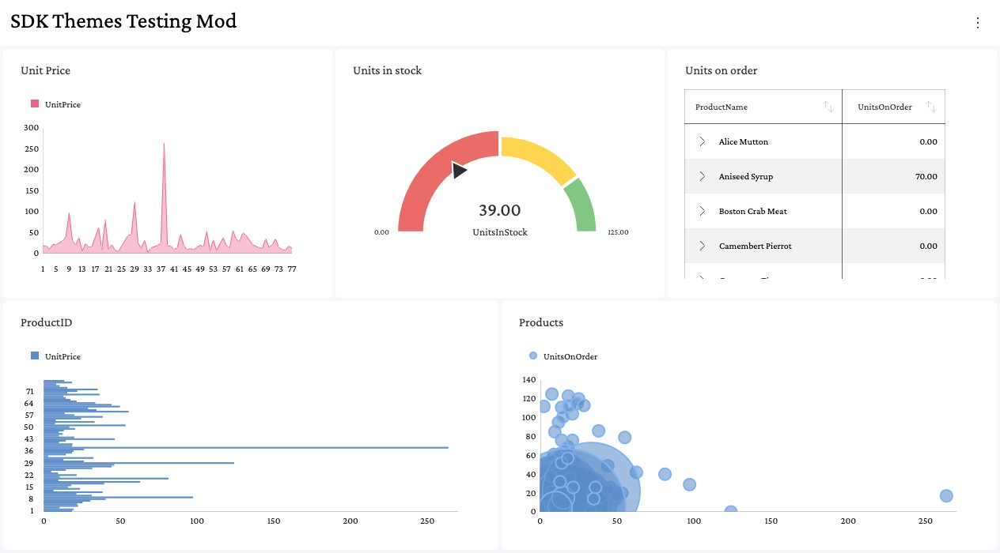

# Theme Fonts

A `RevealTheme` has five font properties, one for each text style the Reveal SDK renders. Each property takes the name of a font family that must be available to the page, either through an `@font-face` rule or as a font installed on the user's device.

| Property           | Style                  | Examples of where it is used                                              |
| ----------         | -----                  | ---------------------------------------------------------------------      |
| **regularFont**    | Regular (400)          | Chart labels, grid cells, filter values and most other text               |
| **mediumFont**     | Medium (500)           | Labels and headings in the visualization editor                           |
| **boldFont**       | Bold (700)             | Dashboard and visualization titles, grid headers, gauge values            |
| **italicFont**     | Italic (400 italic)    | Grid cells styled by a conditional formatting rule with italic text       |
| **boldItalicFont** | Bold Italic (700 italic) | Grid cells styled by a conditional formatting rule with bold italic text |

## How Font Properties Are Resolved

Reveal renders every font property at normal weight and normal style. It never applies `font-weight: bold` or `font-style: italic` on its own; the family assigned to a property is expected to supply that style itself. This is how the built-in themes work: their `boldFont` is the `Roboto-Bold` family, not `Roboto` drawn at a bold weight.

Because of this, a font property describes where a font is used, not how it is drawn. Assigning a regular family such as `"Crimson Pro"` to `boldFont` renders titles with the regular face. To get bold titles you can either assign a family whose only face is bold, or reuse the regular family and let Reveal derive the bold face from the `@font-face` rules on your page. Both patterns are described below.

## Dedicated Font Family per Style

Assign a different family to each property, where each family contains a single face in the intended style.

```js
const theme = new RevealTheme();
theme.regularFont = "Crimson Pro";
theme.mediumFont = "Crimson Pro Medium";
theme.boldFont = "Crimson Pro Bold";
theme.italicFont = "Crimson Pro Italic";
theme.boldItalicFont = "Crimson Pro Bold Italic";

RevealSdkSettings.theme = theme;
```

The families can come from any source, as long as each name resolves to the intended face. For self-hosted fonts, declare one `@font-face` rule per family:

```css
@font-face { font-family: "Crimson Pro";             src: url("fonts/CrimsonPro-Regular.woff2"); }
@font-face { font-family: "Crimson Pro Medium";      src: url("fonts/CrimsonPro-Medium.woff2"); }
@font-face { font-family: "Crimson Pro Bold";        src: url("fonts/CrimsonPro-Bold.woff2"); }
@font-face { font-family: "Crimson Pro Italic";      src: url("fonts/CrimsonPro-Italic.woff2"); }
@font-face { font-family: "Crimson Pro Bold Italic"; src: url("fonts/CrimsonPro-BoldItalic.woff2"); }
```

## One Font Family for Every Style

Assign the same family to every property. When a style property is set to exactly the same string as `regularFont`, Reveal looks for an `@font-face` rule for that family with the weight and style of the property, and renders the property's text with that face.

```js
const theme = new RevealTheme();
theme.regularFont = "Crimson Pro";
theme.mediumFont = "Crimson Pro";
theme.boldFont = "Crimson Pro";
theme.italicFont = "Crimson Pro";
theme.boldItalicFont = "Crimson Pro";

RevealSdkSettings.theme = theme;
```


:::caution

The values are compared as strings, so every property must be assigned the identical string. A value that names the same family in another way is treated as a dedicated family: its text renders with the regular face, and no warning is logged.

```js
theme.regularFont = "Crimson Pro";
theme.boldFont = "'Crimson Pro'";        // extra quotes: not the same string
theme.italicFont = "Crimson Pro, serif"; // fallback list: not the same string
```

Assigning every property from a single variable avoids the mismatch.

:::

Each property is matched against the `@font-face` descriptors below. Declare each weight as a single value. A rule that declares a weight range needs the extra step described in [Variable Fonts](#variable-fonts).

| Property           | font-weight | font-style |
| ----------         | ----------- | ---------- |
| **mediumFont**     | 500         | normal     |
| **boldFont**       | 700         | normal     |
| **italicFont**     | 400         | italic     |
| **boldItalicFont** | 700         | italic     |

### Declaring the Font Faces

With this pattern, the page must declare an `@font-face` rule for every weight and style that the theme uses. When loading from Google Fonts, request each weight and style explicitly, as a list of weights (`400;500;700`) and not as a range (`200..900`):

```html
<link href="https://fonts.googleapis.com/css2?family=Crimson+Pro:ital,wght@0,400;0,500;0,700;1,400;1,700&display=swap" rel="stylesheet">
```

For self-hosted fonts, declare the rules with the matching `font-weight` and `font-style` descriptors:

```css
@font-face { font-family: "Crimson Pro"; font-weight: 400; font-style: normal; src: url("fonts/CrimsonPro-Regular.woff2"); }
@font-face { font-family: "Crimson Pro"; font-weight: 500; font-style: normal; src: url("fonts/CrimsonPro-Medium.woff2"); }
@font-face { font-family: "Crimson Pro"; font-weight: 700; font-style: normal; src: url("fonts/CrimsonPro-Bold.woff2"); }
@font-face { font-family: "Crimson Pro"; font-weight: 400; font-style: italic; src: url("fonts/CrimsonPro-Italic.woff2"); }
@font-face { font-family: "Crimson Pro"; font-weight: 700; font-style: italic; src: url("fonts/CrimsonPro-BoldItalic.woff2"); }
```

:::caution

Reveal reads the `@font-face` rules when the theme is assigned to `RevealSdkSettings.theme`. Add the stylesheet to the page before assigning the theme, otherwise the faces are not found.

:::

### Variable Fonts

A variable font is usually declared with a weight range, such as `font-weight: 200 900`. Requesting a range from Google Fonts (`wght@200..900`) produces the same kind of rule. Reveal finds a rule like this for `mediumFont`, `boldFont` and `boldItalicFont`, but because it renders every property at normal weight, the text is drawn at weight 400 and looks regular. No warning is logged, because a matching face was found.

Declare one rule per weight instead, each with a single `font-weight` value. Every rule can point to the same variable font file:

```css
@font-face { font-family: "Crimson Pro"; font-weight: 400; font-style: normal; src: url("fonts/CrimsonPro-VariableFont_wght.woff2"); }
@font-face { font-family: "Crimson Pro"; font-weight: 500; font-style: normal; src: url("fonts/CrimsonPro-VariableFont_wght.woff2"); }
@font-face { font-family: "Crimson Pro"; font-weight: 700; font-style: normal; src: url("fonts/CrimsonPro-VariableFont_wght.woff2"); }
@font-face { font-family: "Crimson Pro"; font-weight: 400; font-style: italic; src: url("fonts/CrimsonPro-Italic-VariableFont_wght.woff2"); }
@font-face { font-family: "Crimson Pro"; font-weight: 700; font-style: italic; src: url("fonts/CrimsonPro-Italic-VariableFont_wght.woff2"); }
```

### Missing Font Faces

If no `@font-face` rule matches a property, the text for that property renders with the regular face. For example, requesting only the regular weight from Google Fonts leaves the titles, grid headers and gauge values regular even though `boldFont` is set:

```html
<link href="https://fonts.googleapis.com/css2?family=Crimson+Pro:wght@400&display=swap" rel="stylesheet">
```



Reveal logs a warning in the browser console for each property it could not resolve. The warning names the weight and style that is missing:

```
Reveal could not resolve a 700 face for the theme font "Crimson Pro". Text using this style will render with the regular face. Provide an @font-face for that weight/style (e.g. include it in your font stylesheet), or assign a dedicated per-style family to the theme slot.
```

To fix it, add the missing weight or style to your font stylesheet, or assign a dedicated family to that property as shown in [Dedicated Font Family per Style](#dedicated-font-family-per-style).

## Applying Font Changes

Font properties take effect when a theme is assigned to `RevealSdkSettings.theme`. The assignment is the step that applies them. Reading `RevealSdkSettings.theme` returns the current theme object, and changing a font property on that object applies nothing: the text keeps rendering with the previous fonts, and no warning is logged.

```js
// Wrong: the change is never applied
RevealSdkSettings.theme.boldFont = "Crimson Pro";
```

Change a copy of the theme and assign it:

```js
// Right: the assignment applies the fonts
const theme = RevealSdkSettings.theme.clone();
theme.regularFont = "Crimson Pro";
theme.boldFont = "Crimson Pro";

RevealSdkSettings.theme = theme;
```

`RevealView.refreshTheme` does not replace the assignment. It reloads the dashboard with the theme that was last assigned, so call it after the assignment when a `RevealView` is already showing a dashboard.

## Limitations

- Fonts registered through the CSS Font Loading API (`document.fonts.add(new FontFace(...))`) have no `@font-face` rule that Reveal can read, so styles cannot be derived from them. Properties that share such a family with `regularFont` render with the regular face. Declare the font with `@font-face` in CSS instead, or assign a dedicated family per style.
- When no `@font-face` rule exists for the family at all, Reveal tries the style names of an installed font (for example `Crimson Pro Bold`). This only works when the font is installed on the user's device, so do not rely on it for a public web application.

:::note

In earlier versions of the Web SDK, `italicFont` and `boldItalicFont` were accepted but not applied. They now take effect, so if you already set them, grid cells that use an italic conditional formatting style will change appearance after upgrading.

:::
