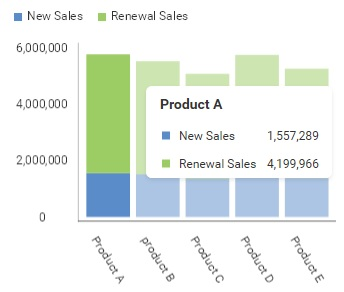
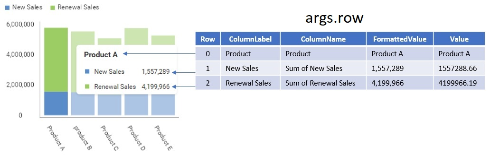

# Working with Tooltips

A tooltip is a message which appears when the end-user hovers over a data point in a dashboard visualization.



Tooltips are shown on hover for every visualization type that supports them - charts, pie, funnel and treemap visualizations, maps, grids and data charts. Tooltip actions, such as drill down or filtering, are available directly from the tooltip without an extra click.

:::info

Hover tooltips were previously available behind a beta feature flag, enabled as `"newTooltip"` or through the `BetaFeatures.newTooltips` constant. They are now the default tooltip experience and the beta flag has been removed - you no longer need to enable anything to get them, and any remaining call that enables the flag can be deleted.

:::

When a tooltip is showing in a dashboard visualization, the `RevealView.onTooltipShowing` event is invoked. Handling this event will allow you to read tooltip data, or prevent the tooltip from showing

```js
revealView.onTooltipShowing = (args) => {

};
```

The `TooltipShowingEventArgs` contains the following properties:
- **cell** - gets the data point that is associated with the tooltip
- **row** - gets a collection of cell data that is provided in the tooltip
- **visualization** - gets the Visualization displaying the tooltip
- **cancel** - set to `true` to prevent the tooltip from being displayed
- **customItems** - a collection of `RVTooltipItem` objects used to add custom menu items to the tooltip

:::info

The `RevealView.onTooltipShowing` event will not be triggered for visualizations that do not support tooltips, such as gauges.

:::

## Showing and Hiding Tooltips

Use the `RevealView.showTooltips` property to turn tooltips on or off for every visualization in the dashboard. The property defaults to `true`.

```js
import { RevealView } from "reveal-sdk";

const revealView = new RevealView("#revealView");
revealView.showTooltips = false;
```

The property can be changed at any time and the visualizations update immediately, so you can also toggle it at runtime.

```js
document.getElementById("toggleTooltips").addEventListener("click", () => {
    revealView.showTooltips = !revealView.showTooltips;
});
```

:::info

`showTooltips` controls tooltips that are triggered by hovering a data point. Tooltips triggered by clicking or tapping a data point are always displayed, as touch devices have no hover events.

:::

If you are using the Reveal SDK in a WPF or .NET MAUI application, the equivalent property on the `RevealView` control is `ShowTooltips`.

### Migrating from `hoverTooltipsEnabled`

The `showTooltips` property replaces `hoverTooltipsEnabled`. The old name was specific to chart visualizations, while the setting now gates tooltips for every visualization type that supports them.

```js
//deprecated
revealView.hoverTooltipsEnabled = false;

//use this instead
revealView.showTooltips = false;
```

:::warning

`hoverTooltipsEnabled` still works and forwards to `showTooltips`, so existing code continues to run. It is deprecated and will be removed in a future release - update to `showTooltips` when you get the chance. The same applies to the `HoverTooltipsEnabled` property in WPF and .NET MAUI applications.

:::

## Reading Tooltip Data

By using the properties exposed by the event `TooltipShowingEventArgs` object, such as the `TooltipShowingEventArgs.cell` and `TooltipShowingEventArgs.row` properties, you can read data that is used for display in the tooltip.

It's important to understand that the `TooltipShowingEventArgs.row` property provides a collection of `RVCell` objects that represent each data point in the tooltip.

The `RVCell` class has the following properties:
- **columnLabel** - the label, or custom name, of the column belonging to the data point
- **columnName** - the name of the column belonging to the data point
- **formattedValue** - the formatted value of the data point
- **value** - the original value of the data point

The following image illustrates how the properties of a `RVCell` maps to the data being displayed in the tooltip.



## Prevent Tooltips from Showing
To prevent tooltips from showing for all visualizations, or a specific visualization, simply set the `TooltipShowingEventArgs.cancel` property to `true`.

In this example, we are checking if the `TooltipShowingEventArgs.visualization.title` property is **Sales** and preventing the tooltip from showing by setting the `TooltipShowingEventArgs.cancel` property to `true`.

```js
revealView.onTooltipShowing = (args) => {
    if (args.visualization.title == "Sales") {
             args.cancel = true;
    }
};
```

## Adding Custom Items to the Tooltip

Use the `TooltipShowingEventArgs.customItems` collection to add your own menu items to the tooltip. Each item is an `RVTooltipItem`, created with a group header, a title, an icon, and a click handler.

```js
import { RVTooltipItem } from "reveal-sdk";

revealView.onTooltipShowing = (args) => {
    args.customItems.push(new RVTooltipItem("Actions", "View Details", null, (sender, e) => {
        console.log("View Details clicked", e);
    }));
};
```

The `icon` argument accepts either a URL string or an `RVImage` instance, and may be `null` when no icon is needed.

:::info Get the Code

The source code to this sample can be found on [GitHub](https://github.com/RevealBi/sdk-samples-javascript/tree/main/Tooltips)

:::
