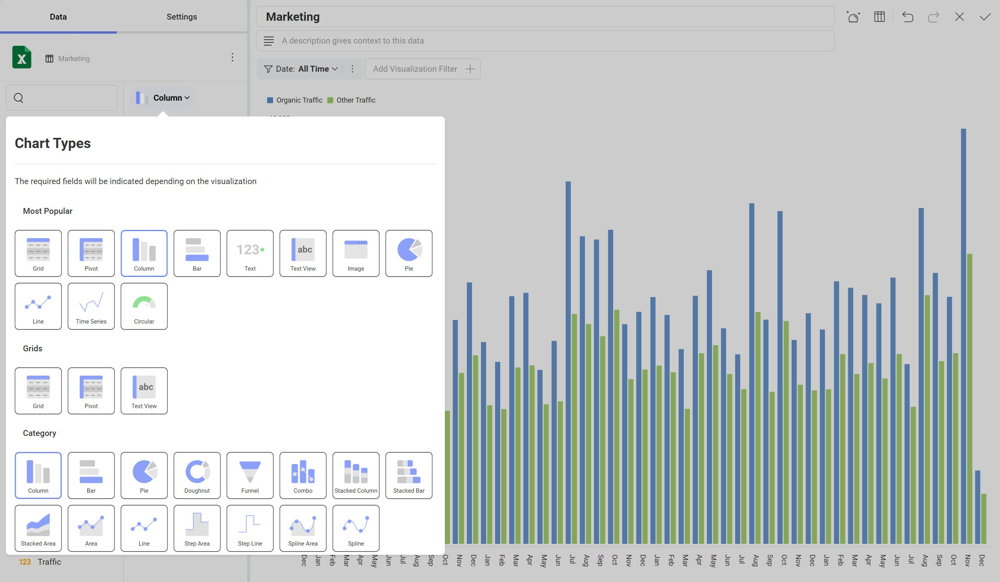

# Chart Types

**Chart Types** represent various types of charts that can be used as a dashboard visualization. When creating or editing a visualization, the chart type is chosen from the Chart Types drop-down menu.



The Reveal SDK provides 37 different types of charts placed in various groups. The groups are as follows:

- Most Popular
- Grids
- Category
- Gauges
- Maps
- Scatter
- Financial
- Time
- Other

## Customizing Chart Types
To modify, remove, or add custom visualizations to the chart types drop down, simply modify the items in the `RevealView.ChartTypes` collection.

### Update Chart Type
To update an existing chart type, find the chart type in the `RevealView.ChartTypes` property. Modify the various properties of the chart type to either rename, change the icon, or regroup the chart type item.

```cs
var barConfig = _revealView.ChartTypes.First(x => x.ChartType == RVChartType.BarChart);
barConfig.Title = "My Cool Bar";
barConfig.Icon = "https://help.revealbi.io/img/logo.png";
barConfig.Groups = new string[] { "Enterprise Visualizations", "HR", "Some Other Category" };
```

### Remove Chart Type
Remove a chart type by finding the chart type item you want remove, and remove it from the `ChartTypes` colelction.

```cs
_revealView.ChartTypes.Remove(_revealView.ChartTypes.FirstOrDefault(x => x.ChartType == RVChartType.Grid));
```

### Add Custom Chart Type
Besides updating and removing existing chart type items, you can also add your Custom Visualizations as a new chart type in the Chart Types drop down.

```cs
_revealView.ChartTypes.Add(new RVChartTypeCustomItem("Custom Viz", "https://host/customViz.html")
{
    Icon = "https://help.revealbi.io/img/logo.png",
    Groups = new string[] { "Custom Vizualizations" }
});
```

## Set the Default Chart Type
By default, the Reveal SDK sets the `ColumnChart` chart as the default chart type. You can change the default chart type by setting the `RevealView.DefaultChartType` property to one of the [RVChartType](https://help.revealbi.io/api/wpf/latest/Reveal.Sdk.RVChartType.html) enumeration members.

```cs
_revealView.DefaultChartType = RVChartType.StackedColumnChart;
```

If you want to set the default chart type to a Custom Visualization, then you need to set the `RevealView.DefaultCustomChartType` property to the title of the custom visualization.

```js
_revealView.DefaultCustomChartType = "Custom Viz";
```

:::info Get the Code

You can find a sample demonstrating Chart Types on [GitHub](https://github.com/RevealBi/sdk-samples-wpf/tree/master/ChartTypes).

:::
