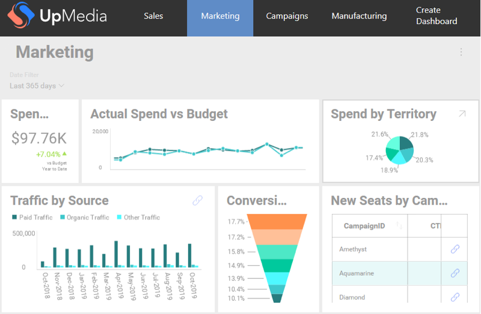

# Localizing Dashboards

The Localization service allows you to localize different dashboard elements based on your custom logic. It also provides you with the ability to set custom formatting settings for fields.

## Supported Elements for Localization

Dashboard elements you can localize:

  - Dashboard Title
  - Filter Title
  - Visualization Title
  - Field Label
  - Summarization Field Label

## Using the Localization service

The dashboard used for the example is the *Marketing* sample dashboard.

### Localizing a dashboard title - example

The initial state of the *Marketing* sample:



Follow the steps below to localize the *Marketing* dashboard title to *Localized Marketing*.

1.  To be allowed to localize the dashboard, you should set the **LocalizationProvider** property to your custom implementation:

    ```cs
    RevealSdkSettings.LocalizationProvider = new UpMediaLocalizationProvider()
    ```

2.  Implement the **IRVLocalizationProvider**:

    ```cs
    public class UpMediaLocalizationProvider : IRVLocalizationProvider
    {
        public IRVLocalizationService GetLocalizationService()
        {
          return new UpMediaLocalizationService();
        }
    }
    ```

3.  Implement the **GetLocalizedString** method in the **IRVLocalizationService** as shown below to localize the dashboard title:

    ```cs
    public class UpMediaLocalizationService : IRVLocalizationService
    {
        public RVFormattingSpec GetFormattingSettingsForField(string fieldName, RVDashboardDataType dataType, RVFormattingSpec currentSettings, bool isAggregated)
        {
            return null;
        }

        public string GetLocalizedString(string originalValue, RVLocalizationElementType type)
        {
            if (type == RVLocalizationElementType.DashboardTitle && originalValue == "Marketing")
            {
                return "Localized Marketing";
            }

            return originalValue;
        }
    }
    ```

When running the app again you can see the localized dashboard title - *Localized Marketing*:


### Localizing a field label - example

Below you will see an example of how to localize more than one element of the same dashboard.

Here is the initial state of one of the *Marketing*'s sample visualizations - *Actual Spend vs Budget*:


To localize the *Date* field label, you need to add some logic to the **UpMediaLocalizationService** that will handle the localization of the *Date* field:

```cs
public class UpMediaLocalizationService : IRVLocalizationService
{
    public RVFormattingSpec GetFormattingSettingsForField(string fieldName, RVDashboardDataType dataType, RVFormattingSpec currentSettings, bool isAggregated)
    {
        return null;
    }

    public string GetLocalizedString(string originalValue, RVLocalizationElementType type)
    {
        if (type == RVLocalizationElementType.DashboardTitle && originalValue == "Marketing")
        {
            return "Localized Marketing";
        }
        else if (type == RVLocalizationElementType.FieldLabel && originalValue == "Date")
        {
            return "Localized Date";
        }

        return originalValue;
    }
}
```

The *Date* field label in *Actual Spend vs Budget* is now changed to *Localized Date*:


You can use the steps in the examples to localize any other dashboard element.

## Using the Localization Service to Change Formatting Settings

Currently you can use the Localization service to change the formatting settings of numeric fields and non-aggregated date fields.

### Changing the formatting settings of a numeric field - example

The initial state of the *Spend vs Budget* visualization below shows the numeric field formatted in the US Dollars ($) currency:


To change the currency format, you will need to create new formatting settings and return them in the **GetFormattingSettingsForField** method in the implementation of **IRVLocalizationService**.

The code snippet illustrates how to change the number formatting to the Japanese Yen (¥) and display it with no decimal digits:

```cs
public class UpMediaLocalizationService : IRVLocalizationService
{
    public RVFormattingSpec GetFormattingSettingsForField(string fieldName, RVDashboardDataType dataType, RVFormattingSpec currentSettings, bool isAggregated)
    {
        if (fieldName == "Spend" && dataType == RVDashboardDataType.Number && isAggregated == true)
        {
            var newSettings = new RVNumberFormattingSpec()
            {
                ApplyMkFormat = false,
                CurrencySymbol = "¥",
                DecimalDigits = 0,
                FormatType = RVDashboardNumberFormattingType.Currency,
                NegativeFormat = RVDashboardNegativeFormatType.MinusSign,
                ShowGroupingSeparator = true
            };

            return newSettings;
        }

        return null;
    }

    public string GetLocalizedString(string originalValue, RVLocalizationElementType type)
    {
       ...
    }
}
```

Now, the amount is displayed in a different currency:


### Changing the formatting settings of a date field - example

Currently changing the formatting settings for an aggregated date field cannot be configured with the Localization service and won’t affect the values in pivot. In order to achieve this you have to use the [Formatting service](formatting-data.md).

The Localization service allows you to change the formatting settings of **non-aggregated date fields**.

First, change the *Actual Spend vs Budget* visualization to **Grid**, in order to exclude any aggregated data:


To change the formatting settings of the *Date* field, you need to add your preferences to the logic of the **GetFormattingSettingsForField** method. The code snippet below shows how to change the date format to display the full name of the month, like: "January 01, 2001".

```cs
public RVFormattingSpec GetFormattingSettingsForField(string fieldName, RVDashboardDataType dataType, RVFormattingSpec currentSettings, bool isAggregated)
{
    if (fieldName == "Spend" && dataType == RVDashboardDataType.Number && isAggregated == true)
    {
        var newSettings = new RVNumberFormattingSpec()
        {
            ApplyMkFormat = false,
            CurrencySymbol = "¥",
            DecimalDigits = 0,
            FormatType = RVDashboardNumberFormattingType.Currency,
            NegativeFormat = RVDashboardNegativeFormatType.MinusSign,
            ShowGroupingSeparator = true
        };

        return newSettings;
    }
    else if (fieldName == "Date" && dataType == RVDashboardDataType.Date && isAggregated == false)
    {
        var newSettings = new RVDateFormattingSpec()
        {
            DateFormat = "MMMM dd,yyyy"
        };

        return newSettings;
    }

    return null;
}
```

:::info

Note that you need to check if the field name is *Date*, not *Localized Date*. The reason is the formatting settings are applied based on the name of the field. In this case, *Date* is the name of the field and *Localized Date* is just the label displayed. When editing a dashboard, you can modify the field labels, but the field names keep their original names.

:::

After you run the app again and change the visualization to Grid, you will see the updated date format:


