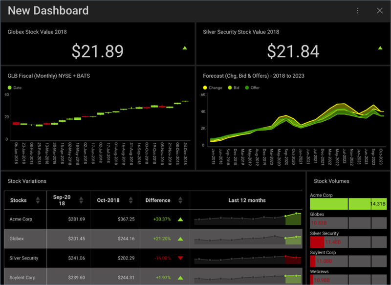

## Finance Dashboard Tutorial

In this tutorial, you will see how the "Stock Market (Performance)"
dashboard displayed below was created using a sample spreadsheet with
similar data.

### What's in this Dashboard?

This dashboard contains information on a sample company's:

  - The top stocks by value and the YTD value of the highest-value stock

  - A forecast for all changes, bids, and offers for a 4 year period

  - The variation in stock prices and the volume of available stocks

<a name='sample-datasheet'>
### Sample Datasheet

You can download the sample datasheet
[here](http://download.infragistics.com/reportplus/help/samples/Reveal_Dashboard_Tutorials.xlsx).
All other dashboards [in these tutorials](dashboard-tutorials.md) will use
the same sample spreadsheet.

>[NOTE!]
>Excel files as local files are not supported in this release. In order to follow these tutorials, make sure you upload the file to one of the
[supported cloud services](data-sources.md).

### Steps Overview

1.  [Creating the Dashboard and Adding a Data Source](Finance-Starting-Creation-Process.md)

2.  [Creating the First Visualization](Finance-Selecting-Data-Visualization.md)

3.  [Applying Formatting to the First Visualization](Finance-Applying-Formatting-Visualization.md)

4.  [Applying a Theme to the Dashboard](Finance-Applying-Theme.md)

5.  [Adding the other visualizations](Finance-Adding-Other-Visualizations.md) ([Silver Security Stock Value 2018](Finance-Adding-Other-Visualizations.html#sis-stock-value-2018), [GLB Fiscal (Monthly) NYSE + BATS](Finance-Adding-Other-Visualizations.html#glb-fiscal-monthly), [Forecast (Chg, Bid & Offer) - 2018 to 2013](Finance-Adding-Other-Visualizations.html#forecast-change-bid-offers), [Stock Variations](Finance-Adding-Other-Visualizations.html#stock-variations), [Stock Volumes](Finance-Adding-Other-Visualizations.html#stock-volumes))

6.  [Saving your Dashboard](Finance-Saving-Dashboard.md)

[Get Started »](Finance-Starting-Creation-Process.md)
